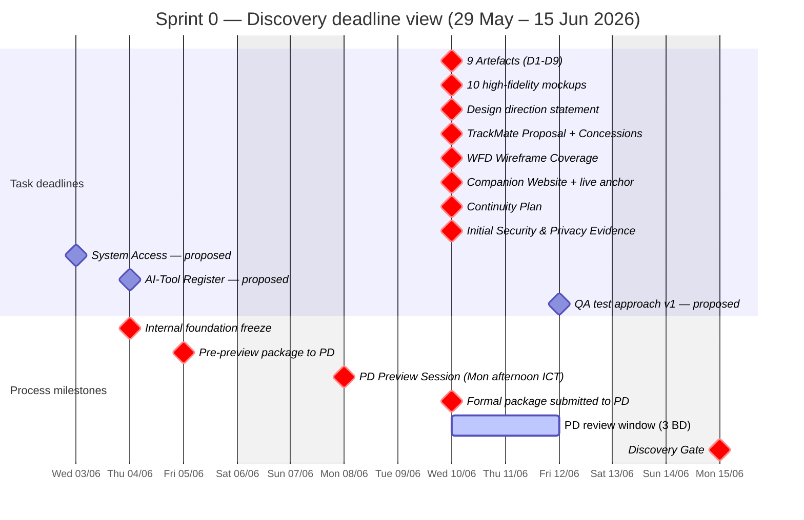

# Sprint 0 — Discovery delivery plan

> **Parent:** [Planning](./_index.md)
> **Window:** 29 May – 15 Jun 2026 (12 business days)
> **Gate:** → **Discovery Gate** (15 Jun 2026)

## Sprint goal

> **Pass Discovery Gate on 15 June 2026** by delivering **10 PD-deliverable tasks** (9 Architectural Compliance Artefacts · Design + UI · TrackMate Transport + concessions · Operational & Admin Readiness) **+ 1 internal QA pre-study task** (Sprint 1 enablement). Acceptance by PD unblocks all subsequent build work in Sprints 1+.

## Timeline & milestones

> **Legend (gantt colour code):**
> - 🔴 **Red (`crit`)** = **Official deadline** — backed by PD mandate, Kickoff agreement, or spec (DCA / CMP)
> - ⚪ **Default style** = **Proposed deadline** — Slitigenz-proposed internal target (pending Slitigenz/PD confirmation)

### Internal milestones (manage proactively)

> **Source legend:** **PD** = PD written mandate · **Kickoff** = agreed at kickoff meeting 2026-06-01 · **DCA / CMP** = spec clause · **Proposed** = Slitigenz-proposed internal target (pending confirm)

| Date | Milestone | Source | Why it matters |
|---|---|---|---|
| **Wed 3 Jun** | System Access live | **Proposed** | Other tasks need repo access; unblocks dev infra. Mine — Slitigenz to confirm or adjust |
| **Thu 4 Jun** | AI-Tool Register complete | **Proposed** | Lowest-effort task; close early to demonstrate process discipline. Mine — Slitigenz to confirm |
| **Thu 4 Jun EOD** | All 10 PD-deliverable tasks draft v1 complete — **internal freeze** | **Kickoff** | Pulled forward 1 BD vs CMP-standard, to feed Fri 5 Jun pre-preview submission per kickoff agreement |
| **Fri 5 Jun 09:00 ICT** | **Pre-preview package submitted to PD** | **Kickoff** | PD travelling weekend (no signal Sat–Sun); drafts must be self-explanatory |
| **Mon 8 Jun 15:00 ICT** | **PD Preview Session** (~85 min · 3 parts) | **Kickoff** | Direction-setting before formal lock — out-of-window slot accepted by PD (CMP §6.3.2) |
| **Wed 10 Jun** | Formal package submitted to PD | **PD** | Hard deadline per PD: *"Design Intent Submission due by 10 June 2026, 5 Business Days before gate"* |
| **Fri 12 Jun** | PD review complete | DCA §5.5.2 inference | 3 BD window only (Wed–Fri). Any rejection → recovery plan ≤5 BD — extremely risky if rejected this late |
| **Fri 12 Jun** | QA test approach v1 ready | **Proposed** | Sprint 1 (SOS) test suite build starts Day 1 — no QA ramp-up time lost. Mine — Slitigenz QA Lead to confirm |
| **Mon 15 Jun** | **Discovery Gate clearance** | **PD** (DCA §5) | Sprint 1 cannot start without it |

## Task list

| Task | Description | Owner (Squad role) | Effort | Deadline | Related docs |
|---|---|---|---|---|---|
| **9 Architectural Compliance Artefacts** (D1–D9) | The full Discovery artefact package — 7 architecture docs + SDK audit + OSS licence audit. Each D# detailed in [Gate Checklist §1A](./01-gate-deliverable-checklist.md#1a-9-architectural-compliance-artefacts). Demonstrates Survival Core isolation, deterministic state, offline-first execution, breadcrumb classification, CAL/PCR architecture. | **Tech Lead** — Dinh Ba Trung (lead) · Mobile Lead (D8) · DevOps Lead (D9) | High | **Wed 10 Jun** *(PD official)* · pre-preview draft Fri 5 Jun *(Kickoff)* | AOD-5026 · FSD-5126 · OSM-5026 §10 · BTF-5126 · CDG-5126 · VGD-5126 · PSB-5026 · DCA §10.7 (D9) |
| **10 high-fidelity mockups** (5 screens × daylight + night) | Design Intent submission — 5 key screens (Map · Archetype Selection · TrackMate™ Group · SOS Confirmation · First Aid Reference) each in **daylight + night** modes. Used by PD to assess Design Quality Obligation. | **UI/UX Lead** — Nguyen Thuy Duong | High | **Wed 10 Jun** *(PD official)* | UXS-5726 · WFD-5126 · MAS-5126 · TAA-5126 · DCA §11A |
| **Written design direction statement** (Design Quality Obligation §11A) | 2–4 page document articulating how the visual language meets premium-consumer-safety-app standard. Independent acceptance ground per DCA §11A — PD may reject design quality even if functional spec passes. | **UI/UX Lead** — Nguyen Thuy Duong | Medium | **Wed 10 Jun** *(PD official)* | DCA §11A · UXS-5726 · MAS-5126 |
| **TrackMate™ Transport Proposal + Proposal-Stage Concessions** | (a) Technical proposal for 3-tier peer-comms transport stack (BLE Mesh · Wi-Fi Direct · LoRa) with deterministic fallback logic. (b) Concessions: **methodology + architecture** for deferred empirical validation of **battery performance** (BPS thresholds) + **transport** (range · fallback · HW auto-detection). Foundation for Sprint 8 build + downstream gate validation. | **Mobile Developer** — Nguyen Tien Dat (+ QA Lead for validation methodology) | Medium-High | **Wed 10 Jun** *(PD official — gate package)* | FSD-5126 §6.2 · WFD-5126 §5.7–5.8 · BPS-5126 · CDG-5126 · TQP-5026 |
| **WFD-5126 Wireframe Coverage** — all Survival Core subsystems | UI state coverage for every Survival Core subsystem (Navigation · SOS · BackTrack™ · HazTrack™ · First Aid). PD-approval prerequisite before any subsystem dev may start (per WFD-5126 build-gate rule). | **UI/UX Lead** — Nguyen Thuy Duong | High | **Wed 10 Jun** *(PD official)* | WFD-5126 · UXS-5726 · FQH-5026 · FSD-5126 |
| **AI-Tool Register** (per DCA §10.6) | Disclosure sheet of every AI coding tool in use + data-handling model + human-review process + PD approval status. Schema in [`templates/06-register-schemas.md`](../templates/06-register-schemas.md) §H8. | **Tech Lead** — Dinh Ba Trung | Low | **Thu 4 Jun** *(Proposed — mine)* | DCA §10.6 · VGD-5126 |
| **Companion Website Staging + live anchor** | Staging env + CMS configured + IA accepted by PD. **Live site with verbatim product anchor statement.** Foundation for Alpha (market-ready). | **Web/Console Lead** — Nguyen Quoc Viet | Medium | **Wed 10 Jun** *(PD official — gate package)* | OCS-5026 · Slitigenz Proposal §10.2 · DCA §8.4 · CMP-5026 §6.11 |
| **System Access** — Client admin to repos · build envs · credentials | Sets up continuous, unrestricted Client admin access to all repositories · CI/CD · platform accounts (App Store, Play, Mapbox, Firebase) · credentials register. **Strict prerequisite** to any subsequent work per DCA §8.1. | **DevOps Lead** — Nguyen Viet Hoang | Low | **Wed 3 Jun** *(Proposed — mine)* | DCA §8.1, §8.3, §8.4 · CDG-5126 |
| **Continuity Plan** | Written plan: backup personnel · knowledge-transfer steps · repo/build continuity · escalation arrangements if any Key Personnel unavailable >5 consecutive BD or materially reduced. **Strict precedent before Discovery Gate Clearance** per DCA §14.1. | **Project Manager** — Luong Gia Khanh | Low | **Wed 10 Jun** *(PD official — gate prerequisite per DCA §14.1)* | DCA §14.1 · CMP-5026 §6.2.2 · Slitigenz Squad (§1.3) |
| **Initial Security & Privacy Evidence** | Documentation of data-isolation architecture (Survival Core local-only · Firebase boundary) + security baselines (AES-256 at rest · TLS 1.3 in transit · MFA · zero outbound from Core verified). Pre-flight for Schedule 9 DPSA executed before env access. | **DevOps Lead** — Nguyen Viet Hoang (+ Tech Lead) | Medium | **Wed 10 Jun** *(PD official — gate package)* | DCA §9.1–9.7 + Schedule 9 · CDG-5126 · BTF-5126 · ESF-5026 |
| **QA pre-study + Sprint 1 test approach draft** *(internal — not a Discovery deliverable)* | QA Lead reads key spec docs in advance + drafts test approach for Sprint 1 (SOS theme) so test suite build can start Day 1 of Sprint 1. Outputs: TQP domain coverage matrix for SOS · device matrix · test-data plan · early RT/RG checks (RT-16 SOS legal, RT-09 prohibited capabilities). | **QA/Audit Lead** — Nguyen Thi Thom | Medium | **Fri 12 Jun** *(Proposed — mine, Sprint 1 enablement)* | TQP-5026 (11 domains) · ESF-5026 (SOS, non-dispatch) · SFD-5026 · FSD-5126 §4.4 · BPS-5126 (battery ≤20%/hr SOS) · VGD-5126 (RT-01..23 · RG-01..11) · WFD-5126 §SOS · UXS-5726 (≤2 tap rule) · FQH-5026 |

> **Compressed deadlines** (per kickoff 2026-06-01): **Thu 4 Jun EOD** internal freeze · **Fri 5 Jun 09:00 ICT** pre-preview package to PD · **Mon 8 Jun 15:00 ICT** preview session (~85 min, 3 parts) · **Wed 10 Jun** formal submission · **Mon 15 Jun** Discovery Gate.
> **11 sprint tasks total** — 10 PD-deliverable + 1 internal QA pre-study (Sprint 1 enablement). All track in parallel across the 8-person Squad ([Team & Contacts](../03-team-contacts.md) §2).
> Task IDs + status assigned in the Jira board synced into this page.

## Risk register

> Schema per [`templates/registers/risk.md`](../templates/registers/risk.md) (7-col canonical).

| # | Date | Description | Severity | Owner | Mitigation status | Status |
|---|---|---|---|---|---|---|
| **RISK-001** | 2026-06-01 | 17-day Sprint 0 window = tightest gate · no slack for re-submission · all 8 tasks must clear PD on first review | High | Luong Gia Khanh (PM) | Front-load all 8 tasks from Day 1, parallel across 8 owners; foundation freeze Fri 5 Jun gives 3-BD internal polish before submission | Mitigating |
| **RISK-002** | 2026-06-01 | 9 Artefacts + 10 mockups + WFD Wireframes = highest combined effort + highest PD review risk | High | Dinh Ba Trung (Tech Lead) | Split across 3 owners (Tech / UI/UX / UI/UX) · run fully parallel from Day 1 · daily standups | Mitigating |
| **RISK-003** | 2026-06-01 | System Access task lightweight but critical blocker for any repo-dependent work | Medium | Nguyen Viet Hoang (DevOps Lead) | DevOps Lead closes by Wed 3 Jun (Week 1) before any other task needs repo access | Mitigating |
| **RISK-004** | 2026-06-01 | DCA §11A Design Quality Obligation = independent PD rejection ground for mockups + design statement (premium-consumer-safety standard) | High | Nguyen Thuy Duong (UI/UX Lead) | Pre-review with PD on Tue 9 Jun (informal walkthrough) before formal Wed 10 Jun submission | Open |
| **RISK-005** | 2026-06-01 | Submission Wed 10 Jun → only **3 BD PD review** (Wed–Fri) · recovery plan (5 BD per DCA §5.5.2) would exceed gate date if rejected | High | Luong Gia Khanh (PM) | Submit early Wed 10 Jun AM · daily check-ins during 3-BD review · pre-flag any reviewer concerns before formal review opens | Open |
| **RISK-006** | 2026-06-01 | Compressed internal freeze: Thu 4 Jun EOD vs original Fri 5 Jun — 1 BD pulled forward across all 10 PD-deliverable tasks running in parallel. Risk of incomplete drafts being sent to PD pre-preview. | High | Luong Gia Khanh (PM) | Daily Squad standups Mon–Thu · escalate ASAP if any task slips · pre-preview package allowed to contain explicit *'placeholder pending PD direction'* sections for items needing input | Open |

## Sign-off

| Item | Status |
|---|---|
| All 10 PD-deliverable tasks accepted | ☐ |
| QA test approach v1 ready (internal) | ☐ |
| Discovery Gate Clearance issued | ☐ |
| PD signature | __________ |
| Date | __________ |
| CAR-5026 reference | __________ |
