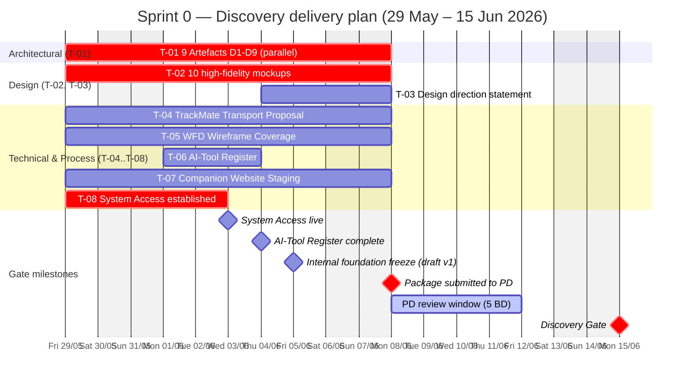

# Sprint 0 — Discovery delivery plan

> **Parent:** [Planning](./_index.md)
> **Window:** 29 May – 15 Jun 2026 (12 business days)
> **Gate:** → **Discovery Gate** (15 Jun 2026)

## Sprint goal

> **Pass Discovery Gate on 15 June 2026** by delivering **8 tasks (T-01..T-08)** covering 9 Architectural Compliance Artefacts · Design Intent · 5 technical/process deliverables. Acceptance by PD unblocks all subsequent build work in Sprints 1+.

## Task list

| # | Task | Owner (Squad role) | Internal deadline | Effort | Sub-deliverables |
|---|---|---|---|---|---|
| **T-01** | **9 Architectural Compliance Artefacts** (D1–D9) | **Tech Lead** — Dinh Ba Trung (lead) · Mobile Lead (D8) · DevOps Lead (D9) | **Fri 5 Jun** (draft) · **Mon 8 Jun** (submit) | High | D1–D7 docs + D8 SDK audit + D9 OSS licence audit |
| **T-02** | **10 high-fidelity mockups** (5 screens × daylight + night) | **UI/UX Lead** — Nguyen Thuy Duong | **Mon 8 Jun** | High | Map · Archetype Selection · TrackMate™ Group · SOS Confirmation · First Aid Reference — each in 2 modes |
| **T-03** | **Written design direction statement** (Design Quality Obligation §11A) | **UI/UX Lead** — Nguyen Thuy Duong | **Mon 8 Jun** *(after T-02 v1)* | Medium | 1 written doc, 2–4 pages |
| **T-04** | **TrackMate™ Transport Proposal** (BLE Mesh · Wi-Fi Direct · LoRa) | **Mobile Developer** — Nguyen Tien Dat | **Mon 8 Jun** | Medium | 1 technical proposal doc |
| **T-05** | **WFD-5126 Wireframe Coverage** — all Survival Core subsystems | **UI/UX Lead** — Nguyen Thuy Duong | **Mon 8 Jun** | High | Wireframe set covering Navigation · SOS · BackTrack™ · HazTrack™ · First Aid Reference |
| **T-06** | **AI-Tool Register** (per DCA §10.6) | **Tech Lead** — Dinh Ba Trung | **Thu 4 Jun** | Low | 1 Google Sheet (schema in [`templates/06-register-schemas.md`](../templates/06-register-schemas.md) §H8) |
| **T-07** | **Companion Website Staging** (env + CMS + content plan) | **Web/Console Lead** — Nguyen Quoc Viet | **Mon 8 Jun** | Medium | Staging URL · CMS configured · content delivery plan approved |
| **T-08** | **System Access** — Client admin to repos · build envs · credentials | **DevOps Lead** — Nguyen Viet Hoang | **Wed 3 Jun** | Low | GitHub org access · Firebase/Mapbox accounts · CI/CD repo · credentials register |

> **Submission deadline:** Mon 8 Jun → PD review 5 BD (8–12 Jun) → Discovery Gate Mon 15 Jun.
> **All 8 tasks track in parallel** (Squad of 8 senior experts, see [Team & Contacts](../03-team-contacts.md) §2).

## Timeline & milestones

## Internal milestones (manage proactively)

| Date | Milestone | Why it matters |
|---|---|---|
| **Wed 3 Jun** | T-08 System Access live | Other tasks need repo access; unblocks dev infra |
| **Thu 4 Jun** | T-06 AI-Tool Register complete | Lowest-effort task; close it early to demonstrate process discipline |
| **Fri 5 Jun** | All 8 tasks draft v1 complete | "Foundation freeze" — Squad self-review starts |
| **Mon 8 Jun** | Package submitted to PD | Hard deadline — 5 BD PD review window starts here |
| **Fri 12 Jun** | PD review complete | Any rejection → recovery plan ≤5 BD (per DCA §5.5.2) — risky if rejected this late |
| **Mon 15 Jun** | **Discovery Gate clearance** | Sprint 1 cannot start without it |

## Risk callouts

- **17-day window from contract execution is the tightest gate** — no slack for re-submission. All 8 tasks must clear PD on first review.
- **T-01 (9 Artefacts) + T-02 (mockups) + T-05 (wireframes) = highest effort + highest review risk** — split across 3 different owners and run fully parallel from Day 1.
- **T-08 System Access** is critical but lightweight — close by end of Week 1 to avoid blocking everything else.
- **Design Quality Obligation (DCA §11A)** introduces independent PD rejection grounds — T-02 and T-03 must reach **premium consumer safety app** standard, not just minimum spec.

## Sign-off

| Item | Status |
|---|---|
| All 8 tasks accepted by PD | ☐ |
| Discovery Gate Clearance issued | ☐ |
| PD signature | __________ |
| Date | __________ |
| CAR-5026 reference | __________ |
