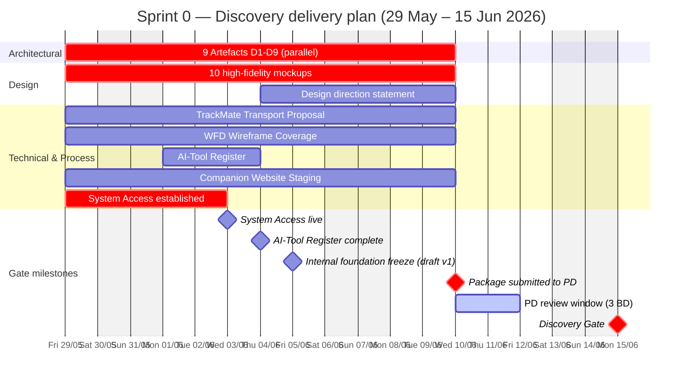

# Sprint 0 — Discovery delivery plan

> **Parent:** [Planning](./_index.md)
> **Window:** 29 May – 15 Jun 2026 (12 business days)
> **Gate:** → **Discovery Gate** (15 Jun 2026)

## Sprint goal

> **Pass Discovery Gate on 15 June 2026** by delivering 8 tasks covering 9 Architectural Compliance Artefacts · Design Intent · 5 technical/process deliverables. Acceptance by PD unblocks all subsequent build work in Sprints 1+.

## Timeline & milestones

### Internal milestones (manage proactively)

| Date | Milestone | Why it matters |
|---|---|---|
| **Wed 3 Jun** | System Access live | Other tasks need repo access; unblocks dev infra |
| **Thu 4 Jun** | AI-Tool Register complete | Lowest-effort task; close it early to demonstrate process discipline |
| **Fri 5 Jun** | All 8 tasks draft v1 complete | "Foundation freeze" — Squad self-review starts |
| **Wed 10 Jun** | Package submitted to PD | Hard deadline (per PD: *"Design Intent Submission due by 10 June 2026"*) — PD review window starts here |
| **Fri 12 Jun** | PD review complete | 3 BD window only (Wed–Fri). Any rejection → recovery plan ≤5 BD (per DCA §5.5.2) — extremely risky if rejected this late |
| **Mon 15 Jun** | **Discovery Gate clearance** | Sprint 1 cannot start without it |

## Task list

| Task | Description | Owner (Squad role) | Effort | Deadline | Related docs |
|---|---|---|---|---|---|
| **9 Architectural Compliance Artefacts** (D1–D9) | The full Discovery artefact package — 7 architecture docs + SDK audit + OSS licence audit. Each D# detailed in [Gate Checklist §1A](./01-gate-deliverable-checklist.md#1a-9-architectural-compliance-artefacts). Demonstrates Survival Core isolation, deterministic state, offline-first execution, breadcrumb classification, CAL/PCR architecture. | **Tech Lead** — Dinh Ba Trung (lead) · Mobile Lead (D8) · DevOps Lead (D9) | High | **Fri 5 Jun** (draft) · **Wed 10 Jun** (submit) | AOD-5026 · FSD-5126 · OSM-5026 §10 · BTF-5126 · CDG-5126 · VGD-5126 · PSB-5026 · DCA §10.7 (D9) |
| **10 high-fidelity mockups** (5 screens × daylight + night) | Design Intent submission — 5 key screens (Map · Archetype Selection · TrackMate™ Group · SOS Confirmation · First Aid Reference) each in **daylight + night** modes. Used by PD to assess Design Quality Obligation. | **UI/UX Lead** — Nguyen Thuy Duong | High | **Wed 10 Jun** | UXS-5726 · WFD-5126 · MAS-5126 · TAA-5126 · DCA §11A |
| **Written design direction statement** (Design Quality Obligation §11A) | 2–4 page document articulating how the visual language meets premium-consumer-safety-app standard. Independent acceptance ground per DCA §11A — PD may reject design quality even if functional spec passes. | **UI/UX Lead** — Nguyen Thuy Duong | Medium | **Wed 10 Jun** *(after mockups v1)* | DCA §11A · UXS-5726 · MAS-5126 |
| **TrackMate™ Transport Proposal** (BLE Mesh · Wi-Fi Direct · LoRa) | Technical proposal for 3-tier peer-comms transport stack with deterministic fallback logic + battery/range trade-offs. Foundation for Sprint 8 build. | **Mobile Developer** — Nguyen Tien Dat | Medium | **Wed 10 Jun** | FSD-5126 §6.2 · WFD-5126 §5.7–5.8 · BPS-5126 · CDG-5126 |
| **WFD-5126 Wireframe Coverage** — all Survival Core subsystems | UI state coverage for every Survival Core subsystem (Navigation · SOS · BackTrack™ · HazTrack™ · First Aid). PD-approval prerequisite before any subsystem dev may start (per WFD-5126 build-gate rule). | **UI/UX Lead** — Nguyen Thuy Duong | High | **Wed 10 Jun** | WFD-5126 · UXS-5726 · FQH-5026 · FSD-5126 |
| **AI-Tool Register** (per DCA §10.6) | Disclosure sheet of every AI coding tool in use + data-handling model + human-review process + PD approval status. Schema in [`templates/06-register-schemas.md`](../templates/06-register-schemas.md) §H8. | **Tech Lead** — Dinh Ba Trung | Low | **Thu 4 Jun** | DCA §10.6 · VGD-5126 |
| **Companion Website Staging** (env + CMS + content plan) | Public-facing staging website + CMS configured + delivery plan accepted by PD. Goes live as part of Alpha gate (market-ready). | **Web/Console Lead** — Nguyen Quoc Viet | Medium | **Wed 10 Jun** | OCS-5026 · Slitigenz Proposal §10.2 · DCA §8.4 · CMP-5026 §6.11 |
| **System Access** — Client admin to repos · build envs · credentials | Sets up continuous, unrestricted Client admin access to all repositories · CI/CD · platform accounts (App Store, Play, Mapbox, Firebase) · credentials register. **Strict prerequisite** to any subsequent work per DCA §8.1. | **DevOps Lead** — Nguyen Viet Hoang | Low | **Wed 3 Jun** | DCA §8.1, §8.3, §8.4 · CDG-5126 |

> **Submission deadline:** Wed 10 Jun (per PD: *"Design Intent Submission due by 10 June 2026, 5 Business Days before gate"*) → PD review Wed–Fri (10–12 Jun) → Discovery Gate Mon 15 Jun.
> **All 8 tasks track in parallel** (Squad of 8 senior experts, see [Team & Contacts](../03-team-contacts.md) §2).
> Task IDs + status assigned in the Jira board synced into this page.

## Risk register

| # | Date | Raised by | Risk | Approved by | Resolution |
|---|---|---|---|---|---|
| **RISK-001** | 2026-06-01 | Luong Gia Khanh (PM) | 17-day Sprint 0 window = tightest gate · no slack for re-submission · all 8 tasks must clear PD on first review | *(awaiting PD)* | Front-load all 8 tasks from Day 1, parallel across 8 owners; foundation freeze Fri 5 Jun gives 3-BD internal polish before submission |
| **RISK-002** | 2026-06-01 | Luong Gia Khanh (PM) | 9 Artefacts + 10 mockups + WFD Wireframes = highest combined effort + highest PD review risk | Dinh Ba Trung (Tech Lead) | Split across 3 owners (Tech / UI/UX / UI/UX) · run fully parallel from Day 1 · daily standups |
| **RISK-003** | 2026-06-01 | Luong Gia Khanh (PM) | System Access task lightweight but critical blocker for any repo-dependent work | Nguyen Viet Hoang (DevOps Lead) | DevOps Lead closes by Wed 3 Jun (Week 1) before any other task needs repo access |
| **RISK-004** | 2026-06-01 | Luong Gia Khanh (PM) | DCA §11A Design Quality Obligation = independent PD rejection ground for mockups + design statement (premium-consumer-safety standard) | *(awaiting PD)* | Pre-review with PD on Tue 9 Jun (informal walkthrough) before formal Wed 10 Jun submission |
| **RISK-005** | 2026-06-01 | Luong Gia Khanh (PM) | Submission Wed 10 Jun → only **3 BD PD review** (Wed–Fri) · recovery plan (5 BD per DCA §5.5.2) would exceed gate date if rejected | *(awaiting PD)* | Submit early Wed 10 Jun AM · daily check-ins during 3-BD review · pre-flag any reviewer concerns before formal review opens |

## Sign-off

| Item | Status |
|---|---|
| All 8 tasks accepted by PD | ☐ |
| Discovery Gate Clearance issued | ☐ |
| PD signature | __________ |
| Date | __________ |
| CAR-5026 reference | __________ |
