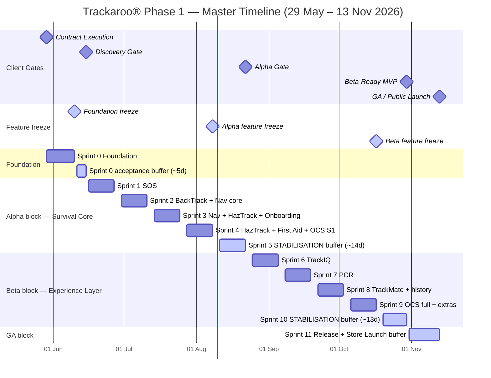

# Planning — Trackaroo® Phase 1 Delivery

> **Owner:** Delivery Lead · Project Director (acceptance authority)
> **Source:** DCA-5026 §5 (Gate Schedule) · Slitigenz Proposal §10.1–10.3 · CMP-5026
> **Status:** Active · last updated 2026-06-01

## Overview

| | |
|---|---|
| **Contract executed** | 29 May 2026 |
| **Hard launch (GA)** | 13 November 2026 |
| **Total duration** | ~24 weeks · ~900 man-days |
| **Squad** | 8-person Lean Senior Squad ([Team & Contacts](../03-team-contacts.md)) |
| **Cadence** | 2-week sprints · 8 parallel tracks |
| **Gates** | Discovery (15 Jun) → Alpha (22 Aug) → Beta-Ready (30 Oct) → GA (13 Nov) |
| **Sprints** | 12 (Sprint 0 Foundation · Sprints 1–11 build + buffer + release) |
| **Backlog** | 51 features across 11 Epics — see [Modules / Feature Backlog](../../02-product/03-modules/_index.md) |

## Master timeline

## Child pages

| Page | What's in it |
|---|---|
| [Gate Deliverable Checklist](./01-gate-deliverable-checklist.md) | The 4-gate commitment — every artefact Slitigenz delivers to obtain PD Gate Clearance |
| [Sprint 0 — Discovery](./02-sprint-0-discovery.md) ⭐ | Detailed plan for the Discovery gate sprint (29 May – 15 Jun) |
| [Sprint 1](./03-sprint-1.md) | SOS & Emergency Logging *(coming soon)* |
| [Sprint 2](./04-sprint-2.md) | BackTrack™ + Navigation core *(coming soon)* |
| [Sprint 3](./05-sprint-3.md) | Navigation + HazTrack™ + Onboarding *(coming soon)* |
| [Sprint 4](./06-sprint-4.md) | HazTrack™ + First Aid + OCS Stage 1 — Alpha feature freeze *(coming soon)* |
| [Sprint 5](./07-sprint-5.md) | Stabilisation buffer → Alpha Gate *(coming soon)* |
| [Sprint 6](./08-sprint-6.md) | TrackIQ™ *(coming soon)* |
| [Sprint 7](./09-sprint-7.md) | PCR — Point Condition Reports *(coming soon)* |
| [Sprint 8](./10-sprint-8.md) | TrackMate™ + multi-session history *(coming soon)* |
| [Sprint 9](./11-sprint-9.md) | OCS full + extras — Beta feature freeze *(coming soon)* |
| [Sprint 10](./12-sprint-10.md) | Stabilisation buffer → Beta-Ready Gate *(coming soon)* |
| [Sprint 11](./13-sprint-11.md) | Release buffer → GA Launch *(coming soon)* |

## How to read this section

1. **Start here** (this page) for the macro picture — when each gate hits, what each sprint covers.
2. **Open Gate Deliverable Checklist** to see exactly what's committed at each gate.
3. **Open the relevant sprint page** for the detailed plan (goal, tasks, timeline, milestones, risk callouts).
