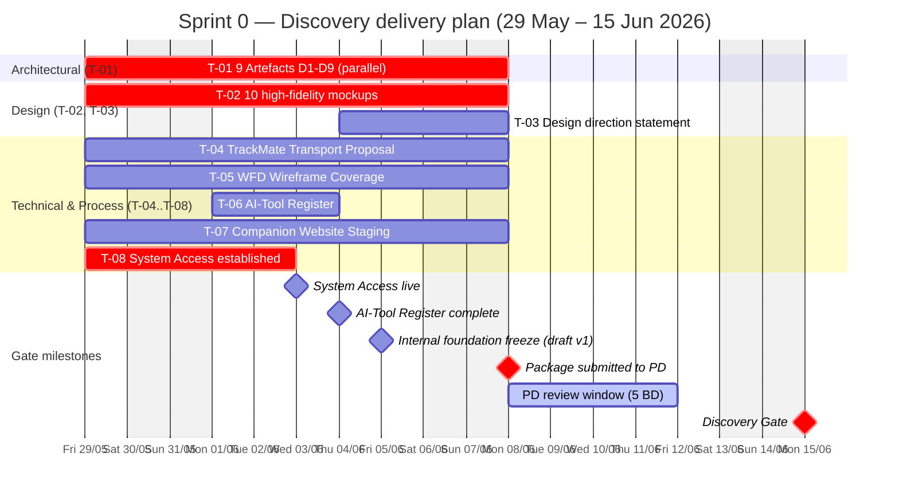

# Roadmap & Milestones — Trackaroo® Phase 1 Delivery Plan

> **Owner:** Delivery Lead · Project Director (acceptance authority)
> **Source:** DCA-5026 §5 (Gate Schedule) · Schedule 2 (Gate Conditions) · CMP-5026
> **Status:** Draft v2 · 2026-06-01

---

## 1. Gate model

Slitigenz must provide specific **technical, design, and administrative deliverables** at each gate to achieve **Gate Clearance** from the Project Director.

- **Binary** — a gate either passes (all items accepted) or fails (any item rejected).
- **No self-certification** — vendor cannot certify own delivery; PD acceptance is sole authority.
- **Prerequisite gate (Discovery)** blocks any active build until cleared.
- **Failure → recovery plan** per DCA §5.5.2: written notice ≤48h, recovery plan ≤5 BD.

---

## 2. Gate deliverable checklist

The 4 gates with full per-gate deliverable lists committed by Slitigenz. Use the **Confirm** column to track acceptance.

---

### Gate 1 · Discovery — **15 June 2026**

> **Prerequisite gate** — no active build execution may commence on any subsystem until these items are accepted by PD.

#### 1A. 9 Architectural Compliance Artefacts

| ✓ | # | Artefact | Detail |
|---|---|---|---|
| ☐ | **D1** | High-level architecture diagram | Showing Survival Core isolation |
| ☐ | **D2** | Deterministic state transition matrix | All Survival Core states |
| ☐ | **D3** | Offline-first execution explanation | Whitepaper |
| ☐ | **D4** | Module isolation mapping | Dependency graph |
| ☐ | **D5** | Breadcrumb classification confirmation | Local-Only / Non-Syncable |
| ☐ | **D6** | CAL architecture documentation | Priority logic + 4 mandatory flags (`satReady`, `queueEnabled`, `offlineBeacon`, `partialSignal`) |
| ☐ | **D7** | PCR architecture documentation | Supersession resolution model |
| ☐ | **D8** | SDK audit declaration | Full inventory: SDK name + activation status |
| ☐ | **D9** | OSS licence audit | App Store + Google Play distribution compatibility |

#### 1B. Design Intent Submission

| ✓ | Item | Detail |
|---|---|---|
| ☐ | **10 high-fidelity mockups** | **5 key screens × 2 modes** — Map · Archetype Selection · TrackMate™ Group · SOS Confirmation · First Aid Reference — in **daylight + night** modes |
| ☐ | **Written design direction statement** | Explains how the visual language satisfies the Design Quality Obligation (DCA §11A) |

#### 1C. Technical & Process Deliverables

| ✓ | Item | Detail |
|---|---|---|
| ☐ | **TrackMate™ Transport Proposal** | Technical proposal for BLE Mesh · Wi-Fi Direct · LoRa transport |
| ☐ | **WFD-5126 Wireframe Coverage** | Formally approved UI state coverage for **all Survival Core subsystems** |
| ☐ | **AI-Tool Register** | Disclosure of all AI coding tools + human-review processes (per DCA §10.6) |
| ☐ | **Companion Website Staging** | Staging environment · CMS configuration · delivery plan accepted |
| ☐ | **System Access** | Continuous, unrestricted Client admin access to all repositories · build environments · credentials (per DCA §8.1) |

---

### Gate 2 · Alpha — **22 August 2026**

| ✓ | Deliverable | Detail / Acceptance criterion |
|---|---|---|
| ☐ | **Survival Core Build** | Fully functional + certified subsystems: Navigation · BackTrack™ · HazTrack™ · SOS · local logging |
| ☐ | **SOS Validation** | Proof of **≤2 tap access** from all screen states + correct rendering of the 3-stage log sequence |
| ☐ | **First Aid Universal Baseline** | Content display framework complete · clinically reviewed (RT-12 closed) |
| ☐ | **Operations Console — Stage 1** | Functional modules: PCR Management · User & Account Admin · Tester Management · System Audit Log |
| ☐ | **Companion Website** | Market-ready · approved content structure · CMS operational |
| ☐ | **Inert Scaffold Evidence** | Verification that Phase 2 scaffolds are inert + display *"Inactive in Phase 1"* |
| ☐ | **Prohibited Capability Scan** | Clear scan results confirming absence of prohibited artefacts (AI / satellite / Phase 2 triggers) |

---

### Gate 3 · Beta-Ready MVP — **30 October 2026**

| ✓ | Deliverable | Detail / Acceptance criterion |
|---|---|---|
| ☐ | **Full Scope Delivery** | All Phase 1 features functional + validated across all 11 TQP-5026 domains |
| ☐ | **Operations Console — Full** | All **7 modules** functional — adds Track Grade Admin · TrackIQ™ Pipeline · HazTrack™ Feed Management · FAR Content Admin |
| ☐ | **Validation Results Report** | Comprehensive pass/fail summary across all 11 validation domains |
| ☐ | **Battery Benchmarks** | Empirical data confirming **≤8 %/hr navigation** + **≤20 %/hr SOS mode** |
| ☐ | **WCAG 2.1 AA Audit** | Successful independent accessibility audit report (RT-11 closed) |
| ☐ | **V-05 Confirmation** | Written certification that Phase 1 data model preserves Phase 2 Emergency Escrow pathway without structural barriers |
| ☐ | **Legal & Regulatory Clearance** | Final sign-off on Terms of Service · Privacy Policy (APPs compliance) · clinical reviews for all FAR tiers (LE-04, LE-05, LE-06) |

---

### Gate 4 · GA / Public Launch — **13 November 2026**

| ✓ | Deliverable | Detail / Acceptance criterion |
|---|---|---|
| ☐ | **Live App Submissions** | Approved + live listings on **Apple App Store** + **Google Play Store** |
| ☐ | **Handover Pack** | Complete pack: source code · build scripts · deployment instructions · credentials register · final documentation (per DCA Schedule 7) |
| ☐ | **Final Compliance Confirmation** | All open Rejection Triggers (RT-01..23) resolved + **go/no-go sign-off issued by PD** |

---

## 3. Sprint 0 — Discovery delivery plan

> **Sprint 0** = the work to pass Gate 1 (Discovery, 15 Jun 2026). Window: **29 May – 15 Jun** (12 business days).

### 3.1 Sprint goal

> **Pass Discovery Gate on 15 June 2026** by delivering **8 tasks (T-01..T-08)** covering 9 Architectural Compliance Artefacts · Design Intent · 5 technical/process deliverables. Acceptance by PD unblocks all subsequent build work in Sprints 1+.

### 3.2 Task list

| # | Task | Owner (Squad role) | Internal deadline | Effort | Sub-deliverables |
|---|---|---|---|---|---|
| **T-01** | **9 Architectural Compliance Artefacts** (D1–D9) | **Tech Lead** — Dinh Ba Trung (lead) · Mobile Lead (D8) · DevOps Lead (D9) | **Fri 5 Jun** (draft) · **Mon 8 Jun** (submit) | High | D1–D7 docs + D8 SDK audit + D9 OSS licence audit |
| **T-02** | **10 high-fidelity mockups** (5 screens × daylight + night) | **UI/UX Lead** — Nguyen Thuy Duong | **Mon 8 Jun** | High | Map · Archetype Selection · TrackMate™ Group · SOS Confirmation · First Aid Reference — each in 2 modes |
| **T-03** | **Written design direction statement** (Design Quality Obligation §11A) | **UI/UX Lead** — Nguyen Thuy Duong | **Mon 8 Jun** *(after T-02 v1)* | Medium | 1 written doc, 2–4 pages |
| **T-04** | **TrackMate™ Transport Proposal** (BLE Mesh · Wi-Fi Direct · LoRa) | **Mobile Developer** — Nguyen Tien Dat | **Mon 8 Jun** | Medium | 1 technical proposal doc |
| **T-05** | **WFD-5126 Wireframe Coverage** — all Survival Core subsystems | **UI/UX Lead** — Nguyen Thuy Duong | **Mon 8 Jun** | High | Wireframe set covering Navigation · SOS · BackTrack™ · HazTrack™ · First Aid Reference |
| **T-06** | **AI-Tool Register** (per DCA §10.6) | **Tech Lead** — Dinh Ba Trung | **Thu 4 Jun** | Low | 1 Google Sheet (schema in [`templates/06-register-schemas.md`](./templates/06-register-schemas.md) §H8) |
| **T-07** | **Companion Website Staging** (env + CMS + content plan) | **Web/Console Lead** — Nguyen Quoc Viet | **Mon 8 Jun** | Medium | Staging URL · CMS configured · content delivery plan approved |
| **T-08** | **System Access** — Client admin to repos · build envs · credentials | **DevOps Lead** — Nguyen Viet Hoang | **Wed 3 Jun** | Low | GitHub org access · Firebase/Mapbox accounts · CI/CD repo · credentials register |

> **Submission deadline:** Mon 8 Jun → PD review 5 BD (8–12 Jun) → Discovery Gate Mon 15 Jun.
> **All 8 tasks track in parallel** (Squad of 8 senior experts, see [Team & Contacts](./03-team-contacts.md) §2).

### 3.3 Timeline & milestones

### 3.4 Internal milestones (manage proactively)

| Date | Milestone | Why it matters |
|---|---|---|
| **Wed 3 Jun** | T-08 System Access live | Other tasks need repo access; unblocks dev infra |
| **Thu 4 Jun** | T-06 AI-Tool Register complete | Lowest-effort task; close it early to demonstrate process discipline |
| **Fri 5 Jun** | All 8 tasks draft v1 complete | "Foundation freeze" — Squad self-review starts |
| **Mon 8 Jun** | Package submitted to PD | Hard deadline — 5 BD PD review window starts here |
| **Fri 12 Jun** | PD review complete | Any rejection → recovery plan ≤5 BD (per DCA §5.5.2) — risky if rejected this late |
| **Mon 15 Jun** | **Discovery Gate clearance** | Sprint 1 cannot start without it |

### 3.5 Risk callouts

- **17-day window from contract execution is the tightest gate** — no slack for re-submission. All 8 tasks must clear PD on first review.
- **T-01 (9 Artefacts) + T-02 (mockups) + T-05 (wireframes) = highest effort + highest review risk** — split across 3 different owners and run fully parallel from Day 1.
- **T-08 System Access** is critical but lightweight — close by end of Week 1 to avoid blocking everything else.
- **Design Quality Obligation (DCA §11A)** introduces independent PD rejection grounds — T-02 and T-03 must reach **premium consumer safety app** standard, not just minimum spec.

---

## 4. Acceptance & sign-off block (per gate)

For each gate, the PD records acceptance in writing. Repeated below — fill at gate review:

| Gate | Target date | All items accepted? | PD sign-off | Date signed | Reference (CAR-5026) |
|---|---|---|---|---|---|
| Discovery | 15 Jun 2026 | ☐ | __________ | ____ | __________ |
| Alpha | 22 Aug 2026 | ☐ | __________ | ____ | __________ |
| Beta-Ready MVP | 30 Oct 2026 | ☐ | __________ | ____ | __________ |
| GA / Public Launch | 13 Nov 2026 | ☐ | __________ | ____ | __________ |

---

*Source: DCA-5026 §5 + Schedule 2 · CMP-5026 §6.5.1 · Slitigenz Proposal §2.7 + §10.2. Failure handling per DCA §5.5.2 (48h notice · 5 BD recovery plan).*
