# Roadmap & Milestones — Trackaroo® Phase 1 Delivery Plan

---
---

# PART A — DELIVERY PLAN

## A1. Master Delivery Timeline

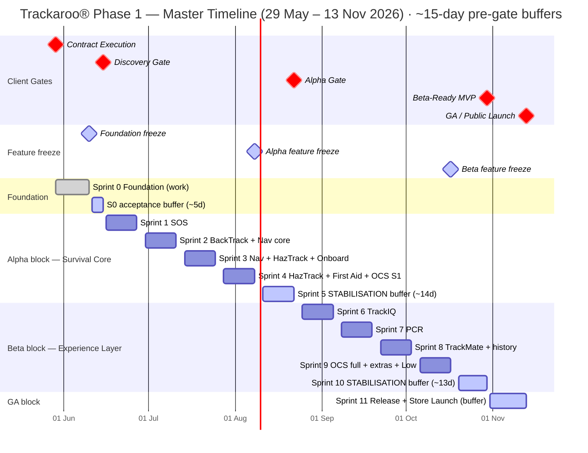

### Sprint → Delivery goal → Client gate

| Sprint | Dates (2026) | Delivery goal | Feature work? | Client gate |
|---|---|---|---|---|
| **Sprint 0** | 29 May – 10 Jun (+5d buffer→15 Jun) | Foundation platform + **9 Compliance Artefacts (D1–D9)** + companion website | Sprint 0 tasks (S0-) | **★ Discovery — 15 Jun** |
| **Sprint 1** | 16 – 27 Jun | SOS & Emergency Logging (safety-critical lead) | ✅ 5 feat | → Alpha |
| **Sprint 2** | 30 Jun – 11 Jul | BackTrack™ + Navigation core | ✅ 6 feat | → Alpha |
| **Sprint 3** | 14 – 25 Jul | Navigation complete + HazTrack™ start + onboarding | ✅ 6 feat | → Alpha |
| **Sprint 4** | 28 Jul – 8 Aug | HazTrack™ complete + First Aid + OCS Stage 1 — **Alpha feature freeze 8 Aug** | ✅ 8 feat | → Alpha |
| **Sprint 5** | 11 – 22 Aug | 🛡️ **STABILISATION buffer** — Survival Core validation · RT-16/RT-12 legal & clinical close · hardening · Alpha gate prep | ⛔ buffer | **★ Alpha — 22 Aug** |
| **Sprint 6** | 25 Aug – 5 Sep | TrackIQ™ track-difficulty intelligence | ✅ 6 feat | → Beta-Ready |
| **Sprint 7** | 8 – 19 Sep | PCR — Point Condition Reports | ✅ 6 feat | → Beta-Ready |
| **Sprint 8** | 22 Sep – 3 Oct | TrackMate™ peer communication + multi-session history | ✅ 6 feat | → Beta-Ready |
| **Sprint 9** | 6 – 17 Oct | OCS full modules + event-log + POI + Low-tier — **Beta feature freeze 17 Oct** | ✅ 8 feat | → Beta-Ready |
| **Sprint 10** | 20 – 30 Oct | 🛡️ **STABILISATION buffer** — 11 TQP validation domains · WCAG 2.1 AA audit · 22 RT clearance · hardening | ⛔ buffer | **★ Beta-Ready — 30 Oct** |
| **Sprint 11** | 31 Oct – 13 Nov | 🛡️ **RELEASE buffer** — regression on frozen RC · App Store / Play submission · GA go/no-go | ⛔ buffer | **★ GA — 13 Nov** |

### Risk-buffer policy

| Gate | Date | Feature freeze | Buffer | Buffer sprint |
|---|---|---|---|---|
| Discovery | 15 Jun | ~10 Jun | ~5 days *(constrained: contract starts 29 May)* | within Sprint 0 |
| Alpha | 22 Aug | **8 Aug** | **14 days** | Sprint 5 |
| Beta-Ready | 30 Oct | **17 Oct** | **13 days** | Sprint 10 |
| GA | 13 Nov | 17 Oct (RC frozen) | RC stable; Sprint 11 = release-only | Sprint 11 |

---

## A2. Sprint-by-sprint execution

### Sprint 0 — Foundation (29 May – 15 Jun) → Discovery Gate

**Deliverable checklist (Discovery Gate 15 Jun):**

| ✓ | Gate deliverable | Composed of (task) | Validated by |
|---|---|---|---|
| ☐ | **D1** High-Level Architecture Diagram | S0-03 | AC-C1-02 |
| ☐ | **D2** Deterministic State Transition Matrix | S0-03 | AC-C1-03 |
| ☐ | **D3** Offline-First Execution Explanation | S0-03 | AC-C1-04 |
| ☐ | **D4** Module Isolation Mapping | S0-03 | AC-C1-05 / AC-C3-02 |
| ☐ | **D5** Breadcrumb Local-Only Classification | S0-03 | AC-C3-03 |
| ☐ | **D6** CAL Architecture Documentation | S0-03 | AC-C4-01 |
| ☐ | **D7** PCR Architecture Documentation | S0-03 | AC-C6-05 |
| ☐ | **D8** SDK Audit Declaration | S0-04 | AC-C2-05 |
| ☐ | **D9** OSS Licence Audit | S0-04 | AC-C2-05 |
| ☐ | Companion website live | S0-07 | AC-C10-01 |
| ☐ | *Internal:* Backlog + delivery plan | S0-01 / S0-02 | (planning ready) |
| ☐ | *Internal:* Design System (Figma) + UX Guide | S0-05 / S0-08 | AC-C7-01..05 |
| ☐ | *Internal:* Eng & DevOps Handbook | S0-06 | AC-C2-01..04 |
| ☐ | *Internal:* Foundation Codebase + CI | S0-09 | AC-C2-01..04 |
| **✅** | **Discovery Gate passed** | All D1–D9 + site accepted by PD | — |

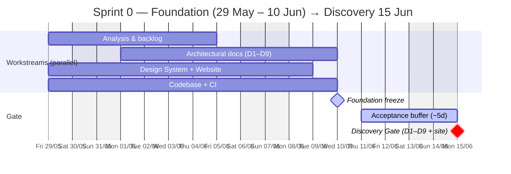

### Sprint 1 — SOS & Emergency Logging (16 – 27 Jun) → Alpha

**Deliverable checklist (towards Alpha 22 Aug):**
| ✓ | Gate deliverable | Composed of (this sprint) |
|---|---|---|
| ☐ | SOS subsystem | FEAT-006 / 007 / 008 / 009 / 010 |
| ☐ | SOS legal-review (RT-16) kickoff | Track 7 Legal — closes in S5 |

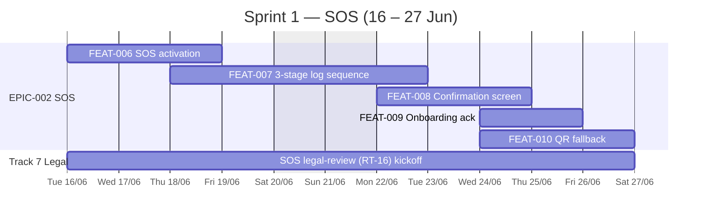

### Sprint 2 — BackTrack™ + Navigation core (30 Jun – 11 Jul) → Alpha

**Deliverable checklist (towards Alpha 22 Aug):**
| ✓ | Gate deliverable | Composed of (this sprint) |
|---|---|---|
| ☐ | BackTrack™ core (capture + immutable write + retrace + distress mode) | FEAT-011 / 012 / 013 / 014 |
| ☐ | Navigation foundation (offline map + location/orientation) | FEAT-001 / 002 |

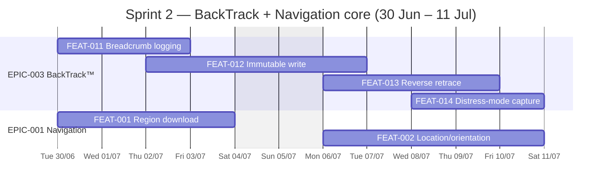

### Sprint 3 — Navigation complete + HazTrack™ start + onboarding (14 – 25 Jul) → Alpha

**Deliverable checklist (towards Alpha 22 Aug):**
| ✓ | Gate deliverable | Composed of (this sprint) |
|---|---|---|
| ☐ | Navigation complete (routing + controls + instrument overlays) | FEAT-003 / 004 / 005 |
| ☐ | HazTrack™ ingestion + overlay rendering | FEAT-017 / 018 |
| ☐ | First-use onboarding flow | FEAT-025 *(pulled from S5)* |

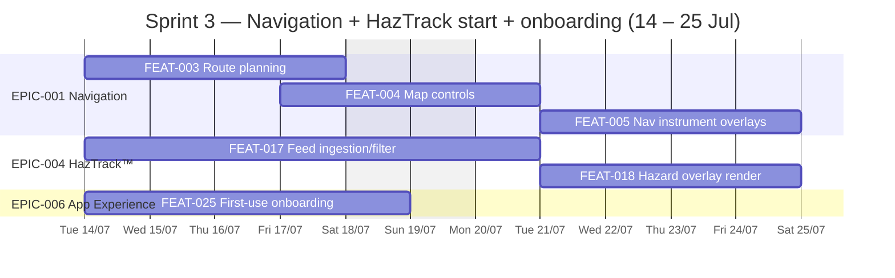

### Sprint 4 — HazTrack™ complete + First Aid + OCS Stage 1 (28 Jul – 8 Aug) → Alpha · **feature freeze 8 Aug**

**Deliverable checklist (towards Alpha 22 Aug · feature freeze 8 Aug):**
| ✓ | Gate deliverable | Composed of (this sprint) |
|---|---|---|
| ☐ | HazTrack™ complete (TTL + attribution + offline cache) | FEAT-019 / 020 / 021 |
| ☐ | First Aid Reference module (content + disclaimer + offline access) | FEAT-022 / 023 / 024 |
| ☐ | OCS Stage 1 (HazTrack admin + break-glass) | FEAT-027 / 028 *(pulled from S5)* |
| ☐ | First Aid clinical review (RT-12) kickoff | Track 7 Legal — closes in S5 |
| **✅** | **Alpha feature freeze (8 Aug)** | All Sprint 1–4 features complete |

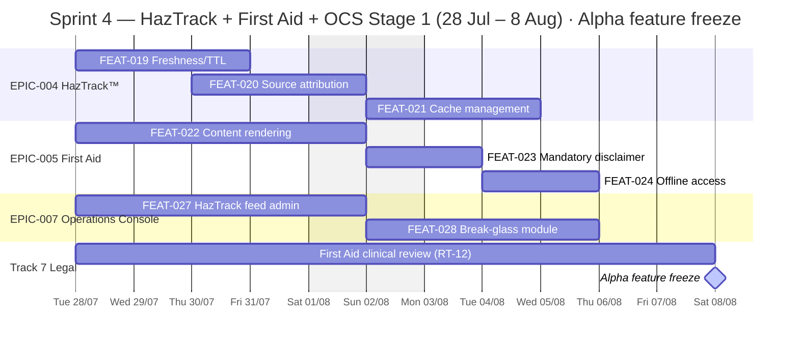

### Sprint 5 — 🛡️ STABILISATION buffer (11 – 22 Aug) → Alpha Gate

**Deliverable checklist (Alpha Gate 22 Aug):**
| ✓ | Gate deliverable | Composed of (this sprint) |
|---|---|---|
| ☐ | Survival Core regression | Full E2E: Nav · SOS · BackTrack™ · HazTrack™ · First Aid · OCS Stage 1 |
| ☐ | RT-16 SOS legal sign-off | Qualified counsel (kicked off in S1) |
| ☐ | RT-12 First Aid clinical sign-off | Clinical reviewer (kicked off in S4) |
| ☐ | Prohibited-capability scan clean | No AI / satellite / Phase 2 triggers detected |
| ☐ | Alpha evidence package | Defect burn-down + signed evidence pack |
| **✅** | **Alpha Gate passed** | All deliverables accepted by PD |

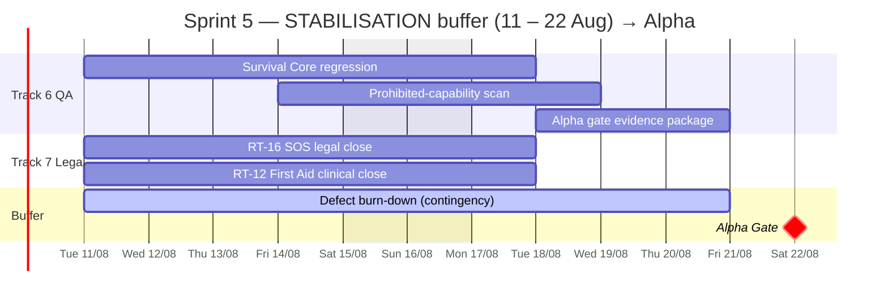

### Sprint 6 — TrackIQ™ Track Difficulty (25 Aug – 5 Sep) → Beta-Ready

**Deliverable checklist (towards Beta-Ready 30 Oct):**
| ✓ | Gate deliverable | Composed of (this sprint) |
|---|---|---|
| ☐ | TrackIQ™ difficulty grading + verification shield + metadata | FEAT-033 / 034 / 035 / 037 |
| ☐ | Stop-detection prompt | FEAT-036 |
| ☐ | HazTrack™ → TrackIQ™ isolation guard (LIR-05) | FEAT-038 |

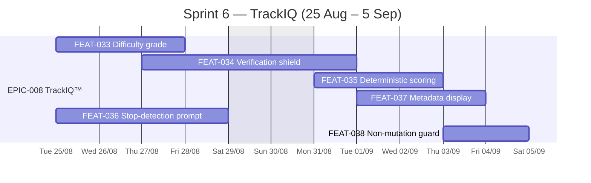

### Sprint 7 — PCR — Point Condition Reports (8 – 19 Sep) → Beta-Ready

**Deliverable checklist (towards Beta-Ready 30 Oct):**
| ✓ | Gate deliverable | Composed of (this sprint) |
|---|---|---|
| ☐ | PCR module (markers + detail + submission + supersession + history) | FEAT-039 / 040 / 041 / 042 / 043 / 044 |

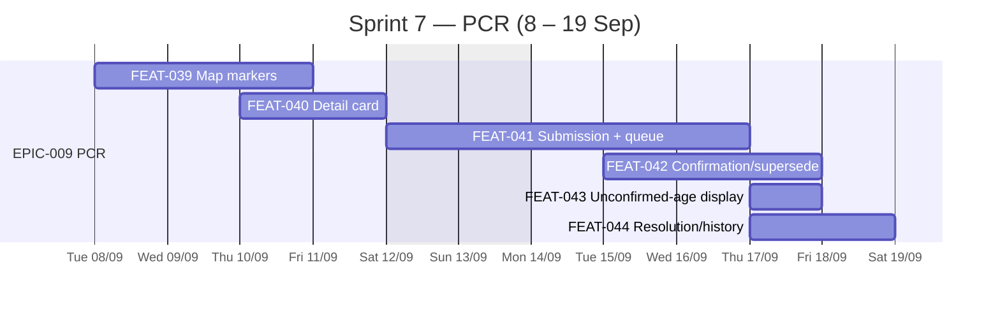

### Sprint 8 — TrackMate™ Peer Communication + history (22 Sep – 3 Oct) → Beta-Ready

**Deliverable checklist (towards Beta-Ready 30 Oct):**
| ✓ | Gate deliverable | Composed of (this sprint) |
|---|---|---|
| ☐ | TrackMate™ peer comms (presence + transport stack + LoRa onboarding + offline queue) | FEAT-045 / 046 / 047 / 049 |
| ☐ | Group Health Envelope (binary indicator) | FEAT-048 |
| ☐ | BackTrack™ multi-session history | FEAT-015 *(pulled from S9)* |

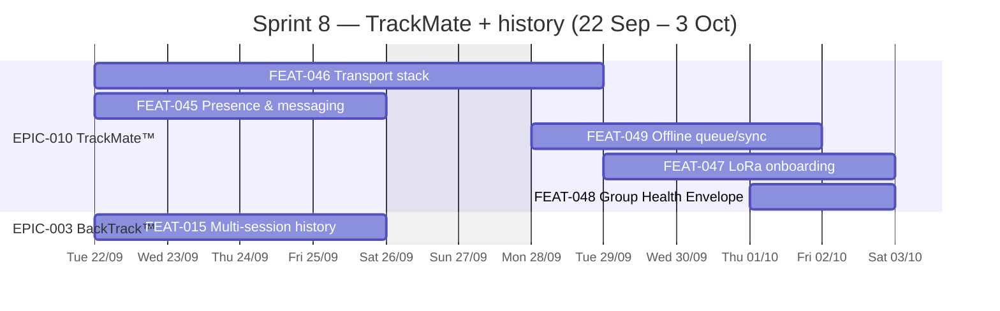

### Sprint 9 — OCS full + event-log + POI + Low-tier (6 – 17 Oct) → Beta-Ready · **feature freeze 17 Oct**

**Deliverable checklist (towards Beta-Ready 30 Oct · feature freeze 17 Oct):**
| ✓ | Gate deliverable | Composed of (this sprint) |
|---|---|---|
| ☐ | OCS full operational (moderation + user mgmt + audit log + analytics/config) | FEAT-029 / 030 / 031 / 032 |
| ☐ | Local event-log viewer | FEAT-026 |
| ☐ | POI module (display + metadata) | FEAT-050 / 051 *(pulled from S10/S11)* |
| ☐ | BackTrack™ export (GPX / CSV) | FEAT-016 *(pulled from S11, Low)* |
| **✅** | **Beta-Ready feature freeze (17 Oct)** | All Sprint 6–9 + pulled Low features complete |

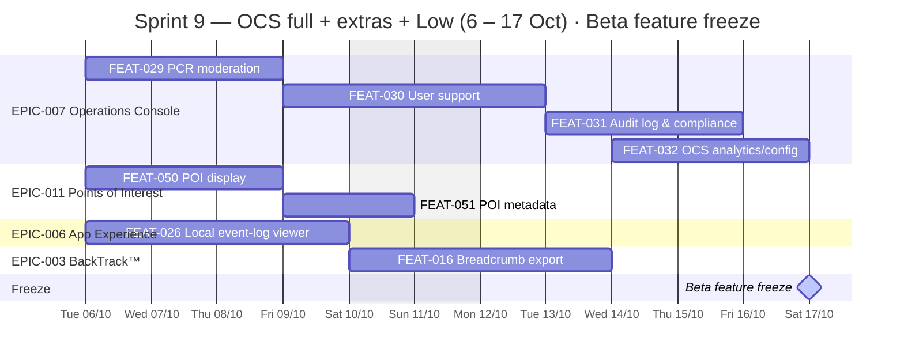

### Sprint 10 — 🛡️ STABILISATION buffer (20 – 30 Oct) → Beta-Ready Gate

**Deliverable checklist (Beta-Ready Gate 30 Oct):**
| ✓ | Gate deliverable | Composed of (this sprint) |
|---|---|---|
| ☐ | 11 TQP-5026 validation domains executed | Full pass on device matrix |
| ☐ | WCAG 2.1 AA audit (RT-11) | Independent audit on feature-complete build |
| ☐ | 22 Rejection Triggers cleared | RT-01..22 all resolved + evidence logged |
| ☐ | Beta-Ready evidence package | Defect burn-down + signed evidence pack |
| **✅** | **Beta-Ready Gate passed** | All deliverables accepted by PD |

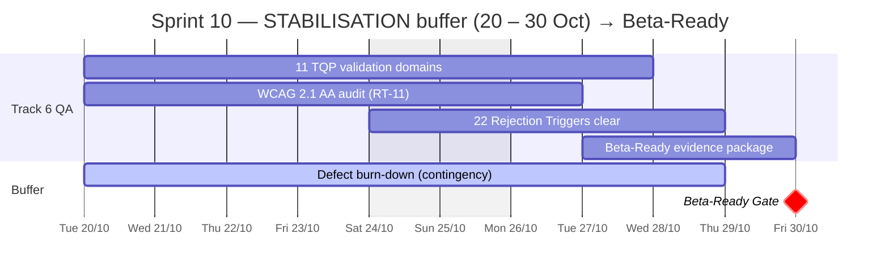

### Sprint 11 — 🛡️ RELEASE buffer (31 Oct – 13 Nov) → GA Gate

**Deliverable checklist (GA Gate 13 Nov):**
| ✓ | Gate deliverable | Composed of (this sprint) |
|---|---|---|
| ☐ | Full regression on frozen RC | All 11 epics E2E on device matrix |
| ☐ | App Store + Google Play submission | Submission package + store review pass-through |
| ☐ | GA go/no-go sign-off | Written Project Director sign-off |
| **✅** | **GA Public Launch (13 Nov)** | All deliverables accepted; launch confirmed |

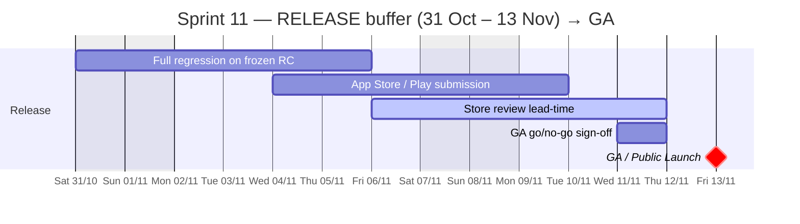

---
---

# PART B — REGISTERS (the consolidated backlog)

## B4. Delivery Gate & Priority

| Priority | Gate | Date | Epics | Sprints |
|---|---|---|---|---|
| **(Foundation)** | Discovery | 15 Jun | — (Sprint 0 tasks S0-, [B2](#b2-sprint-0-foundation-register)) | Sprint 0 |
| **High** | Alpha | 22 Aug | EPIC-001 → EPIC-007 | Sprints 1–5 |
| **Medium** | Beta-Ready | 30 Oct | EPIC-008 → EPIC-011 | Sprints 6–10 |
| **Low** | GA | 13 Nov | (deferrable features, see below) | Sprint 11 |

---
