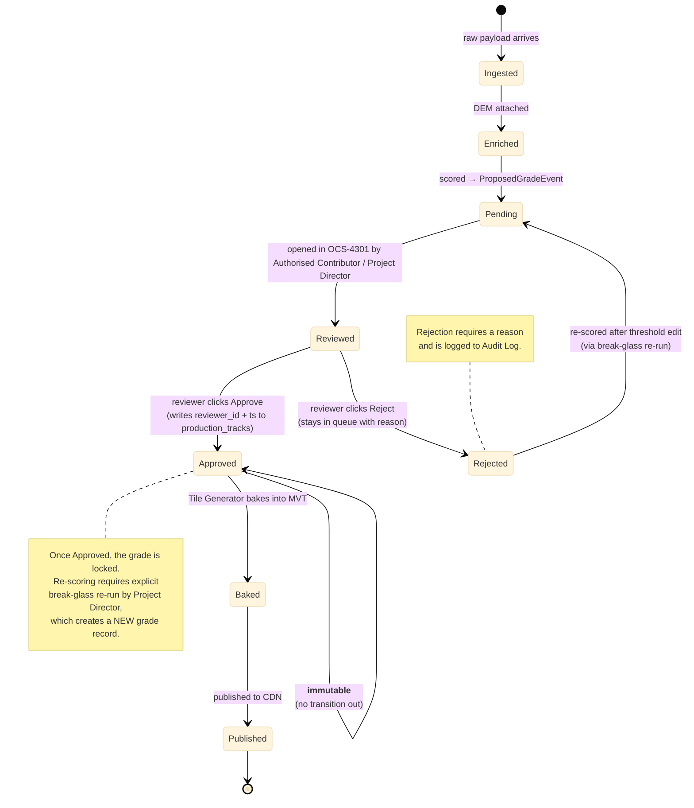

# CBE-5000 · TrackIQ™ Backend Pipeline — Subsystem Deep-Dive

**Tier 2 · C4 Component level.** Zooms into the TrackIQ Backend Pipeline Worker — the deterministic terrain-processing pipeline that converts raw track data into objective difficulty grades.

**Zone in master:** `CBE` (Cloud Backend, purple) — see `../1-overview/trackaroo-phase1-architecture.md`.
**Draw.io twin:** `../1-overview/trackaroo-phase1-architecture.drawio` → page **CBE TrackIQ Detail**

## Architectural pattern

**Pipes & Filters** (decoupled service). Each stage is an isolated filter that consumes from an upstream queue, transforms, and produces to a downstream queue. Filters never call each other directly — coupling is data-only via stores.

| Filter | Pattern variant |
|---|---|
| `CBE-5001` Ingestion Adapter | **Adapter Pattern** — `ITrackIngestAdapter` interface with concrete implementations per vendor format |
| `CBE-5002` DEM Enrichment | Pure transformer — appends metadata, never mutates source geometry |
| `CBE-5003` Scoring | **Pure function** — same input → same output, idempotent · zero side effects |
| `CBE-5004` Tile Generator | Builder — bakes approved grades into MVT/PBF tiles |

**Survival-grade engineering invariants** (all enforced architecturally, not by code review):
- 🚫 No AI / ML / inference of any kind
- 🚫 No telemetry feedback (grades never adjust based on user behavior, speed, visit frequency)
- 🚫 No adaptive logic — thresholds change only when a human edits OCS config
- 🚫 No automated publish — every grade passes through manual approval
- 🚫 HazTrack data cannot mutate grades (compliance isolation)

---

## Pipeline structure

```mermaid
---
config:
  layout: elk
  theme: base
  themeVariables:
    fontFamily: Arial
    fontSize: 13px
---
graph LR

%% ============================================================
%% EXTERNAL INPUTS
%% ============================================================
subgraph EXT_IN["<b>External Inputs</b>"]
    direction TB
    SRC_MAPBOX(["<b>Mapbox</b><br/>vector tiles"])
    SRC_OSM(["<b>OpenStreetMap</b><br/>vector tiles"])
    SRC_GPX(["<b>GPX</b><br/>recordings"])
    SRC_SHP(["<b>Shapefile</b><br/>authority data"])
    SRC_DEM(["<b>AWS Terrain Tiles<br/>SRTM</b><br/>elevation"])
end

%% ============================================================
%% PIPELINE STAGES (Pipes & Filters)
%% ============================================================
subgraph PIPELINE["<b>CBE-5000</b> · TrackIQ Backend Pipeline Worker"]
    direction LR

    subgraph STAGE1["<b>Stage 1 — Ingest</b> · <i>CBE-5001</i>"]
        direction TB
        ADAPTER["<b>Ingestion Adapter</b><br/>ITrackIngestAdapter interface<br/>Vendor-agnostic"]
        subgraph CONCRETE["Concrete adapters"]
            direction TB
            A_MAPBOX["<b>MapboxAdapter</b>"]
            A_OSM["<b>OsmAdapter</b>"]
            A_GPX["<b>GpxAdapter</b>"]
            A_SHP["<b>ShapefileAdapter</b>"]
        end
        ADAPTER --> CONCRETE
        NORM["<b>Normaliser</b><br/>→ TrackSegmentGroup"]
        CONCRETE --> NORM
    end

    subgraph STAGE2["<b>Stage 2 — DEM Enrich</b> · <i>CBE-5002</i>"]
        direction TB
        DEM_ATTACH["<b>DEM tile lookup</b><br/>(bbox-indexed)"]
        SLOPE["<b>Slope calculator</b><br/>Δelev / Δdist<br/>appended as metadata"]
        DEM_ATTACH --> SLOPE
    end

    subgraph STAGE3["<b>Stage 3 — Score</b> · <i>CBE-5003</i>"]
        direction TB
        SCHEMA_SEL["<b>Schema selector</b><br/>Vehicle · Trail · Foot · Snow(stub)"]
        RULE_EVAL["<b>Rule matrix evaluator</b><br/>Pure function · idempotent"]
        HCW["<b>Hardest-Criterion-Wins</b><br/>resolver"]
        SCHEMA_SEL --> RULE_EVAL
        RULE_EVAL --> HCW
    end

    subgraph STAGE4["<b>Stage 4 — Tile Publish</b> · <i>CBE-5004</i>"]
        direction TB
        BAKE["<b>Grade-bake</b><br/>per segment"]
        COMPRESS["<b>MVT / PBF</b><br/>compression"]
        PUB["<b>Publish to CDN</b>"]
        BAKE --> COMPRESS
        COMPRESS --> PUB
    end
end

%% ============================================================
%% DATA STORES (PostgreSQL + PostGIS)
%% ============================================================
subgraph STORES["<b>CBE-6000</b> · Backend Database <i>(PostgreSQL + PostGIS)</i>"]
    direction TB
    RAW[("<b>CBE-6001</b><br/>raw_ingested_tracks")]
    QUEUE[("<b>CBE-6002</b><br/>track_review_queue<br/><i>Pending · Reviewed · Approved · Rejected</i>")]
    PROD[("<b>CBE-6003</b><br/>production_tracks<br/><i>Immutable · reviewer_id + ts</i>")]
end

%% ============================================================
%% DISTRIBUTION
%% ============================================================
subgraph DIST["<b>CBE-7000</b> · Tile Distribution"]
    CDN["<b>CBE-7001</b> · Tile Server / CDN<br/>TrackIQ-baked MVT/PBF · NOT basemap"]
end

%% ============================================================
%% OCS GOVERNANCE (Human-in-the-Loop)
%% ============================================================
subgraph OCS_GOV["<b>OCS-5026</b> · Human-in-the-Loop Governance"]
    direction TB
    TIQ_OPS["<b>OCS-4202</b><br/>TrackIQ Scoring Operations<br/>· Real-time dashboards<br/>· Break-glass re-run<br/>· Threshold config"]
    TDGA["<b>OCS-4301</b><br/>Track Data &amp; Grade Admin<br/>· Authorised Contributor<br/>· Project Director"]
    AUDIT["<b>OCS-4303</b><br/>Audit Log Viewer<br/>· 90-day retention"]
end

%% ============================================================
%% EDGES — DATA FLOWS (purple dotted)
%% ============================================================
    SRC_MAPBOX -.->|"vector tiles"| A_MAPBOX
    SRC_OSM -.->|"vector tiles"| A_OSM
    SRC_GPX -.->|"GPX"| A_GPX
    SRC_SHP -.->|"shapefile"| A_SHP
    SRC_DEM -.->|"elevation tiles"| DEM_ATTACH

    NORM -.->|"<b>TrackSegmentGroup</b>"| RAW
    RAW -.->|"reads raw"| STAGE2
    SLOPE -.->|"<b>EnrichedSegment</b>"| STAGE3
    HCW -.->|"<b>ProposedGradeEvent</b>"| QUEUE
    QUEUE -.->|"approved rows"| PROD
    PROD -.->|"definitive tracks"| BAKE
    PUB -.->|"<b>MVT/PBF tiles</b>"| CDN

%% ============================================================
%% EDGES — GOVERNANCE (solid + verb)
%% ============================================================
    TIQ_OPS -->|"Configures thresholds<br/>(no hardcode)"| RULE_EVAL
    TIQ_OPS -->|"Surfaces stage health<br/>Triggers break-glass re-run"| PIPELINE
    QUEUE -->|"Surfaces pending grades"| TDGA
    TDGA -->|"Approves / rejects<br/>(reviewer_id + ts)"| QUEUE
    QUEUE -->|"Logs every transition"| AUDIT
    AUDIT -->|"Reads (read-only)"| QUEUE

%% ============================================================
%% PROHIBITED PATHS (red dashed)
%% ============================================================
    HAZ_FAKE["<i>(HazTrack data — from OCS HAZADMIN)</i>"] -.->|"<b>[X] PROHIBITED</b><br/>HazTrack isolation:<br/>hazards must NOT mutate grade"| RULE_EVAL
    TELEMETRY_FAKE["<i>(User telemetry / speed / visit count)</i>"] -.->|"<b>[X] PROHIBITED</b><br/>Zero telemetry weighting"| RULE_EVAL

%% ============================================================
%% STYLES
%% ============================================================
    classDef ext fill:#fff3e0,stroke:#e65100,stroke-width:1px,color:#000
    classDef pipe fill:#ffffff,stroke:#5e35b2,stroke-width:1.2px,color:#000
    classDef store fill:#ffffff,stroke:#5e35b2,stroke-width:1.5px,color:#000
    classDef ocs fill:#ffffff,stroke:#00695c,stroke-width:1.2px,color:#000
    classDef fake fill:#fff5f5,stroke:#c62828,stroke-width:1px,stroke-dasharray:3 2,color:#b71c1c

    class SRC_MAPBOX,SRC_OSM,SRC_GPX,SRC_SHP,SRC_DEM ext
    class ADAPTER,A_MAPBOX,A_OSM,A_GPX,A_SHP,NORM,DEM_ATTACH,SLOPE,SCHEMA_SEL,RULE_EVAL,HCW,BAKE,COMPRESS,PUB,CDN pipe
    class RAW,QUEUE,PROD store
    class TIQ_OPS,TDGA,AUDIT ocs
    class HAZ_FAKE,TELEMETRY_FAKE fake

    style EXT_IN fill:#fff3e0,stroke:#e65100,stroke-width:2px,color:#000
    style PIPELINE fill:#d1c4e9,stroke:#5e35b2,stroke-width:2px,color:#000
    style STAGE1 fill:#ede7f6,stroke:#5e35b2,stroke-width:1.5px,color:#000
    style STAGE2 fill:#ede7f6,stroke:#5e35b2,stroke-width:1.5px,color:#000
    style STAGE3 fill:#ede7f6,stroke:#5e35b2,stroke-width:1.5px,color:#000
    style STAGE4 fill:#ede7f6,stroke:#5e35b2,stroke-width:1.5px,color:#000
    style CONCRETE fill:#f5f0fa,stroke:#5e35b2,stroke-width:1px,stroke-dasharray:3 2,color:#000
    style STORES fill:#d1c4e9,stroke:#5e35b2,stroke-width:2px,color:#000
    style DIST fill:#d1c4e9,stroke:#5e35b2,stroke-width:2px,color:#000
    style OCS_GOV fill:#b2dfdb,stroke:#00695c,stroke-width:2px,color:#000
```



---

## Stage detail

### Stage 1 — Ingestion Adapter (`CBE-5001`)

Vendor-agnostic ingestion via the **Adapter Pattern**.

```text
ITrackIngestAdapter
├── ingest(rawPayload: bytes, sourceMeta: VendorMeta) → TrackSegmentGroup
└── supports(format: VendorFormat) → bool

Concrete adapters (Phase 1):
├── MapboxAdapter      — consumes Mapbox vector tile MVT
├── OsmAdapter         — consumes OSM vector tiles
├── GpxAdapter         — consumes XML GPX recordings
└── ShapefileAdapter   — consumes ESRI .shp + .dbf + .prj
```

**Adapter contract:** must output `TrackSegmentGroup` regardless of input. New format support = new adapter implementation, **no changes to downstream pipeline**.

**Output store:** `raw_ingested_tracks` (PostgreSQL) with full source lineage (vendor, version, ingestion_ts).

---

### Stage 2 — DEM Enrichment Engine (`CBE-5002`)

Attaches terrain context to each segment.

| Input | Compute | Output |
|---|---|---|
| `TrackSegmentGroup` from `raw_ingested_tracks` | DEM tile lookup (bbox-indexed against AWS Terrain Tiles / SRTM) | `EnrichedSegment` — same geometry + new fields: `elevation_start`, `elevation_end`, `slope`, `aspect` |

**Slope formula:** `slope = (elev_end - elev_start) / horizontal_distance` (signed — positive ascent, negative descent).

**Invariant:** never mutates source geometry — only appends metadata fields.

---

### Stage 3 — Scoring Engine (`CBE-5003`)

The deterministic core. **Pure function** — same `EnrichedSegment` always produces the same `ProposedGradeEvent`.

#### Schemas (Phase 1)

| Schema | Audience | Sample criteria attributes |
|---|---|---|
| **Vehicle** | 4WD / off-road | slope, surface, width, water_crossing_depth, trail_class |
| **Trail** | Mountain bike / hike | slope, surface, technical_features, river_crossing |
| **Foot** | Walking / hiking | slope, surface, exposure, water_crossing |
| **Snow (stub)** | Phase 1 inert scaffold — schema present but no rules wired | (TBD Phase 2) |

#### Hardest-Criterion-Wins rule

> If a single segment satisfies criteria for **multiple difficulty levels** across different attributes, assign the **highest** (most difficult) rating.

Example: a Vehicle segment has slope=easy + water_crossing=expert → **rated expert**. Never averaged, never softened.

#### Threshold configuration

Thresholds are **not hardcoded**. They live in OCS-managed config and are loaded into the Scoring Engine at runtime.

```text
OCS-4202 (TIQADMIN)
   │
   │ writes thresholds.json
   ▼
config_store (Postgres)
   │
   │ Scoring Engine reads on startup + on config-change event
   ▼
RULE_EVAL applies thresholds during scoring
```

Changing a threshold:
1. Authorised user edits in OCS-4202 dashboard
2. Validation: dry-run against historical sample
3. Write to config_store with reviewer_id + ts
4. Scoring Engine picks up on next config-change event
5. Existing approved grades **not re-scored automatically** — would require explicit re-run via break-glass

---

### Stage 4 — Tile Generator (`CBE-5004`)

Bakes approved grades into vector tiles.

| Step | Output |
|---|---|
| Reads from `production_tracks` (only approved + immutable rows) | — |
| Bakes grade attributes into MVT (Mapbox Vector Tile) format | `.mvt` blob per zoom/x/y |
| Optionally re-compresses to **PBF** (Protocol Buffer Format) | `.pbf` |
| Publishes to `CBE-7001` Tile Server / CDN | tile manifest + assets |

**Tile cost governance** (enforced at this stage + at CDN):
- MVT/PBF compression mandatory (no uncompressed paths)
- Cache versioning so app updates don't trigger re-downloads of unchanged tiles
- Max tile count ceiling per device (vendor-proposed safeguard)

---

## Governance flow — single segment lifecycle



---

## Internal store schemas

### `CBE-6001 raw_ingested_tracks`
| Field | Type | Notes |
|---|---|---|
| `track_id` | UUID | PK |
| `source_vendor` | TEXT | mapbox / osm / gpx / shp |
| `source_version` | TEXT | vendor's version tag |
| `ingested_at` | TIMESTAMP | |
| `geometry` | GEOMETRY (PostGIS) | raw, never mutated |
| `attributes` | JSONB | raw vendor attributes |

### `CBE-6002 track_review_queue`
| Field | Type | Notes |
|---|---|---|
| `proposal_id` | UUID | PK |
| `track_id` | UUID | FK → raw_ingested_tracks |
| `schema` | ENUM | vehicle / trail / foot / snow |
| `proposed_grade` | ENUM | easy / moderate / hard / expert |
| `evidence` | JSONB | which criteria triggered which level |
| `status` | ENUM | pending / reviewed / approved / rejected |
| `reviewer_id` | UUID | NULL until reviewed |
| `reviewed_at` | TIMESTAMP | NULL until reviewed |
| `reject_reason` | TEXT | NULL unless rejected |

### `CBE-6003 production_tracks`
| Field | Type | Notes |
|---|---|---|
| `track_id` | UUID | PK |
| `schema` | ENUM | as above |
| `approved_grade` | ENUM | as above |
| `geometry` | GEOMETRY | from raw + enrichment |
| `reviewer_id` | UUID | non-null |
| `approved_at` | TIMESTAMP | non-null |
| **Constraint:** | | rows are **append-only** — no UPDATE/DELETE permitted in schema |

---

## OCS-side operations (`OCS-4202` + `OCS-4301` + `OCS-4303`)

| Module | Capabilities | Cross-ref |
|---|---|---|
| `OCS-4202` TrackIQ Scoring Operations | Real-time stage dashboards (Ingest · DEM · Score · Tile) · break-glass re-run of individual stage or full pipeline · threshold configuration | See `ocs-operations-console.md` |
| `OCS-4301` Track Data & Grade Admin | Manual approval gateway — Authorised Contributor + Project Director only · approve / reject with mandatory reason · no auto-bypass | See `ocs-operations-console.md` |
| `OCS-4303` Audit Log Viewer | Read-only history of all pipeline runs + grade approvals · 90-day minimum retention · search by reviewer / time / track_id | See `ocs-operations-console.md` |

**Break-glass intervention:** only `Project Director` role can trigger. Triggers a pipeline re-run for a specific stage (or full pipeline) over a specific bbox / track_id set. Every trigger logged.

---

## Compliance constraints (all enforced architecturally)

| Constraint | Source | Where enforced |
|---|---|---|
| No ML / inference in scoring | RT-09 | `RULE_EVAL` is pure function — no model artifacts deployable |
| No telemetry feedback into scoring | RT-09 | No telemetry → SCORE edge exists in any deployment |
| Idempotent scoring | RT-09 | Same input always same output (no PRNG, no time-dependent logic) |
| Scores mutate only via OCS | RT-09 | `production_tracks` is append-only; only OCS-4301 can flip a queue row to Approved |
| HazTrack data cannot mutate scores | Spec — "HazTrack isolation" | No edge from `HAZADMIN` to `SCORE` exists (architecturally forbidden) |
| Configurable thresholds via OCS | Spec — "no hardcode" | Scoring Engine reads thresholds from config_store at runtime — config_store writable only by OCS-4202 |

All of the above are also catalogued in `../4-cross-cutting/compliance-matrix.md`.

---

## Performance / delivery targets

| Target | Value | Spec source |
|---|---|---|
| Alpha-ready date | **22 Aug 2026** | Spec — Staged Delivery |
| Pipeline run idempotency | 100% (re-run produces identical output) | RT-09 |
| Audit log retention | **≥ 90 days** | Spec — Historical Audit |
| Schema set (Phase 1) | Vehicle + Trail + Foot + Snow (stub) | Spec — Scoring Stage |

See `../4-cross-cutting/performance-targets.md` for the full system-wide perf table.

---

## Cross-references

- Master: `../1-overview/trackaroo-phase1-architecture.md` — see `CBE` zone
- Behavioral view: `../3-flows/data-flow/dfd-trackiq-pipeline.md` — runtime data lifecycle
- Sibling subsystems:
  - OCS (governance consumer): `./ocs-operations-console.md`
  - SYN (downstream — receives published grades): `./syn-firestore-sync.md`
  - MOB Survival Core (downstream — consumes baked tiles): `./mob-survival-core.md`
- Cross-cutting:
  - `../4-cross-cutting/compliance-matrix.md` — all PROHIBITED rules
  - `../4-cross-cutting/performance-targets.md` — all numeric SLAs
  - `../4-cross-cutting/tile-lifecycle.md` — full tile journey end-to-end
- Navigation: `../README.md`
