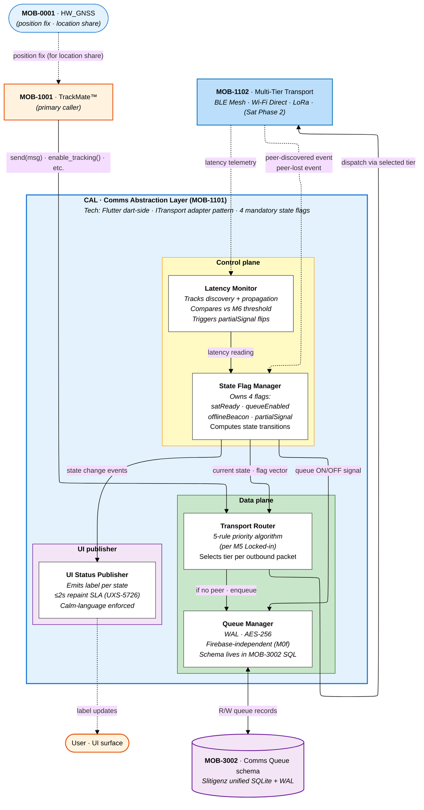

# MOB-1101 · CAL Architectural Diagram

**Visual companion** to `mob-cal-architecture.md` (spec/mandates) and `../3-flows/state/state-cal.md` (state matrix). Combines **component architecture** + **state machine with flag transitions** in one file.

**Spec authorities:** FSD-5126 · ESF-5026 · UXS-5726 · OSM-5026 · design-decisions M5 + M6

---

## 1. Component architecture — what's inside CAL (`MOB-1101`)

CAL is the **abstraction layer** between TrackMate (and other App features needing outbound comms) and the actual transport radios. It hides peer mesh complexity behind a uniform interface.

### Responsibility split

| Component | Owns | Triggers state transitions? |
|---|---|---|
| **State Flag Manager** (SFM) | The 4 flags · state computation · transition logic | ✅ Central authority |
| **Latency Monitor** (LMON) | Discovery + propagation timing · partialSignal flag input | Provides signal · SFM decides |
| **Transport Router** (TR) | 5-rule priority selection per packet | ❌ Read-only on state |
| **Queue Manager** (QMGR) | WAL queue persistence in `MOB-3002` SQL | ❌ Read queueEnabled flag |
| **UI Status Publisher** (SPUB) | Emit label · ≤2s repaint · Visual Calm language | ❌ Read state · output only |

---

## 2. State machine — 5 states with flag transitions

Each state has a fixed **flag vector** (`satReady` · `queueEnabled` · `offlineBeacon` · `partialSignal`). Transitions are deterministic — same trigger always produces same next state.

```mermaid
---
config:
  theme: base
  themeVariables:
    fontFamily: Arial
    fontSize: 12px
---
stateDiagram-v2
    [*] --> AppLaunch

    AppLaunch: <b>S0 · AppLaunch</b><br/>flags = [F,F,F,F]<br/><i>satReady · queueEnabled · offlineBeacon · partialSignal</i>
    Idle: <b>S1 · Idle</b><br/>flags = [F,F,F,F]<br/><i>TrackMate not running</i>
    SessionActive: <b>S2 · SessionActive (transient)</b><br/>flags = [F,T,?,?]<br/><i>queueEnabled flips ON · resolving</i>
    BeaconingFull: <b>S3 · BeaconingFull</b><br/>flags = [F,T,T,F]<br/><i>UI: "Beacon active"</i>
    BeaconingPartial: <b>S4 · BeaconingPartial</b><br/>flags = [F,T,T,T]<br/><i>UI: "Limited Connectivity"</i>
    QueueOnly: <b>S5 · QueueOnly</b><br/>flags = [F,T,F,F]<br/><i>UI: "Queue pending" / "Offline"</i>

    AppLaunch --> Idle: process init complete<br/><i>queueEnabled stays F</i>
    Idle --> SessionActive: user starts TrackMate<br/><i>queueEnabled: F → T</i>

    SessionActive --> BeaconingFull: peer discovered AND<br/>latency &lt; threshold<br/><i>offlineBeacon: ? → T<br/>partialSignal: ? → F</i>
    SessionActive --> BeaconingPartial: peer discovered AND<br/>latency &gt; threshold<br/><i>offlineBeacon: ? → T<br/>partialSignal: ? → T</i>
    SessionActive --> QueueOnly: no peer found within<br/>discovery window<br/><i>offlineBeacon: ? → F<br/>partialSignal: ? → F</i>

    BeaconingFull --> BeaconingPartial: latency exceeds threshold<br/>(debounced)<br/><i>partialSignal: F → T</i>
    BeaconingPartial --> BeaconingFull: latency recovers<br/>(debounced)<br/><i>partialSignal: T → F</i>

    BeaconingFull --> QueueOnly: all peers lost<br/><i>offlineBeacon: T → F</i>
    BeaconingPartial --> QueueOnly: all peers lost<br/><i>offlineBeacon: T → F<br/>partialSignal: T → F</i>

    QueueOnly --> BeaconingFull: new peer in range AND<br/>latency &lt; threshold<br/><i>offlineBeacon: F → T<br/>queue flushes</i>

    BeaconingFull --> Idle: user stops TrackMate<br/><i>queueEnabled: T → F<br/>offlineBeacon: T → F</i>
    BeaconingPartial --> Idle: user stops TrackMate<br/><i>queueEnabled, offlineBeacon, partialSignal → F</i>
    QueueOnly --> Idle: user stops TrackMate<br/><i>queueEnabled: T → F</i>

    note right of AppLaunch
        <b>satReady = FALSE</b>
        in ALL Phase 1 states.
        Static analysis CI gate:
        no satReady=true literal,
        no satellite SDK imports.
    end note

    note right of BeaconingPartial
        <b>UI mandate:</b> "Limited Connectivity"
        only · NO autonomous-recovery
        language (UXS-5726).
        Re-emission throttled.
    end note

    note right of QueueOnly
        <b>Outbound behavior:</b>
        packets persist to WAL queue
        (MOB-3002 SQL · M0f schema).
        Flush on transition back to S3.
    end note
```

---

## 3. Flag transition matrix — what changes per transition

| From → To | Trigger | satReady | queueEnabled | offlineBeacon | partialSignal |
|---|---|---|---|---|---|
| S0 → S1 | Process init complete | F (stays) | F (stays) | F (stays) | F (stays) |
| S1 → S2 | User starts TrackMate | F | F → **T** | F | F |
| S2 → S3 | Peer + low latency | F | T | F → **T** | F |
| S2 → S4 | Peer + high latency | F | T | F → **T** | F → **T** |
| S2 → S5 | No peer found | F | T | F (stays) | F (stays) |
| S3 → S4 | Latency degrades | F | T | T | F → **T** |
| S4 → S3 | Latency recovers (debounced) | F | T | T | T → **F** |
| S3 → S5 | All peers lost | F | T | T → **F** | F |
| S4 → S5 | All peers lost | F | T | T → **F** | T → **F** |
| S5 → S3 | New peer + low latency | F | T | F → **T** | F |
| Any → S1 | User stops session | F | T → **F** | * → **F** | * → **F** |

**Bold** values = flag flipped on this transition. `*` = depends on starting state.

### Invariants (mandatory)

| Invariant | Mechanism |
|---|---|
| `satReady` is `false` in every Phase-1 reachable state | Hardcoded literal · static analysis CI gate (`satReady\s*=\s*true` → 0 matches) |
| `queueEnabled` is `true` iff a TrackMate session is active | Coupling enforced by SFM — flipping queueEnabled is gated by session start/stop only |
| `offlineBeacon` is `true` iff CAL is in S3 or S4 (peer present) | Coupling: SFM flips it on enter/exit of beaconing states |
| `partialSignal` is `true` only in S4 | Coupling: SFM uses LMON readings to gate the flip |
| Transitions are deterministic — same trigger ALWAYS produces same next state | No probabilistic / ML logic in SFM (compliance §13 static analysis) |
| No autonomous-recovery language in UI | UI string lint against prohibited label list (UXS-5726) |

---

## 4. Architectural prohibitions for CAL

Per `compliance-matrix.md`:

- ❌ **CAL → Survival Core imports** (architectural isolation · §13 static-analysis CI gate)
- ❌ **`satReady = true` literal** anywhere in CAL code (§13 + ESF-5026)
- ❌ **Satellite SDK imports** (iridium · inmarsat · globalstar · orbcomm) (§13 + ESF-5026 Phase 2 prohibition)
- ❌ **Direct transport calls outside `ITransport` abstraction** (§13)
- ❌ **AI/ML inference framework imports** in CAL modules (§13 + Deterministic execution mandate)
- ❌ **UI labels implying autonomous recovery** ("Reconnecting…", "Searching for signal…", "Recovery in progress…") (UXS-5726 Visual Calm)

---

## 5. Component-to-state responsibility map

Who triggers each state transition?

| Transition | Triggered by | Mechanism |
|---|---|---|
| S0 → S1 | OS / Flutter framework | App init signal |
| S1 → S2 | TrackMate (User action) | `enable_tracking()` call → SFM flips queueEnabled |
| S2 → S3/S4/S5 | MTT peer-discovery event + LMON latency reading | SFM consumes both signals · routes to appropriate state |
| S3 ↔ S4 | LMON | Latency crosses threshold (debounced per design-decision when set) |
| S3/S4 → S5 | MTT peer-lost event | SFM flips offlineBeacon |
| S5 → S3 | MTT peer-discovered event + LMON OK | SFM flips offlineBeacon · QMGR flushes |
| Any → S1 | TrackMate (User stops session) | Session-stop call → SFM flips queueEnabled |

---

## 6. Open calibration values (vendor input expected)

Per `state-cal.md §7`:

| ID | Parameter | Status |
|---|---|---|
| **M6** | `partialSignal` latency threshold (ms) | 🟡 Provisional · vendor proposes discovery + propagation thresholds |
| **(new)** | Threshold debounce window | 🔴 Not yet captured · prevents UI flicker on S3 ↔ S4 |
| **(new)** | Discovery window for S2 → S5 | 🔴 Not yet captured · max time before forcing QueueOnly |

These don't change the state-machine shape — only numeric trip points within it.

---

## 7. Cross-references

- Spec mandates: `./mob-cal-architecture.md` (transport priority · 4-flag definitions · UI rules · static analysis)
- State matrix (cross-product view): `../3-flows/state/state-cal.md` (state × flag × transport × UI × transitions)
- Parent module: `./mob-application-layer.md` — `MOB-1001 TrackMate` (primary caller)
- Downstream sibling: `MOB-1102 Multi-Tier Transport` (see same file)
- System-wide events: `../3-flows/state/state-trackaroo-transitions.md §6` — `E4 CAL transport switch`
- Compliance: `../4-cross-cutting/compliance-matrix.md` §7 (FA suppression of CAL indicator) · §8 (Visual Calm) · §13 (static-analysis gates)
- Performance SLA: `../4-cross-cutting/performance-targets.md` (UI label transition ≤ 2s)
- Provisional decisions: `../../research/design-decisions.md` — M5 (priority order locked-in) · M6 (threshold provisional)
- Master architecture: `../1-overview/trackaroo-phase1-architecture.md` — see `MOB-1101` cell in `MOB_G2` Comms & Transport sub-zone

---

## 8. Document status

| Field | Value |
|---|---|
| Purpose | **Architectural visual** for CAL — component layout + state machine with flag transitions |
| Scope | 5 internal components · 5 reachable states · 4 mandatory flags · all Phase 1 transitions |
| Outstanding | Numeric calibration (M6 threshold · debounce · discovery window) — not blocking diagram structure |
| Next review trigger | Vendor proposes calibration numbers · OR component split changes (e.g. LMON merges into SFM) · OR state machine semantics change |
