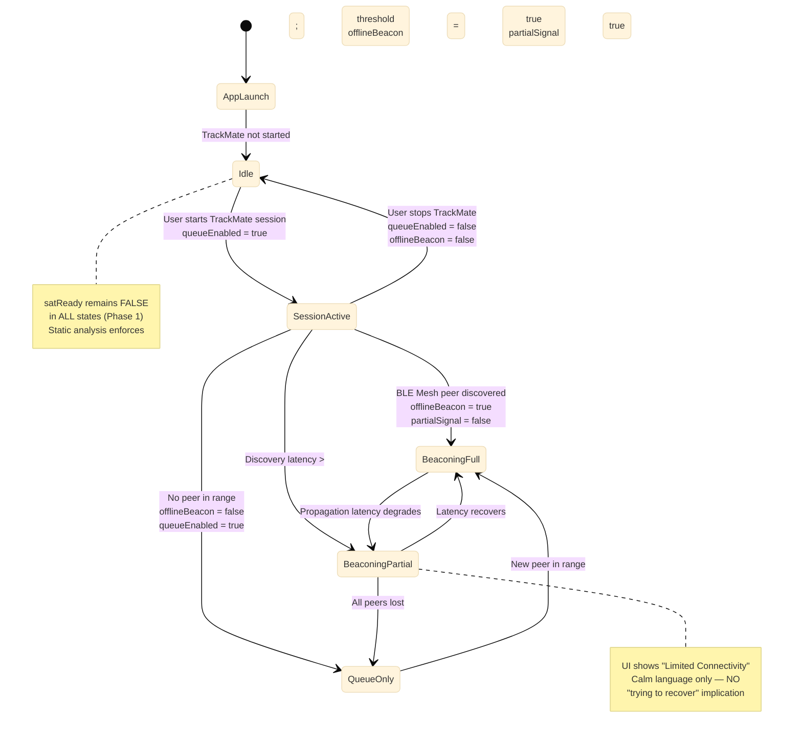
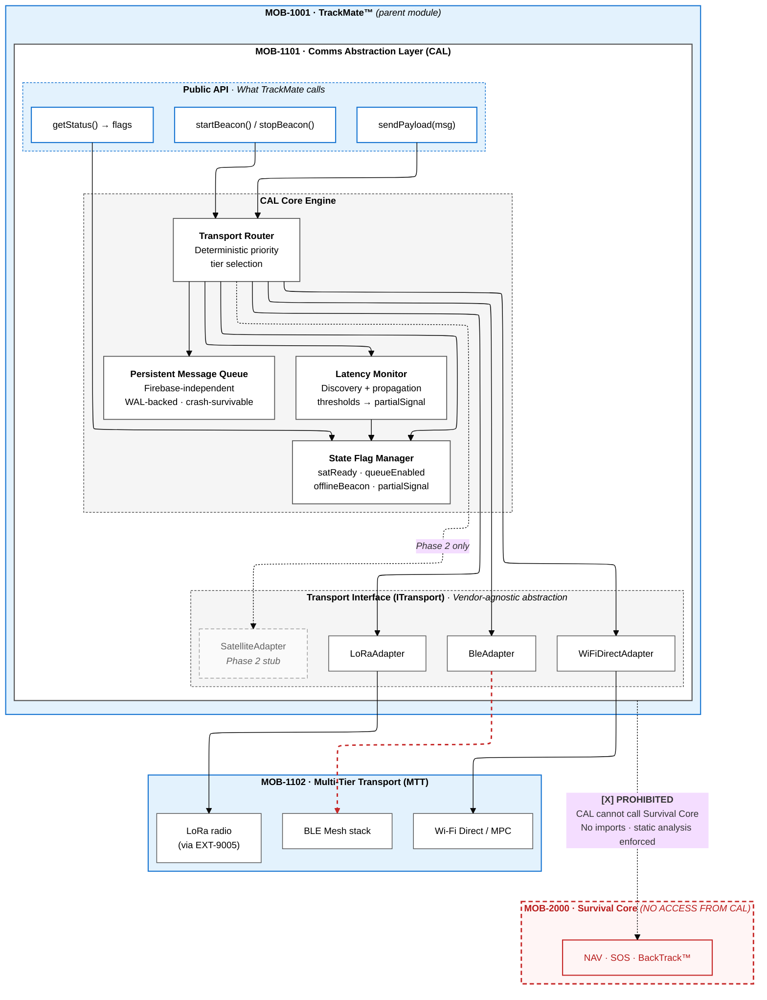
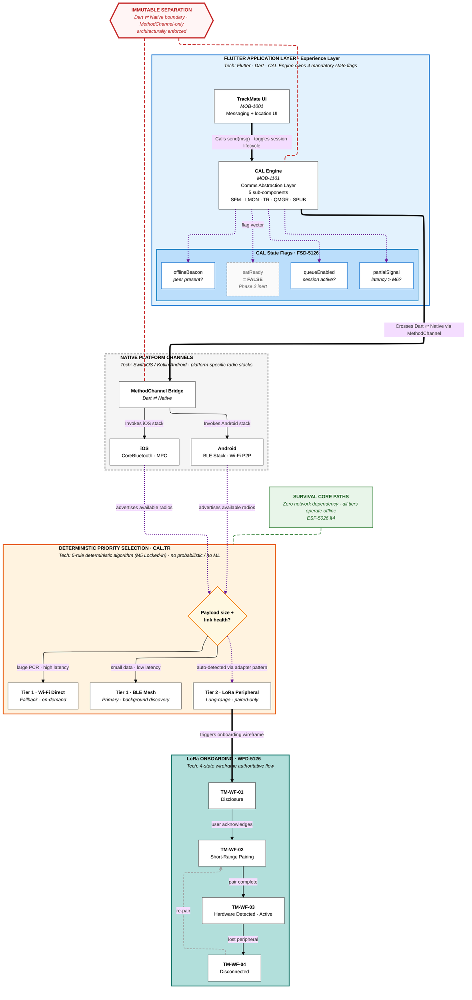

# MOB-1101 · Comms Abstraction Layer (CAL) — Subsystem Deep-Dive

**Tier 2 · C4 Component level.** Specifies the Comms Abstraction Layer — a critical sub-component of the TrackMate™ module (`MOB-1001`) inside the Application Layer (`MOB-1000`). CAL isolates all transport-level complexity from the user **and** — most importantly — from Survival Core execution paths.

**Zone in master:** `MOB_APP / MOB_G2` (Mobile · Application Layer · Comms & Transport · blue)
**Parent module:** TrackMate™ (`MOB-1001`)
**Sibling component:** `MOB-1102` Multi-Tier Transport (MTT) — CAL's downstream
**Draw.io twin:** `../1-overview/trackaroo-phase1-architecture.drawio` → page **CAL Architecture**
**Proposal deliverable #4** — Discovery Gate artifact

---

## 1. Core architectural mandates

| Mandate | Requirement | Enforcement |
|---|---|---|
| **Zero Survival Core interference** | No CAL operation may introduce a network dependency into any Survival Core path (NAV · SOS · BackTrack™) | Static analysis · architectural prohibition · no API surface from CAL into `MOB_CORE` |
| **Transport agnosticism** | CAL must abstract all transports (BLE Mesh · Wi-Fi Direct/MPC · LoRa · future Satellite) behind a unified interface | `ITransport` interface · CAL never references concrete transports directly |
| **Deterministic priority logic** | CAL must internally manage transport priority + selection transparently · no manual user intervention | Hardcoded priority matrix · no user-facing transport picker |
| **Phase 2 readiness** | Architecture must accommodate future **Satellite Relay (Tier 3)** without structural rework | `satReady` flag scaffold present · `ITransport` interface accepts new implementation without changes to CAL contract |

---

## 2. Transport priority tiers

CAL selects transport using a deterministic priority order. Higher tier = preferred. Selection happens transparently — no user prompt.

| Tier | Transport | Status (Phase 1) | Range | Use case |
|---|---|---|---|---|
| **Tier 1 (primary)** | **BLE Mesh** | ✅ Active | ~30-100m | Default for nearby peer comms; lowest latency |
| **Tier 1 (fallback)** | **Wi-Fi Direct / MPC** | ✅ Active | ~50-200m | Higher bandwidth fallback when BLE Mesh saturated or unavailable |
| **Tier 2** | **LoRa** | ✅ Active (paired peripherals only) | ~1-15 km | Long-range when peer outside BLE/Wi-Fi range; requires `EXT-9005` LoRa peripheral |
| **Tier 3** 🔵 | **Satellite Relay** | 🔵 **Phase 2 only — inert scaffold** | Global | Future capability; `satReady` flag hardcoded `false` in Phase 1 |

**Selection rule (deterministic):**
```text
For each outbound payload:
   1. If satReady == true  AND  satellite peer in range  →  Tier 3   (PHASE 2 ONLY)
   2. If BLE Mesh peer in range                          →  Tier 1 primary
   3. If Wi-Fi Direct peer in range                      →  Tier 1 fallback
   4. If LoRa peripheral paired AND peer in range        →  Tier 2
   5. Else                                               →  queue (persisted) + offline beacon
```

No probabilistic / adaptive / telemetry-weighted selection. Same inputs always produce the same transport choice.

---

## 3. Mandatory state flags

CAL must implement and test **four boolean state flags**. Each governs system behavior + UI feedback.

| Flag | Phase 1 value | Active condition | Triggers UI state | Notes |
|---|---|---|---|---|
| **`satReady`** | **Hardcoded `false`** 🔵 | (never — Phase 2 only) | (none in Phase 1) | **Inert scaffold.** Schema field exists but must not be reachable / triggerable. No satellite SDK in codebase. Static analysis enforces |
| **`queueEnabled`** | dynamic | TrackMate™ session active AND persistent message queue operational | (no UI change — internal state) | Indicates Firebase-independent queue accepts outbound payloads |
| **`offlineBeacon`** | dynamic | BLE Mesh stack actively broadcasting presence data via available offline transport | "Beacon active" indicator | Confirms peer-discoverability without cellular |
| **`partialSignal`** | dynamic | Discovery OR propagation latency exceeds calibrated thresholds (intermittent connectivity) | "**Limited Connectivity**" UI indicator | Triggered when comms degraded but not zero |

### Flag interactions



---

## 4. UI & interaction requirements

| Requirement | Spec value |
|---|---|
| **Persistence** | CAL status indicator MUST be persistently visible in the primary navigation view (no dismiss / no hide) |
| **Response time** | Any change in connectivity state (e.g. transition into `partialSignal`) MUST update the UI indicator within **≤ 2 seconds** |
| **Language posture** | Calm, non-alarming text. MUST NOT imply that any automated recovery or escalation action is pending |
| **Accepted labels** | "Beacon active" · "Limited Connectivity" · "Queue pending" · "Offline" |
| **PROHIBITED labels** | "Reconnecting…" · "Searching for signal…" · "Trying satellite…" · "Recovery in progress…" · anything implying autonomous action |

**Rationale for language posture:** users facing emergencies are calmer if comms status is presented as **state** ("you are offline") rather than as **action-in-progress** ("trying to reconnect"). The latter creates false expectation of automated rescue.

---

## 5. CAL component architecture



---

## 6. Transport Stack — Flutter ⇄ Native ⇄ Radios + LoRa Onboarding

Complementary view to §5 (CAL Component Architecture). §5 looks at CAL's **internal** 5-component structure (SFM · LMON · TR · QMGR · SPUB). This section looks at the **vertical transport stack** — how a `send(msg)` call travels from Dart down through the MethodChannel boundary into native radio stacks, and how CAL's Transport Router makes its tier selection. It also surfaces the **4 WFD-5126 LoRa onboarding states** (referenced in Scenario 2 evaluator probe E.2 — see `../../research/scenario-responses.md`).

**Draw.io twin:** `./mob-cal-transport-stack.drawio` (single-page, master-architecture style).



### How to read this view

| Zone | Purpose | Boundary it respects |
|---|---|---|
| **Flutter Application Layer** (blue) | Dart-side CAL Engine + 4 mandatory state flags. CAL never references concrete transports — only the `ITransport` abstraction. | Survival Core wall (`compliance-matrix.md §5`) — CAL cannot import from `mob_core` |
| **Native Platform Channels** (grey dashed) | Swift/Kotlin side. MethodChannel Bridge is the **only** path between Dart and platform radio stacks. | Dart ⇄ Native immutable separation (red dashed marker) |
| **Deterministic Priority Selection · CAL.TR** (peach) | The 5-rule priority algorithm — `M5` Locked-in. Selection is pure integer/bucket arithmetic; same inputs → same tier. | `RT-03` (no AI / probabilistic) · `M0a` deterministic execution mandate |
| **LoRa Onboarding · WFD-5126** (teal) | The 4 wireframe states triggered when a LoRa peripheral is connected mid-session. Authoritative copy + visual treatment derive from `WFD-5126`. | Evaluator probe E.2 in `scenario-responses.md` requires all 4 states present |

### Edge semantics in this view

| Edge style | Meaning |
|---|---|
| Solid + verb label | Operational / control relationship (`TM → CAL`, `BRIDGE → ANDROID`, `ROUTER → BLE`) |
| Purple dotted + noun label | Data payload flow (`CAL → flag`, `ANDROID → ROUTER` "advertises available radios") |
| Grey dashed | Phase 2 inert OR retry path (`WF04 → WF02 re-pair`) |
| Red dashed hexagon marker | Architectural separation boundary (Dart ⇄ Native) — not an edge, a marker |
| Green note | Cross-cutting mandate (offline-first paths · ESF-5026 §4) |

---

## 7. Validation & evidence obligations (Discovery Gate)

Vendors must provide the following at Discovery Gate. This file IS one of the deliverables; the other two reference it.

| Evidence | Source | Reference |
|---|---|---|
| **CAL Architecture Documentation** | This file | `mob-cal-architecture.md` (you are here) |
| **Module Isolation Mapping** | Low-level dependency graph proving Experience Layer (where CAL resides) cannot mutate / block Survival Core | `../4-cross-cutting/module-isolation-mapping.md` (TBD — to be extracted from `state-trackaroo-transitions.md §7`) |
| **Static analysis evidence** | CI pipeline scan confirming:<br/>1. `satReady` flag remains `false`<br/>2. No prohibited satellite-specific field names exist in codebase<br/>3. No satellite SDKs imported<br/>4. CAL has no import of Survival Core packages | Vendor build pipeline output |

### Static analysis scan checklist

| Check | Match pattern | Expected result |
|---|---|---|
| `satReady` literal `true` | `satReady\s*=\s*true` | **0 matches** |
| Satellite SDK imports | `import.*(iridium\|inmarsat\|globalstar\|orbcomm)` | **0 matches** |
| Satellite-specific field names | `(satelliteHandle\|iridiumSession\|inmarsatPeer)` | **0 matches** |
| CAL → Survival Core imports | `from mob_core.*` (or equivalent) inside any CAL module | **0 matches** |
| Transport-specific calls outside `ITransport` abstraction | Direct `ble.*` / `wifi.*` / `lora.*` outside `T_BLE/T_WIFI/T_LORA` adapters | **0 matches** |

---

## 8. Cross-references

- Master: `../1-overview/trackaroo-phase1-architecture.md` — see `MOB-1101` in `MOB_G2` (Comms & Transport)
- Parent module: TrackMate™ (`MOB-1001`) — see `./mob-application-layer.md`
- Downstream sibling: Multi-Tier Transport (`MOB-1102`) — see `./mob-application-layer.md`
- Survival Core boundary: `./mob-survival-core.md` — explicit non-target of CAL
- **State matrix (runtime view): `../3-flows/state/state-cal.md`** — explicit `(state × flags × transport × UI × transitions)` matrix consolidating §2/§3/§4 of this doc
- System-wide state map: `../3-flows/state/state-trackaroo-transitions.md` — see §7 Inter-Layer Isolation Map
- Compliance: `../4-cross-cutting/compliance-matrix.md` — entries for `satReady` inertness, CAL→Core prohibition
- Navigation: `../README.md`

## 9. Document status

| Field | Value |
|---|---|
| Document purpose | Proposal stage · Discovery Gate Deliverable #4 |
| Spec coverage | Core mandates · 4 flags · UI rules · validation obligations · static analysis checklist |
| Outstanding | Calibrated threshold values for `partialSignal` trigger (latency ms) — vendor to propose |
| Next review trigger | Vendor proposal received → reconcile threshold values + add measurement methodology |
