```mermaid
---
config:
  layout: elk
  theme: base
  themeVariables:
    fontFamily: Arial
    fontSize: 13px
---
graph TB

%% ============================================================
%% EXTERNAL ENTITIES (actors / hardware / pre-journey / background sync)
%% ============================================================
subgraph EXT_ENTITIES["<b>External Entities</b>"]
    direction LR
    USER(["<b>User</b><br/><i>Mobile app operator</i>"])
    GNSS(["<b>GNSS Sensor</b><br/><i>MOB-0001 · on-device hardware</i>"])
    CDN_PRE(["<b>Tile CDN</b> <i>(pre-journey only)</i><br/><i>Baked TrackIQ tiles + manifest</i>"])
    MAPBOX_PRE(["<b>Mapbox / OSM</b> <i>(pre-journey only)</i><br/><i>Vector basemap tiles</i>"])
    FB_SYNC(["<b>Firebase</b> <i>(background sync)</i><br/><i>Hazard cache refill — TTL-bounded</i>"])
end

%% ============================================================
%% SURVIVAL CORE PROCESSES (numbered Yourdon-style)
%% ============================================================
subgraph SC_PROCESSES["<b>Survival Core Processes</b> · <i>100% offline-first · deterministic</i>"]
    direction TB

    NAV(("<b>1.0</b><br/>Offline Navigation<br/>Engine"))
    BT(("<b>2.0</b><br/>BackTrack™<br/>Engine"))
    HT(("<b>3.0</b><br/>HazTrack™<br/>Renderer"))
    SOS(("<b>4.0</b><br/>SOS Emergency<br/>Logger"))
    EVT(("<b>5.0</b><br/>Local Event<br/>Logger"))
    SAP(("<b>6.0</b><br/>Safe Anchor<br/>Manager"))
    BUNDLE(("<b>7.0</b><br/>Map Bundle<br/>Download Manager"))
end

%% ============================================================
%% LOCAL DATA STORES
%% ============================================================
subgraph SC_STORES["<b>Local Data Stores</b> · <i>D1 = Mapbox SDK native · D2–D6 = Slitigenz unified SQLite + WAL · AES-256</i>"]
    direction LR
    D1[("<b>D1</b><br/>map_tile_cache<br/><i>MOB-3004 · MBTiles</i>")]
    D2[("<b>D2</b><br/>breadcrumb_log<br/>+ nav_session<br/><i>MOB-3002 schema</i>")]
    D3[("<b>D3</b><br/>hazard_cache<br/><i>MOB-3005 · FB ingress</i>")]
    D4[("<b>D4</b><br/>sos_log<br/><i>MOB-3002 · immutable</i>")]
    D5[("<b>D5</b><br/>event_log<br/><i>MOB-3002 · ≥30 days</i>")]
    D6[("<b>D6</b><br/>anchor_points<br/><i>MOB-3002 schema</i>")]
end

%% ============================================================
%% PRE-JOURNEY FLOWS (one-time downloads — BUNDLE process)
%% ============================================================
    USER -->|"<b>TRIGGER:</b> select bbox/polygon<br/>+ start download"| BUNDLE
    MAPBOX_PRE -.->|"<b>basemap vector tiles</b>"| BUNDLE
    CDN_PRE -.->|"<b>baked TrackIQ tiles + manifest</b>"| BUNDLE
    BUNDLE -->|"writes bundles<br/>(resumable · integrity-validated)"| D1

%% ============================================================
%% BACKGROUND SYNC — HazTrack cache refill (NOT a Core process)
%% ============================================================
    FB_SYNC -.->|"<b>hazard records</b><br/><i>(TTL-bounded refresh)</i>"| D3

%% ============================================================
%% USER TRIGGERS — RUNTIME
%% ============================================================
    USER -->|"<b>TRIGGER:</b> route_request(dest)<br/>search_query(text)"| NAV
    USER -->|"<b>TRIGGER:</b> enable_tracking()"| BT
    USER -->|"<b>TRIGGER:</b> distress_tap (≤2 taps)"| SOS
    USER -->|"<b>TRIGGER:</b> create_anchor / edit / navigate_to"| SAP

%% ============================================================
%% GNSS TRIGGERS — continuous position fixes
%% ============================================================
    GNSS -.->|"<b>TRIGGER:</b> position_fix<br/>(lat, lon, accuracy, ts)<br/><i>deterministic only · no network/DR</i>"| NAV
    GNSS -.->|"<b>TRIGGER:</b> position_fix<br/><i>dual-trigger when tracking active</i>"| BT
    GNSS -.->|"<b>position_fix</b><br/><i>(snapshot at SOS tap)</i>"| SOS

%% ============================================================
%% NAV — runtime reads/writes
%% ============================================================
    NAV <-->|"reads tiles by bbox<br/>(read-only at runtime)"| D1
    NAV -->|"reads anchor catalogue<br/>(local search source)"| D6
    NAV -->|"writes nav_session · route_state<br/><b>[LOCAL-ONLY · AES-256 · WAL]</b>"| D2
    NAV -.->|"<b>rendered_map · current_route</b>"| USER
    NAV -.->|"<b>current_route</b>"| BT
    NAV -.->|"<b>current_route geometry</b>"| HT
    NAV -.->|"<b>current_position</b>"| SAP

%% ============================================================
%% BACKTRACK — breadcrumb capture
%% ============================================================
    BT -->|"writes breadcrumb coords<br/>(append-only · WAL)"| D2
    BT -.->|"<b>reverse_path</b><br/><i>(on user request)</i>"| USER

%% ============================================================
%% HAZTRACK — TRIGGER on cache update OR route geometry change
%% ============================================================
    HT -->|"reads hazard overlays"| D3
    HT -.->|"<b>TRIGGER:</b> hazard_intersect_alert<br/>(→ NAV NOTIFIED state)"| NAV
    HT -.->|"<b>hazard_overlay</b><br/><i>(renders on NAV map)</i>"| NAV

%% ============================================================
%% SOS — immutable distress record
%% ============================================================
    SOS -->|"writes distress_record<br/>(IMMUTABLE · forever retention)"| D4
    SOS -.->|"<b>distress_confirmation + QR fallback</b>"| USER

%% ============================================================
%% SAFE ANCHOR — R/W markers
%% ============================================================
    SAP <-->|"R/W anchor markers"| D6
    SAP -.->|"<b>navigation_request</b>"| NAV

%% ============================================================
%% EVENT LOG — sink for all sibling system_event emissions
%% ============================================================
    NAV -.->|"<b>system_event</b>"| EVT
    BT -.->|"<b>system_event</b>"| EVT
    HT -.->|"<b>system_event</b>"| EVT
    SOS -.->|"<b>system_event</b>"| EVT
    SAP -.->|"<b>system_event</b>"| EVT
    BUNDLE -.->|"<b>system_event</b>"| EVT
    EVT -->|"writes event_records<br/>(crash-survivable)"| D5

%% ============================================================
%% PROHIBITED PATHS (red dashed)
%% ============================================================
    NAV -.->|"<b>[X] PROHIBITED</b><br/>No runtime network · No external geocoding<br/>No cloud rerouting (RT-02)"| CDN_PRE
    BT  -.->|"<b>[X] PROHIBITED</b><br/>No cloud sync of breadcrumb data<br/>(Firebase Independence · RT-05)"| FB_SYNC

%% ============================================================
%% STYLES
%% ============================================================
    classDef entity fill:#fff3e0,stroke:#e65100,stroke-width:1.5px,color:#000
    classDef preJourney fill:#ffe0b2,stroke:#e65100,stroke-width:1px,stroke-dasharray:5 3,color:#616161
    classDef backgroundSync fill:#fff9c4,stroke:#f9a825,stroke-width:1px,stroke-dasharray:5 3,color:#616161
    classDef process fill:#c8e6c9,stroke:#2e7d32,stroke-width:1.5px,color:#000
    classDef store fill:#f3e5f5,stroke:#6a1b9a,stroke-width:1.5px,color:#000
    classDef storeMapbox fill:#e3f2fd,stroke:#1976d2,stroke-width:1.5px,color:#000

    class USER,GNSS entity
    class CDN_PRE,MAPBOX_PRE preJourney
    class FB_SYNC backgroundSync
    class NAV,BT,HT,SOS,EVT,SAP,BUNDLE process
    class D2,D3,D4,D5,D6 store
    class D1 storeMapbox

    style EXT_ENTITIES fill:#fff8e7,stroke:#e65100,stroke-width:1.5px,color:#000
    style SC_PROCESSES fill:#e8f5e9,stroke:#2e7d32,stroke-width:2px,color:#000
    style SC_STORES fill:#f3e5f5,stroke:#6a1b9a,stroke-width:1.5px,color:#000

%% Red prohibited edges (last 2 in declaration order — indices 35, 36)
    linkStyle 35 stroke:#c62828,stroke-width:2px,stroke-dasharray:5 5
    linkStyle 36 stroke:#c62828,stroke-width:2px,stroke-dasharray:5 5
```

# Data Flow Diagram — Survival Core (MOB-2000)

**Purpose:** Map data lifecycle inside the Survival Core layer of the mobile app. Shows external sources/sinks, internal processes, **triggers** that initiate each process, and the local data stores read/written.

**Scope:** All 7 Survival Core processes (NAV · BT · HT · SOS · EVT · SAP · BUNDLE) + the 6 local data stores they read/write.

**Notation (Yourdon-style):**
- `([Entity])` = external entity (actor / sensor / pre-journey source / background sync)
- `((Process))` = Survival Core process (numbered)
- `[(Store)]` = local data store
- **`TRIGGER:`** prefix on edge label = event that initiates the destination process
- `-->` solid = control / R-W operation (verb label)
- `-.->` dashed-dotted = data payload (noun label)
- `<-->` bidirectional = R/W relationship

**Storage-tech mapping** (per design-decisions M0e + M0g + M0i):

| DFD store | Logical name | Physical home | Tech |
|---|---|---|---|
| `D1` | `map_tile_cache` | **MOB-3004** standalone | Mapbox SDK native (MBTiles / vector tiles) — NOT SQLite |
| `D2` | `breadcrumb_log` + `nav_session` | **MOB-3002** schema | Slitigenz unified SQLite + WAL · AES-256 |
| `D3` | `hazard_cache` | **MOB-3005** schema | Slitigenz unified SQLite + WAL · Firebase ingress allowed |
| `D4` | `sos_log` | **MOB-3002** schema | Slitigenz unified SQLite + WAL · immutable |
| `D5` | `event_log` | **MOB-3002** schema | Slitigenz unified SQLite + WAL |
| `D6` | `anchor_points` | **MOB-3002** schema | Slitigenz unified SQLite + WAL |

**Compliance:** All runtime flows happen **on-device**; external entities (CDN / Mapbox / Firebase) only appear on **pre-journey** or **background-sync** edges — never on runtime data paths.

---

---

## Process catalogue — Trigger · Inputs · Outputs · Stores

| # | Process | TRIGGER (what initiates execution) | Inputs (data read) | Outputs (data written / emitted) | Stores |
|---|---|---|---|---|---|
| **1.0** | **NAV** — Offline Navigation Engine | (a) user `route_request` / `search_query` (b) map screen entry (warm-up) (c) destination change (d) HT `hazard_intersect_alert` → NOTIFIED transition | `position_fix` (GNSS); vector tiles (`D1`); anchors (`D6`); hazard overlay + intersect alert (HT) | `rendered_map`, `current_route` → User `current_route` → BT/HT `current_position` → SAP/SOS `nav_session` / `route_state` → `D2` `system_event` → EVT | R: `D1` · `D6` W: `D2` |
| **2.0** | **BT** — BackTrack™ Engine | **Dual-trigger** per BTF-5126: (a) user `enable_tracking()` (b) `position_fix` arrives WHILE tracking active (c) Distress lock from SOS → cannot revert within session | `position_fix` (GNSS); `current_route` (NAV); tracking state | `reverse_path` → User (on request) breadcrumb coords → `D2` `system_event` → EVT | W: `D2` (append-only) |
| **3.0** | **HT** — HazTrack™ Renderer | (a) `D3` cache update (background sync) (b) NAV `current_route` geometry change → intersect check | hazard records (`D3`); `current_route` geometry (NAV) | `hazard_overlay` → NAV (renders on map) `hazard_intersect_alert` → NAV (triggers NOTIFIED) `system_event` → EVT | R: `D3` |
| **4.0** | **SOS** — Emergency Logger | user `distress_tap` (≤2 taps from any screen state per ESF-5026) | `distress_tap`; `position_fix`; nav context (optional) | `distress_confirmation` + QR fallback → User `distress_record` → `D4` (immutable) `system_event` → EVT | W: `D4` (immutable · forever) |
| **5.0** | **EVT** — Local Event Logger | any sibling emits `system_event` | `system_event` payload (from 6 other Core processes) | event records → `D5` | W: `D5` (≥30-day retention) |
| **6.0** | **SAP** — Safe Anchor Manager | (a) user `create_anchor` / `edit_anchor` (b) user `navigate_to_anchor` (c) NAV anchor catalogue query | anchor request; `position_fix` (for create); anchor records (`D6`) | `navigation_request` → NAV anchor records → `D6` `system_event` → EVT | R/W: `D6` |
| **7.0** | **BUNDLE** — Map Bundle Download Manager | user initiates download with bbox/polygon selection · **PRE-JOURNEY ONLY** | bbox/polygon spec; tile data from MAPBOX_PRE + CDN_PRE; resumable progress state | tile bundles → `D1` integrity_validation_result → User "offline-ready" gate signal `system_event` → EVT | W: `D1` |

## Trigger inventory — what causes Survival Core to run

| Trigger source | Type | Affected processes | Notes |
|---|---|---|---|
| **User tap / gesture** | discrete | NAV · BT · SOS · SAP · BUNDLE | Includes ≤2-tap mandate for SOS per ESF-5026 |
| **GNSS `position_fix`** | continuous (every N seconds) | NAV · BT (dual-trigger when tracking) · SOS (snapshot on tap) | Deterministic only — no network/DR fallback |
| **Sibling Core `system_event`** | event-driven | EVT (sink) | All 6 others emit; EVT writes to `D5` |
| **HazTrack intersect detection** | geometric (NAV route × `D3` hazard polygon) | NAV (→ NOTIFIED state) | Intersect logic runs in HT; alert pushes to NAV |
| **Firebase background sync** | scheduled (TTL refresh) | `D3` (write only — NOT a Core process) | Compliance exception per matrix §7 (cache ingress allowed; runtime queries hit `D3` locally) |
| **App lifecycle (cold launch / foreground)** | OS event | NAV (warm-up) · EVT (boot event) | Cold-launch perf per PT-NAV-01/02 |

## Process independence / dependency map

Reading independence from this DFD:

| Process | Depends on (runtime) | Independent of (runtime) |
|---|---|---|
| **NAV** | GNSS · D1 · D6 · HT alert | network · Firebase · CBE · OCS · App Layer |
| **BT** | GNSS · NAV `current_route` | network · Firebase · NAV map render |
| **HT** | D3 (local read) | network · Firebase at runtime (sync is background, not blocking) |
| **SOS** | GNSS · D4 write path | network · everything else (works in isolation) |
| **EVT** | sibling emissions only | external — fully passive sink |
| **SAP** | D6 · NAV (for navigate_to) | network · external |
| **BUNDLE** | MAPBOX_PRE + CDN_PRE + D1 | Only used pre-journey; **zero runtime dependency** |

**Key independence properties:**
- **SOS** can fire even if NAV is unavailable (e.g. tile cache missing) — only depends on GNSS + D4 write
- **BT** continues recording breadcrumbs even with no tiles (NAV renders blank, BT keeps writing to D2)
- **HT** runtime is fully local — Firebase sync failure → silent freshness indicator only (no Core blocking)
- **EVT** is a passive sink — never blocks any sibling; sibling emits and continues, EVT writes async
- **BUNDLE** is fully separated from runtime — once download complete, BUNDLE is dormant

## Architectural constraints visualised

- ❌ **No runtime network** — only `BUNDLE` (pre-journey) + `D3` (background sync) touch external entities
- ❌ **No external search APIs** — destination search uses local POIs + `D6` only
- ❌ **No cloud rerouting (RT-02)** — routes calculated locally · NOTIFIED state requires user consent for change
- ❌ **No cloud sync of breadcrumb/SOS data (RT-05)** — `D2` + `D4` are write-only-local
- ✅ **GNSS + breadcrumb continue** even with no pre-downloaded tiles (map blank, tracking continues)
- ✅ **All SQLite stores AES-256 encrypted**, crash-survivable via WAL
- ✅ **SOS log immutable** — no mutation path exists once written (forensic integrity)
- ✅ **EventLog (`D5`) is the single sink** for cross-component event audit
- ✅ **`D3` Firebase ingress** is **the only allowed exception** to Firebase Independence in Survival Core — and only for hazard cache refill, never runtime queries

## See also

- **Drawio twin: `./dfd-survival-core.drawio`** — uses the **full master architecture as visual canvas** (every layer · component · zone preserved 1:1) with DFD-specific overlays on top (process numbers · data-flow edges · prohibited paths · trigger labels). See the DFD OVERLAY LEGEND block inside the file for the reusable template convention used by all DFDs in `3-flows/data-flow/`
- Master architecture (layer-level view): `../../1-overview/trackaroo-phase1-architecture.md`
- Survival Core subsystem deep-dive: `../../2-subsystems/mob-survival-core.md` (currently stub)
- State machines per Survival Core feature: `../state/state-trackaroo-transitions.md`
- TrackIQ pipeline DFD (backend counterpart): `./dfd-trackiq-pipeline.md`
- Performance targets (NAV section): `../../4-cross-cutting/performance-targets.md`
- Compliance matrix (RT-02 · RT-05 · §4 · §5): `../../4-cross-cutting/compliance-matrix.md`
- Storage tech decisions: `../../../research/design-decisions.md` — M0e (Slitigenz unified SQLite) · M0g (MAP_CACHE separate tech) · M0i (hybrid grouping)
- Navigation: `../../README.md`
