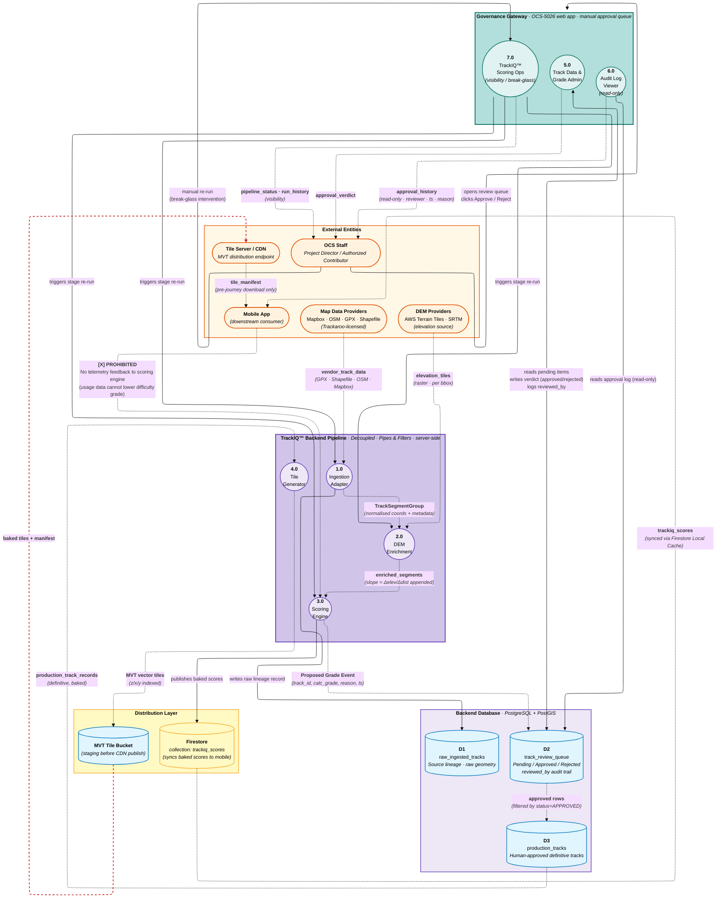

# Data Flow Diagram — TrackIQ™ Backend Pipeline (CBE-5000)

**Purpose:** Map data lifecycle for the TrackIQ™ Difficulty Scoring pipeline, from raw vendor ingestion through governance approval to MVT tile distribution.

**Scope:** The decoupled backend service `CBE-5000` (Pipes & Filters architecture), its PostgreSQL+PostGIS data stores (`CBE-6xxx`), the OCS-5026 governance gateway, and downstream Firestore sync + CDN distribution.

**Notation:**
- `([Entity])` = external entity (data provider, staff, downstream consumer)
- `((Process))` = pipeline stage / engine
- `[(data_store)]` = PostgreSQL table
- `-->` solid = control / verb-form action
- `-.->` dashed = data payload (noun label)
- Compliance constraint: deterministic · idempotent · no telemetry feedback · no ML inference



## Process descriptions

| # | Process | Inputs | Outputs | Stores accessed |
|---|---|---|---|---|
| **1.0** | Ingestion Adapter | `vendor_track_data` (Adapter Pattern via `ITrackIngestAdapter`) | `TrackSegmentGroup` (normalised) | W `D1` (raw_ingested_tracks — source lineage) |
| **2.0** | DEM Enrichment Engine | `TrackSegmentGroup`, `elevation_tiles` | `enriched_segments` (with slope) | (none — pure compute) |
| **3.0** | Scoring Engine | `enriched_segments` | `Proposed Grade Event` | W `D2` (track_review_queue, status=PENDING) |
| **4.0** | Tile Generator | `production_track_records` | `MVT vector tiles` | R `D3` (production_tracks) → W `TILE_BUCKET` |
| **5.0** | Track Data & Grade Admin (OCS-4301) | OCS_STAFF clicks Approve/Reject | `approval_verdict` | R/W `D2` (writes status + reviewed_by) |
| **6.0** | Audit Log Viewer (OCS-4303) | (none — read-only) | `approval_history` to OCS_STAFF | R `D2` (read-only) |
| **7.0** | TrackIQ Scoring Ops (OCS-4202) | OCS_STAFF triggers re-run | `pipeline_status`, stage re-run signals | (none — orchestrator) |

## Data store schema sketch

| Store | Key fields | Write source | Mutation rules |
|---|---|---|---|
| `D1 raw_ingested_tracks` | `track_id (UUID)`, `source_vendor`, `raw_geometry`, `ingested_at` | Process 1.0 (INGEST) | **Append-only** — source lineage preserved |
| `D2 track_review_queue` | `track_id`, `calculated_grade`, `calculated_reason`, `status (Pending/Approved/Rejected)`, `reviewed_by (FK)`, `reviewed_at` | 3.0 (writes PENDING), 5.0 (updates verdict) | Status mutates · `reviewed_by` immutable audit trail |
| `D3 production_tracks` | `track_id`, `definitive_grade`, `approved_by`, `tile_ready_at` | Promoted from `D2` on approval | **Append-only** — replaced via new track_id on regrade |
| `TILE_BUCKET` | `bbox`, `z`, `x`, `y`, `tile_data`, `version` | Process 4.0 (TILE) | Overwritten per tile on re-bake |
| `FIRESTORE / trackiq_scores` | `track_id`, `grade`, `bbox`, `published_at` | Publish job from D3 / SCORE | Read-only from mobile (mobile cannot write back) |

## Pipeline state machine

```text
[raw vendor data]
       │
       ▼
[1.0 INGEST] ──→ writes D1 (lineage) ──→ emits TrackSegmentGroup
       │
       ▼
[2.0 DEM ENRICH] ──→ pure compute (slope) ──→ emits enriched segments
       │
       ▼
[3.0 SCORE] ──→ writes D2 (status=PENDING)
                                  │
                                  ▼
                       ┌──────────────────────┐
                       │  GOVERNANCE GATEWAY  │
                       │  Project Director    │
                       │  reviews & decides   │
                       └──────────┬───────────┘
                                  │
                  ┌───────────────┼───────────────┐
                  ▼               ▼               ▼
              REJECTED        APPROVED        deferred
                  │               │               │
                  ▼               ▼               ▼
            (terminal)    promote → D3       (stays PENDING)
                                  │
                                  ▼
                          [4.0 TILE GEN] ──→ MVT tiles ──→ CDN ──→ mobile pre-download
                                  │
                                  ▼
                          publish baked scores ──→ Firestore ──→ mobile sync
```

## Architectural constraints visualised

- ❌ **No automated approval** — every grade change requires manual OCS-5026 sign-off
- ❌ **No telemetry feedback loop** — Mobile app's usage data cannot mutate scoring (red prohibited edge from MOBILE_APP → SCORE)
- ❌ **No ML inference** — Scoring Engine is pure-function Rule Matrix (Hardest-Criterion-Wins)
- ✅ **Idempotent** — Re-running pipeline on same input → same output (RT-09)
- ✅ **Source lineage preserved** — `D1 raw_ingested_tracks` retains pre-processing snapshot
- ✅ **Audit trail mandatory** — Every approval writes `reviewed_by` (FK to user table)
- ✅ **Break-glass intervention** — OCS staff can manually re-trigger any stage via Process 7.0
- ✅ **Two consumption paths** — heavy tile data via CDN (pre-journey download), lightweight scores via Firestore real-time sync

## See also

- Master architecture: `../../1-overview/trackaroo-phase1-architecture.md`
- TrackIQ pipeline subsystem deep-dive: `../../2-subsystems/cbe-trackiq-pipeline.md`
- Survival Core DFD: `./dfd-survival-core.md`
- Compliance matrix: `../../4-cross-cutting/compliance-matrix.md`
- Navigation map: `../../README.md`
