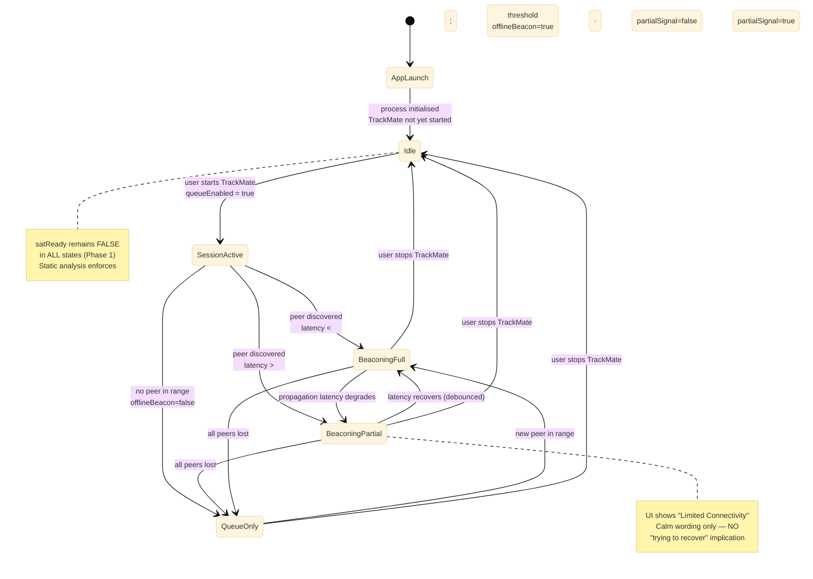

# MOB-1101 · CAL State Matrix

**Tier 3 · Behavioral view (state).** Canonical, single-source state matrix for the **Comms Abstraction Layer (CAL · `MOB-1101`)**. Consolidates information that previously lived split across the CAL subsystem spec, the system-wide state transitions doc, the compliance matrix, and provisional design decisions.

**Relationship to other CAL artifacts:**

| Artifact | Purpose | Authority |
|---|---|---|
| `../../2-subsystems/mob-cal-architecture.md` | **Spec / mandate doc.** Architectural mandates · transport priority rules · UI rules · static analysis obligations · component diagram | Discovery-Gate Deliverable #4 |
| **`state-cal.md`** (this file) | **State matrix.** The explicit cross-product of *(state × flag vector × transport behavior × UI label × allowed transitions)* in one table — runtime behaviour reference | Derived from the spec doc |
| `./state-trackaroo-transitions.md §6` | Cross-system event taxonomy — lists "E4: CAL transport switch" as an Experience-Layer event in the wider inter-subsystem map | System-wide overlay |

The two CAL docs are **complementary, not duplicate**: the spec doc says *what must be true*; this file says *what the runtime looks like at each instant*.

**Authority sources:** FSD-5126 · ESF-5026 · UXS-5726 · OSM-5026 (CAL threshold mention) · `design-decisions.md` M5 + M6

---

## 1. State inventory

CAL has **5 reachable states** in Phase 1 (a 6th — `SatelliteRelay` — is permanently unreachable: `satReady` is hardcoded `false` and static analysis enforces).

| # | State | Meaning | Reachable in Phase 1? |
|---|---|---|---|
| S0 | **`AppLaunch`** | App process started, CAL initialised, TrackMate session not yet opened | ✅ |
| S1 | **`Idle`** | TrackMate not running. CAL quiescent. No outbound activity. | ✅ |
| S2 | **`SessionActive`** *(transient)* | TrackMate session just opened. Discovery + queue come online. Settles into one of S3/S4/S5 within seconds. | ✅ (transient — not a stable resting state) |
| S3 | **`BeaconingFull`** | Peer discovered. Latency below thresholds. Best-available tier transmitting. | ✅ |
| S4 | **`BeaconingPartial`** | Peer discovered. Discovery OR propagation latency exceeds calibrated threshold. Comms degraded but not zero. | ✅ |
| S5 | **`QueueOnly`** | No peer in range. Outbound payloads persisted to Firebase-independent queue · WAL-backed · crash-survivable. | ✅ |
| — | ~~`SatelliteRelay`~~ | (Phase 2 only — `satReady = false` blocks entry) | ❌ inert |

---

## 2. The state matrix (single source of truth)

Each row is one CAL state. Reading left-to-right answers: *"When CAL is in this state, what do the flags read · which transport carries traffic · what does the user see · where can it go next?"*

| State | `satReady` | `queueEnabled` | `offlineBeacon` | `partialSignal` | Transport in use | Outbound behaviour | UI label | Allowed next states |
|---|---|---|---|---|---|---|---|---|
| **S0 · `AppLaunch`** | `false` | `false` | `false` | `false` | none | n/a (CAL not yet serving payloads) | *(none — pre-session)* | → S1 |
| **S1 · `Idle`** | `false` | `false` | `false` | `false` | none | n/a | *(hidden)* | → S2 |
| **S2 · `SessionActive`** *(transient)* | `false` | `true` | resolving | resolving | resolving | enqueue while resolving | *(transient — settles ≤2s)* | → S3, S4, or S5 |
| **S3 · `BeaconingFull`** | `false` | `true` | `true` | `false` | Tier 1 BLE Mesh (primary) → Wi-Fi Direct (fallback) → Tier 2 LoRa (if paired & in range) per priority rule | transmit immediately via selected tier · queue empties | **"Beacon active"** | → S4 (latency degrades), → S5 (all peers lost), → S1 (session stopped) |
| **S4 · `BeaconingPartial`** | `false` | `true` | `true` | `true` | same tier as S3 (no switch on degradation alone) | transmit attempts continue · latency monitor maintains `partialSignal=true` | **"Limited Connectivity"** | → S3 (latency recovers), → S5 (all peers lost), → S1 (session stopped) |
| **S5 · `QueueOnly`** | `false` | `true` | `false` | `false` | none active | persist to WAL-backed queue · flush on next peer | **"Queue pending"** or **"Offline"** | → S3 (new peer in range), → S1 (session stopped) |

### Invariants (must hold in every state)

| Invariant | Mechanism |
|---|---|
| **`satReady` is `false` in all reachable states** | Hardcoded literal · static analysis CI gate (`satReady\s*=\s*true` → 0 matches expected) |
| **No CAL → Survival Core call in any state** | Static analysis CI gate (`from mob_core.*` inside CAL modules → 0 matches expected) |
| **Transport selection is deterministic** — same inputs always yield the same tier | No probabilistic / telemetry-weighted logic in `Transport Router` |
| **No autonomous-recovery language in UI** — labels describe state, not action | Static UI-string lint against prohibited label list (§5) |

---

## 3. State diagram (visual)



---

## 4. Transition triggers

Every transition has a single, deterministic trigger. None are probabilistic.

| From → To | Trigger | Notes |
|---|---|---|
| `AppLaunch → Idle` | Process init complete · CAL bound · no TrackMate session yet | Immediate |
| `Idle → SessionActive` | User starts TrackMate session | Sets `queueEnabled = true` |
| `SessionActive → BeaconingFull` | First peer discovery succeeds · latency below `partialSignal` threshold | Settles ≤ 2s (UXS-5726) |
| `SessionActive → BeaconingPartial` | First peer discovery succeeds · latency exceeds threshold | Same UI deadline as above |
| `SessionActive → QueueOnly` | No peer discovered within discovery window | Window value TBD (vendor M6) |
| `BeaconingFull ↔ BeaconingPartial` | Latency monitor crosses threshold | Debounce required (TBD — see §7) |
| `BeaconingFull / BeaconingPartial → QueueOnly` | Last peer lost | Triggers `offlineBeacon=false` |
| `QueueOnly → BeaconingFull` | New peer in range, latency below threshold | Queue flushes after transition |
| `Any session-state → Idle` | User stops TrackMate session | Clears `queueEnabled` and `offlineBeacon` |

---

## 5. UI label catalogue

| Label | Used when | Source |
|---|---|---|
| *(hidden)* | `Idle` · also forced-hidden while FA Baseline screen is active regardless of state | `compliance-matrix.md §7` line 85 |
| **"Beacon active"** | `BeaconingFull` | `mob-cal-architecture.md §4` |
| **"Limited Connectivity"** | `BeaconingPartial` | `mob-cal-architecture.md §4` |
| **"Queue pending"** | `QueueOnly` with payloads outstanding | `mob-cal-architecture.md §4` |
| **"Offline"** | `QueueOnly` with empty queue | `mob-cal-architecture.md §4` |

### Prohibited labels (UXS-5726 Visual Calm doctrine)

Any UI string in CAL that matches the following is a build-time violation:

- "Reconnecting…"
- "Searching for signal…"
- "Trying satellite…"
- "Recovery in progress…"
- Anything implying autonomous action or escalation

**Rationale:** users facing emergencies stay calmer when comms status is presented as *state* (*"you are offline"*) than as *action-in-progress* (*"trying to reconnect"*). Action-language creates false expectation of automated rescue.

### Response-time SLA

Any state transition that changes the visible UI label MUST repaint within **≤ 2 seconds**. This includes `BeaconingFull ↔ BeaconingPartial`, `* → QueueOnly`, `QueueOnly → BeaconingFull`. See `../../4-cross-cutting/performance-targets.md`.

---

## 6. Transport selection within each state

The transport priority rule is **the same in every active state** (S3 · S4) — it is a function of *which peers are in range*, not of CAL state. CAL state describes *latency / availability outcome*; the rule describes *which radio carries traffic when it is available*.

| Priority | Transport | Engaged when | Phase 1 status |
|---|---|---|---|
| Tier 3 | Satellite Relay | (unreachable — `satReady=false`) | 🔵 Phase 2 only |
| Tier 1 primary | BLE Mesh | BLE peer in range | ✅ Active |
| Tier 1 fallback | Wi-Fi Direct / MPC | No BLE peer · Wi-Fi peer in range | ✅ Active |
| Tier 2 | LoRa | No BLE/Wi-Fi peer · LoRa peripheral paired (`EXT-9005`) AND LoRa peer in range | ✅ Active (paired peripherals only) |
| (none) | — | No tier match | → enters S5 `QueueOnly` |

The deterministic selection algorithm is reproduced from the spec doc for convenience:

```text
For each outbound payload:
   1. If satReady == true  AND  satellite peer in range  →  Tier 3   (PHASE 2 ONLY)
   2. If BLE Mesh peer in range                          →  Tier 1 primary
   3. If Wi-Fi Direct peer in range                      →  Tier 1 fallback
   4. If LoRa peripheral paired AND peer in range        →  Tier 2
   5. Else                                               →  S5 QueueOnly (persist + offline beacon)
```

Spec authority: `design-decisions.md M5` (🟢 Locked-in by spec) · `ESF-5026` · `FSD-5126`.

---

## 7. Open calibration values (vendor input expected)

The matrix is structurally complete. Two numeric parameters remain vendor-proposable:

| ID | Parameter | What's needed | Status |
|---|---|---|---|
| **M6** | `partialSignal` latency threshold | Vendor proposes ms thresholds for discovery + propagation that flip `partialSignal` | 🟡 Provisional — `design-decisions.md M6` |
| **(new)** | Threshold debounce window | Min time below threshold before `BeaconingPartial → BeaconingFull` (prevents UI flicker) | 🔴 Not yet captured — to be added to `design-decisions.md` once vendor proposes |
| **(new)** | Discovery window | Max time `SessionActive` may resolve before forcing `→ QueueOnly` | 🔴 Not yet captured |

These do not affect the **shape** of the matrix — only the numeric trip-points within it.

---

## 8. Cross-references

- Spec / mandate doc: `../../2-subsystems/mob-cal-architecture.md` (transport priority · 4-flag definitions · UI rules · static analysis)
- Parent module: `../../2-subsystems/mob-application-layer.md` — `MOB-1001 TrackMate` (CAL's parent)
- Downstream sibling: `MOB-1102 Multi-Tier Transport` — see same file
- System-wide event taxonomy: `./state-trackaroo-transitions.md §6` — CAL transport switch as event `E4`
- Survival-Core isolation prohibition: `../../4-cross-cutting/compliance-matrix.md` — §7 (FA suppression), §8 (Visual Calm), §13 (static-analysis gates)
- UI response-time SLA: `../../4-cross-cutting/performance-targets.md`
- Provisional decisions: `../../../research/design-decisions.md` — M5 (priority order), M6 (threshold value)
- Master architecture: `../../1-overview/trackaroo-phase1-architecture.md` — see `MOB-1101` in `MOB_G2`

---

## 9. Document status

| Field | Value |
|---|---|
| Document purpose | Consolidated state matrix · runtime behavior reference |
| Spec coverage | 5 reachable states · 4 flag vectors · transport behaviour per state · UI labels · transitions |
| Outstanding | Numeric calibration values (M6 threshold · debounce · discovery window) — not blocking matrix structure |
| Next review trigger | Vendor proposes threshold/debounce numbers → annotate matrix; or spec change to CAL mandates → reconcile both this file and `mob-cal-architecture.md` |
