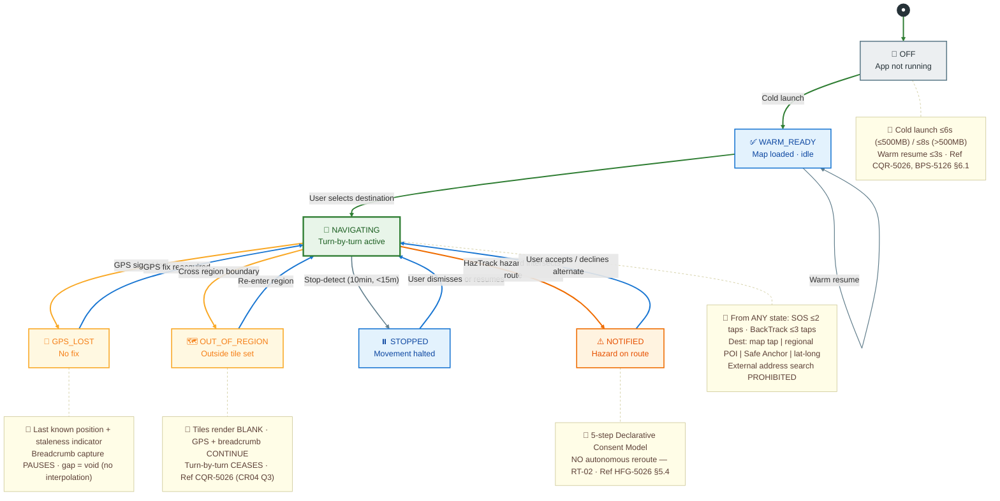
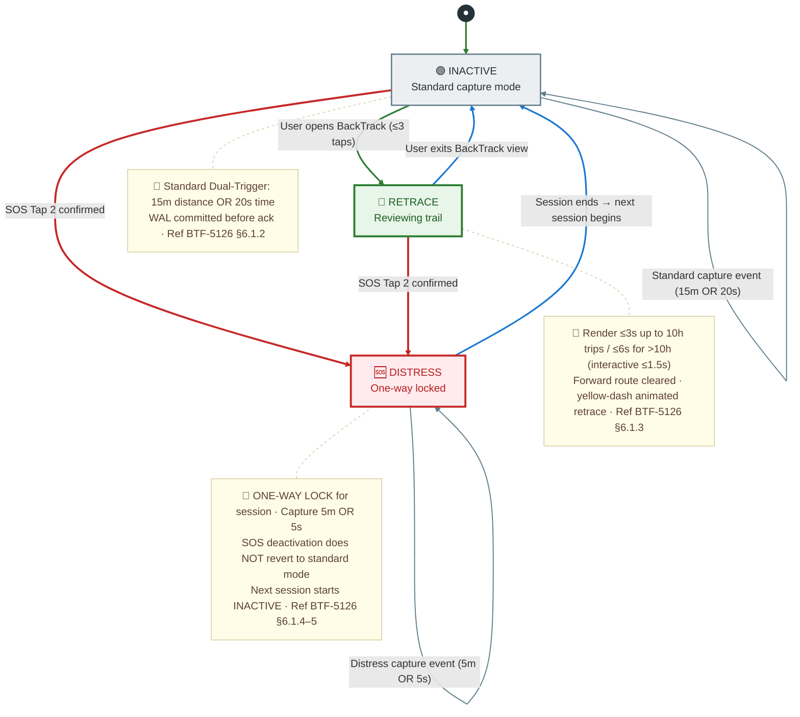
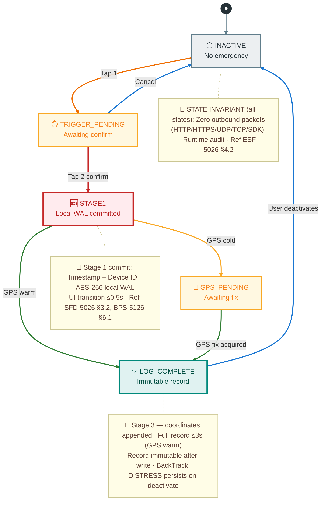
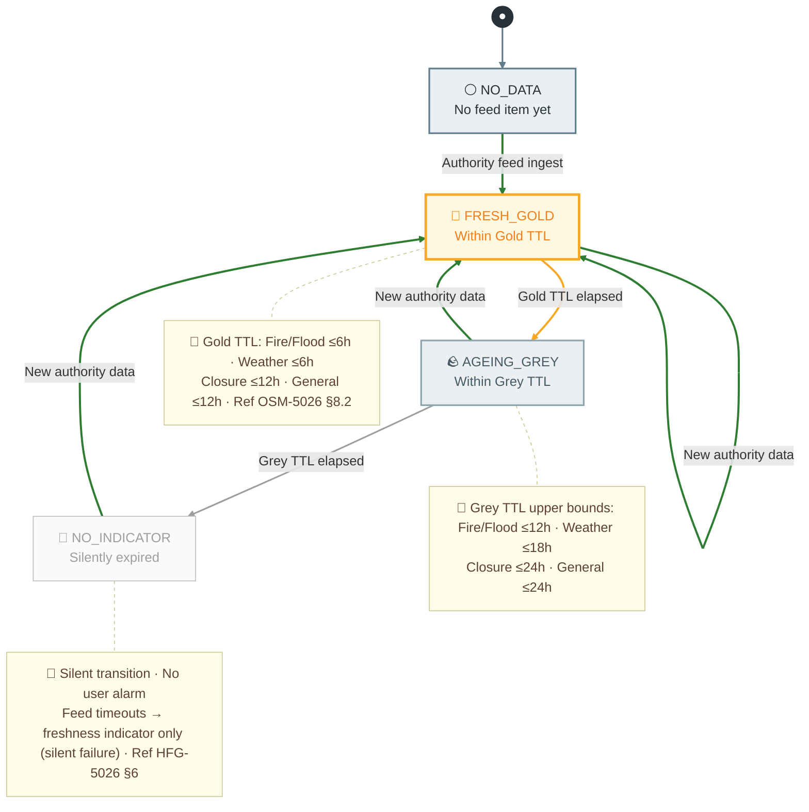
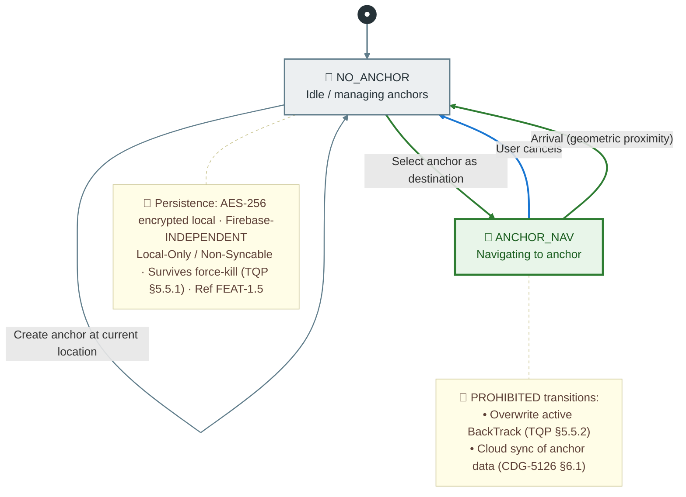
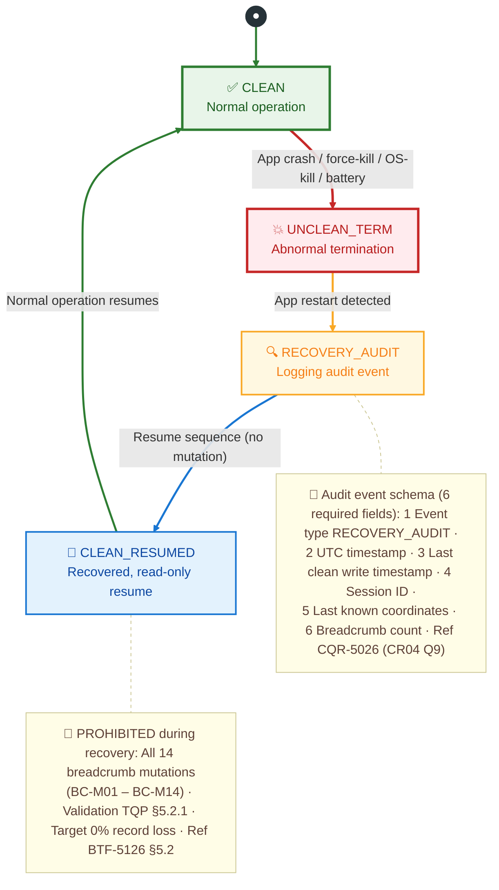

# trackaroo® Phase 1 — Deterministic State Transition Matrix

This document satisfies the Discovery-Gate prerequisite cited in **FEAT-1.1**, **FEAT-2.1**, **FEAT-3.1**, **FEAT-4.4** and **FEAT-6.1** (AOD-5026 §7). It contains:

1. Six state-machine diagrams — one per Survival Core subsystem plus a cross-cutting crash-recovery overlay.
2. An inter-layer isolation diagram proving that Experience-Layer events cannot mutate Survival Core state.
3. A prohibition register listing the negative-space transitions (the things that must *never* happen) and how each is enforced.

---

## How to import into draw.io

1. Open <https://app.diagrams.net/> (or your desktop draw.io).
2. **Extras → Edit Diagram…** (alternatively **Arrange → Insert → Advanced → Mermaid**).
3. Copy a single ```` ```mermaid ```` block below (the code only, without the fences).
4. Paste into the Mermaid dialog and click **Insert**.
5. Repeat for each diagram. Each is independent and self-contained.

---

## 1. Offline Navigation Engine — FEAT-1.1

The largest state space. Every transition is triggered by a single deterministic input (user action, OS-level GPS boolean, or geometric point-in-polygon test). No probabilistic, AI, or telemetry-weighted transitions exist.



---

## 2. BackTrack™ Breadcrumbs — FEAT-1.2

Three operational states with a one-way Distress lock that can only be set by SOS confirmation and cannot be reverted within a session — this is the most safety-critical determinism property of the subsystem.



---

## 3. SOS Emergency Logging — FEAT-1.3

The 3-Stage Log Sequence is the only state machine in the system where timing constraints are mandatory acceptance criteria (≤0.5s UI transition, ≤3s log completion). Zero outbound network packets in any state.



---

## 4. HazTrack™ Freshness — FEAT-1.4

State machine per feed item. Transitions are pure integer arithmetic: `(now − ingest_timestamp)` compared against fixed per-category constants. No adaptive decay curves.



---

## 5. Safe Anchor Points — FEAT-1.5

Two states with strict isolation invariants: no cloud sync of anchor data, and anchor navigation must never overwrite an active BackTrack trail (verified by TQP §5.5.2).



---

## 6. Crash Recovery — Cross-cutting (FEAT-4.4)

Recovery overlay applies to every subsystem's clean state. The WAL discipline guarantees zero record loss; the RECOVERY_AUDIT event encodes six mandatory fields.



---

## 7. Inter-Layer Isolation Map (Immutable Separation Boundary)

The isolation half of the matrix — proves that every Experience-Layer event has an enforcement mechanism preventing it from mutating Survival Core state. Dotted arrows represent transitions that are **prohibited** and the label is the **isolation mechanism** that enforces it.

> **Spec terminology:** this enforcement structure realises the **Immutable Separation Boundary** mandated by NAV spec §4 — Experience Layer features are architecturally incapable of blocking, delaying, or mutating core navigation flow. See `../../4-cross-cutting/compliance-matrix.md §5` for the full rule + enforcement-point catalogue.

```mermaid
flowchart LR
    subgraph EXP["Experience &amp; Intelligence Layer (Epic 2 / 3)"]
        E1[TrackIQ recalculation]
        E2[HazTrack feed event]
        E3[PCR submission / resolution]
        E4[CAL transport switch]
        E5[Firebase sync]
        E6[Archetype preset change]
        E7[First Aid screen open]
        E8[Stop-detect prompt]
        E9[satReady flag flip]
    end

    subgraph CORE["Survival Core (Epic 1 / 4)"]
        C1[Breadcrumb sequence]
        C2[BackTrack capture interval]
        C3[SOS access path ≤2 taps]
        C4[SOS log immutability]
        C5[Nav execution path]
        C6[Nav rerouting authority]
        C7[Safe Anchor data]
        C8[TrackIQ difficulty grade]
        C9[HazTrack TTL state]
    end

    E5 -.->|Firebase isolation: no write context to Core| C1
    E2 -.->|14 mutations prohibited &#40;BC-M01–14&#41;| C1
    E6 -.->|Archetype cannot modify Core execution| C2
    E3 -.->|PCR must not interrupt SOS &#40;FQH Q5&#41;| C3
    E7 -.->|FA isolation &#40;TQP §5.7.7&#41;| C3
    E8 -.->|Dismissible; max 3 reprompts| C3
    E5 -.->|Zero outbound packets &#40;ESF-5026 §4.2&#41;| C4
    E9 -.->|Hardcoded FALSE; non-triggerable| C4
    E2 -.->|RT-02: Declarative Consent Model required| C6
    E2 -.->|RT-14: no mutation across layers| C8
    E1 -.->|Read-only display; static analysis| C5
    E5 -.->|Local-Only classification| C7
    E2 -.->|RG-01: deterministic TTL only| C9

    classDef block stroke:#000,fill:#fff,color:#000
    class EXP,CORE block
```



> **Reading the diagram:** each dotted arrow is an invariant. The label tells you *how* it is enforced (static analysis, architectural prohibition, empirical TQP scenario, or audit). A successful Discovery Gate confirms every arrow has a verifiable enforcement mechanism in the build pipeline.

---

## 8. Prohibition Register

Negative-space transitions — things that must provably never happen — and the enforcement mechanism for each. These complement the state diagrams above (which show what *can* happen) by enumerating what *cannot*.

### 8.1 Breadcrumb Mutations (BC-M01 – BC-M14)

All 14 are enforced by static-analysis scans in CI; detection triggers RT-13 automatic release halt.

| ID | Prohibition | Reference |
| --- | --- | --- |
| BC-M01 | Merge of breadcrumb records | BTF-5126 §5.2 |
| BC-M02 | Compaction of breadcrumb data | BTF-5126 §5.2 |
| BC-M03 | Reconstruction of paths from sparse points | BTF-5126 §5.2 |
| BC-M04 | Reordering of records | BTF-5126 §5.2 |
| BC-M05 | Map-matching to roads/trails | BTF-5126 §5.2; VGD-5126 §8.3 |
| BC-M06 | Coordinate interpolation across gaps | BTF-5126 §5.2 |
| BC-M07 | Gap-filling between records | BTF-5126 §5.2 |
| BC-M08 | Deduplication of records | BTF-5126 §5.2 |
| BC-M09 | Lossy compression of records | BTF-5126 §5.2 |
| BC-M10 | Conflict resolution between records | BTF-5126 §5.2 |
| BC-M11 | Reconciliation with cloud state | BTF-5126 §5.2; CDG-5126 §6.1 |
| BC-M12 | Coalescing of nearby records | BTF-5126 §5.2 |
| BC-M13 | Smoothing of coordinates | BTF-5126 §5.2 |
| BC-M14 | Post-capture correction of records | BTF-5126 §5.2 |

### 8.2 Rejection Triggers (determinism-relevant subset)

| ID | Category | Prohibition | Enforcement |
| --- | --- | --- | --- |
| RT-01 | Network | Active or triggerable Satellite SDK / transmission code | Static analysis + SDK audit (V-12) |
| RT-02 | Adaptive | Autonomous rerouting without user confirmation | Static analysis; TQP hazard-intersect scenario |
| RT-03 | Adaptive | AI, probabilistic inference, or adaptive ML in any execution path | Static analysis; Module Isolation Map |
| RT-04 | Adaptive | Telemetry-weighted scoring in TrackIQ | Static analysis |
| RT-05 | Network | Cloud sync of breadcrumb or SOS data | Firebase isolation audit |
| RT-09 | Phase Boundary | Phase 2+ scaffold accessible without "Inactive" label | Discovery review + static analysis |
| RT-13 | Survival Core | Breadcrumb loss/reorder/duplicate on crash | TQP §5.2.1 |
| RT-14 | Survival Core | HazTrack event mutates TrackIQ grade | Static analysis |
| RT-15 | Survival Core | SOS ≤2 tap path not empirically validated | TQP §5.6 |
| RT-19 | PCR | TTL-based PCR expiry (must be supersession-only) | Static analysis |
| RT-20 | PCR | Deletion of PCR records on supersession (must archive) | Static analysis |
| RT-21 | PCR | Automatic PCR submission triggers | Static analysis |

### 8.3 Layer Independence Rules

| ID | Prohibition | Reference |
| --- | --- | --- |
| LIR-01 | Difficulty colour representing freshness or hazard status | OSM-5026 §11 |
| LIR-02 | Verification shields representing terrain difficulty | OSM-5026 §11 |
| LIR-04 | PCR markers using the verification shield icon system | OSM-5026 §11 |
| LIR-05 | Any overlay layer mutating another layer's data or state | OSM-5026 §11 |
| LIR-06 | Visual state distinguishable by colour alone | OSM-5026 §11; RT-11 |

---

## Notes on the matrix as a Discovery Gate artefact

- **Each state diagram** above is the per-subsystem state-transition table required by AOD-5026 §7. Every transition is annotated with its document reference so a reviewer can trace it back to the authoritative source.
- **The isolation map** is the Module Isolation proof required by VGD-5126 §7.1 and FEAT-2.1 / FEAT-4.4 Discovery Gates. It is the artefact that proves the Experience Layer cannot mutate Survival Core behaviour.
- **The prohibition register** is the static-analysis specification — every entry must have a corresponding rule in the CI scanner. This satisfies the FEAT-4.2 static-analysis mandate.
- All three together form the deliverable that clears the Discovery Gate for Survival Core development.
