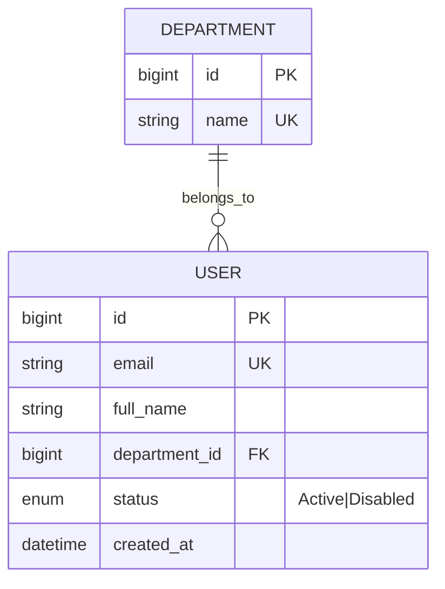

# ERD — Entity Relationship Diagram

> Backed by skill [`diagram/erd`](../MasterMind/models/model_001/diagram/erd/).
> Source: derived from `docs/requirements.md` + `docs/planning.md` §B3 (feature backlog). Authored as Mermaid.

## Domain groups

| Domain | Entities (placeholder — agent fills) |
|---|---|
| Auth & People | `USER`, `DEPARTMENT`, `PERMISSION_GROUP` |
| `<Domain 1>` | ... |
| `<Domain 2>` | ... |

## ER Diagram (Mermaid)

## Cardinality cheatsheet

| Notation | Meaning |
|---|---|
| `||--||` | 1 : 1 |
| `||--o{` | 1 : 0-or-many |
| `||--|{` | 1 : 1-or-many |
| `}o--o{` | many : many |

## Edge cases from cardinality

When writing a relationship, walk each cardinality to surface BRs + edge cases:

| Relationship | Cardinality | Edge case / BR |
|---|---|---|
| `<Entity>` ↔ `<Entity>` | `||--|{` | When creating Parent, is ≥1 Child required? |

## Render `.drawio` (only when needed)

By default the Mermaid `.md` is the source of truth. Render to `.drawio` only when:
- Sharing with non-technical stakeholders
- Wanting to edit visually
- Exporting to PDF

Render using `core/diagram/_shared/scripts/`.

## Workflow

1. Agent reads `docs/requirements.md` → identifies entities (each entity must be supported by ≥1 requirement)
2. Agent draws relationships based on hierarchy + dependencies in the backlog
3. Walk cardinalities → fill the "Edge cases" table → surface BRs that need to be specified
4. SRS (skill `srs`) references entity IDs from here in use-case specs
5. When a CR changes an entity, update the ERD first (single source of truth for the data model)
