# Trackaroo® Phase 1 — Delivery Planning (single source)

> **The single source for delivery planning + backlog.** This file consolidates the former `backlog.md` (business features) and `sprint-0-foundation.md` (cross-cutting foundation) so there is **one place to maintain**.
> Backed by MasterMind skill [`document/features`](../MasterMind/models/model_001/document/features/). Conventions: [`conventions/features-conventions.md`](../conventions/features-conventions.md).
> **Cadence:** 2-week sprints · 8-person Lean Senior Squad · 8 parallel tracks · 900 man-days (Slitigenz proposal §10.3).
> **Build rule (proposal §10.1):** Survival Core first — SOS + BackTrack™ lead; Experience Layer after Alpha; no subsystem coding without WFD-5126 wireframe approval.
> **Last updated:** 2026-05-28

**Document map:**
- **Part A — Delivery Plan:** [A1 Master Timeline](#a1-master-delivery-timeline) · [A2 Sprint-by-sprint execution](#a2-sprint-by-sprint-execution) · [A3 Coverage check](#a3-coverage-check)
- **Part B — Registers (the backlog):** [B1 Scope rule](#b1-scope-rule) · [B2 Sprint 0 Foundation register](#b2-sprint-0-foundation-register) · [B3 Consolidated feature backlog](#b3-consolidated-feature-backlog-9-column-canonical) · [B4 Gate & Priority](#b4-delivery-gate--priority) · [B5 Discovery deliverables](#b5-discovery-gate-deliverable-register) · [B6 Traceability](#b6-feature--governing-spec-traceability) · [B7 Reserved for AC](#b7-cross-cutting-standards-reserved-for-ac)
- **Companion files:** [`docs/sprint-0-acs.md`](./sprint-0-acs.md) — Sprint 0 foundation Task ACs (DoD)

---
---

# PART A — DELIVERY PLAN

## A1. Master Delivery Timeline

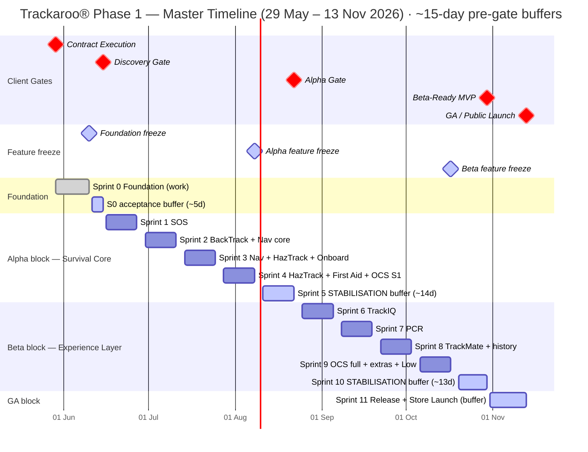

### Sprint → Delivery goal → Client gate

Each gate block now ends with a **dedicated stabilisation sprint** so feature work freezes ~2 weeks before the gate, leaving a managed risk buffer for validation/hardening/gate prep. Feature sprints are loaded harder (more parallel tracks) to absorb the pulled-forward work.

| Sprint | Dates (2026) | Delivery goal | Feature work? | Client gate |
|---|---|---|---|---|
| **Sprint 0** | 29 May – 10 Jun (+5d buffer→15 Jun) | Foundation platform + **9 Compliance Artefacts (D1–D9)** + companion website | Foundation (FND) | **★ Discovery — 15 Jun** |
| **Sprint 1** | 16 – 27 Jun | SOS & Emergency Logging (safety-critical lead) | ✅ 5 feat | → Alpha |
| **Sprint 2** | 30 Jun – 11 Jul | BackTrack™ + Navigation core | ✅ 6 feat | → Alpha |
| **Sprint 3** | 14 – 25 Jul | Navigation complete + HazTrack™ start + onboarding | ✅ 6 feat | → Alpha |
| **Sprint 4** | 28 Jul – 8 Aug | HazTrack™ complete + First Aid + OCS Stage 1 — **Alpha feature freeze 8 Aug** | ✅ 8 feat | → Alpha |
| **Sprint 5** | 11 – 22 Aug | 🛡️ **STABILISATION buffer** — Survival Core validation · RT-16/RT-12 legal & clinical close · hardening · Alpha gate prep | ⛔ buffer | **★ Alpha — 22 Aug** |
| **Sprint 6** | 25 Aug – 5 Sep | TrackIQ™ track-difficulty intelligence | ✅ 6 feat | → Beta-Ready |
| **Sprint 7** | 8 – 19 Sep | PCR — Point Condition Reports | ✅ 6 feat | → Beta-Ready |
| **Sprint 8** | 22 Sep – 3 Oct | TrackMate™ peer communication + multi-session history | ✅ 6 feat | → Beta-Ready |
| **Sprint 9** | 6 – 17 Oct | OCS full modules + event-log + POI + Low-tier — **Beta feature freeze 17 Oct** | ✅ 8 feat | → Beta-Ready |
| **Sprint 10** | 20 – 30 Oct | 🛡️ **STABILISATION buffer** — 11 TQP validation domains · WCAG 2.1 AA audit · 22 RT clearance · hardening | ⛔ buffer | **★ Beta-Ready — 30 Oct** |
| **Sprint 11** | 31 Oct – 13 Nov | 🛡️ **RELEASE buffer** — regression on frozen RC · App Store / Play submission · GA go/no-go | ⛔ buffer | **★ GA — 13 Nov** |

> **Gate blocks:** Sprint 0 → Discovery · Sprints 1–5 → Alpha · Sprints 6–10 → Beta-Ready · Sprint 11 → GA.
> Day-level item durations in the per-sprint charts are **indicative** pending Story-level estimates; tracks run in parallel per the 8-workstream model.

### Risk-buffer policy & parallelisation

**Buffer policy — all feature work completes ~15 days before its gate:**

| Gate | Date | Feature freeze | Buffer | Buffer sprint |
|---|---|---|---|---|
| Discovery | 15 Jun | ~10 Jun | ~5 days *(constrained: contract starts 29 May)* | within Sprint 0 |
| Alpha | 22 Aug | **8 Aug** | **14 days** | Sprint 5 |
| Beta-Ready | 30 Oct | **17 Oct** | **13 days** | Sprint 10 |
| GA | 13 Nov | 17 Oct (RC frozen) | RC stable; Sprint 11 = release-only | Sprint 11 |

> ⚠️ **Discovery is the one constrained gate** — contract executes 29 May, gate is 15 Jun (17-day window), so a full 15-day buffer is impossible. We target foundation-complete by **10 Jun** with a **5-day acceptance buffer**. Mitigation: run all 10 foundation concerns **in parallel from day 1** (8 tracks), front-load D8/D9 audits.

**How we absorb the compression — parallel tracks (8 experts / 8 workstreams, proposal §10.3):** the pulled-forward features run concurrently rather than sequentially. Recommended concurrency per sprint:

| Sprint | Parallel tracks running concurrently |
|---|---|
| S1 | Track 1 (SOS) · Track 7 (RT-16 legal kickoff) |
| S2 | Track 1 (BackTrack) ∥ Track 3 (Navigation) ∥ Track 8 (OCS scaffold) |
| S3 | Track 3 (Nav finish) ∥ Track 5 (HazTrack ingestion) ∥ Track 4 (onboarding) |
| S4 | Track 5 (HazTrack finish) ∥ Track 4 (First Aid) ∥ Track 8 (OCS Stage 1) |
| S6 | Track 4 (TrackIQ display) ∥ Track 5 (TrackIQ scoring/intelligence) |
| S7 | Track 4 (PCR) ∥ Track 3 (PCR markers on map) |
| S8 | Track 2 (TrackMate transport+messaging) ∥ Track 1 (history) |
| S9 | Track 8 (OCS full) ∥ Track 4 (POI) ∥ Track 1 (event-log + export) |

> **Capacity check:** peak load is S4 and S9 (8 features each). With 8 senior experts across 8 tracks (≈1 feature/track/sprint) this is within capacity. Hard dependencies still serialise within a track (e.g. OCS HazTrack admin **after** HazTrack feed pipeline; OCS PCR moderation **after** PCR build).

---

## A2. Sprint-by-sprint execution

### Sprint 0 — Foundation (29 May – 15 Jun) → Discovery Gate

**Goal:** Stand up the shared platform once and produce the **9 committed Architectural Compliance Artefacts + companion website**. No business features. Full task list: [B2](#b2-sprint-0-foundation-register). Committed artefacts: [B5](#b5-discovery-gate-deliverable-register).
**Buffer:** all 10 concerns run **in parallel from day 1** → foundation-complete **10 Jun**; **11–15 Jun = artefact-acceptance buffer** (~5 days — constrained by the 29 May contract start; see Risk-buffer policy).
**Gate exit:** D1–D9 accepted by Project Director + companion website live. Validation via lab GPS-spoofing + Faraday (CLR-SLZ-001).

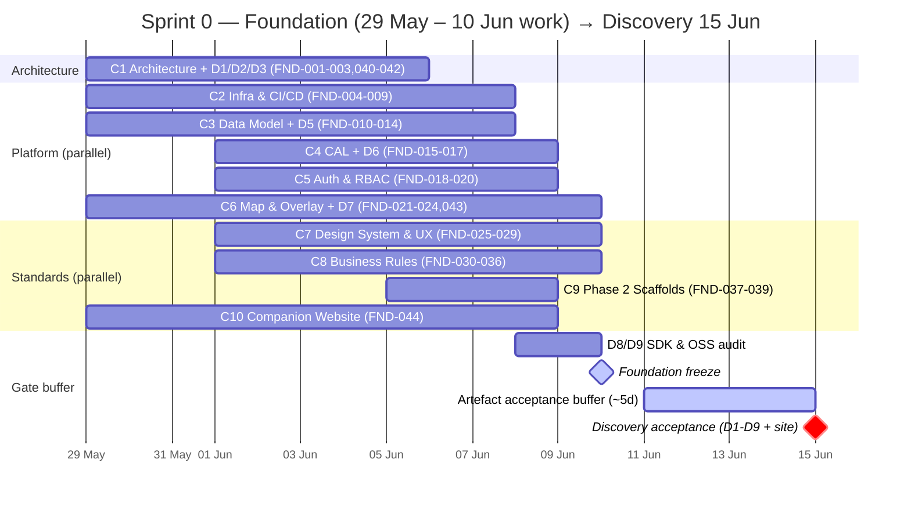

### Sprint 1 — SOS & Emergency Logging (16 – 27 Jun) → Alpha
**Goal:** Safety-critical lead — SOS reaches acceptance first (Evidentiary Integrity early).

| Feature | Name |
|---|---|
| FEAT-006 | SOS activation control (persistent · multi-tap confirm) |
| FEAT-007 | 3-stage SOS log sequence (timestamp → GPS pending → coords) |
| FEAT-008 | SOS confirmation screen (feedback elements · non-dispatch copy) |
| FEAT-009 | SOS onboarding acknowledgement (click-through) |
| FEAT-010 | QR fallback handover (offline-generated) |

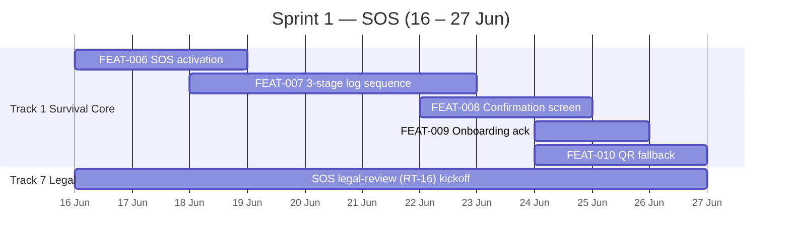

### Sprint 2 — BackTrack™ + Navigation core (30 Jun – 11 Jul) → Alpha
| Feature | Name |
|---|---|
| FEAT-011 | Active-session breadcrumb logging (dual-trigger) |
| FEAT-012 | Breadcrumb immutable write (WAL + encryption) |
| FEAT-013 | BackTrack™ reverse retrace |
| FEAT-014 | Distress-mode breadcrumb capture |
| FEAT-001 | Map region download & offline bundle management |
| FEAT-002 | Current location & orientation indicator |

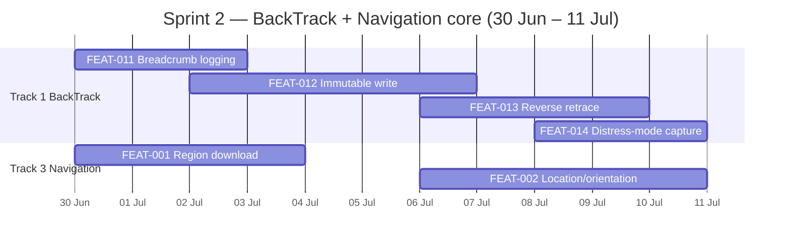

### Sprint 3 — Navigation complete + HazTrack™ start + onboarding (14 – 25 Jul) → Alpha
| Feature | Name |
|---|---|
| FEAT-003 | Route planning & display (deterministic) |
| FEAT-004 | Map interaction controls |
| FEAT-005 | Navigational instrument overlays (route line + breadcrumb trail) |
| FEAT-017 | Hazard feed ingestion & filter pipeline |
| FEAT-018 | Hazard overlay rendering |
| FEAT-025 | First-use onboarding flow *(pulled from S5)* |

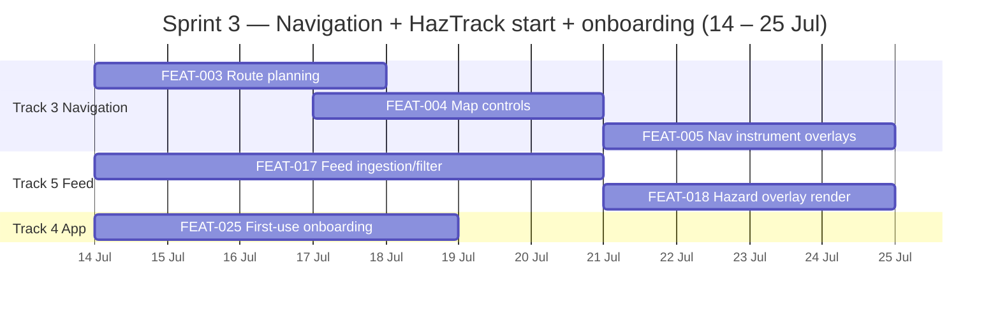

### Sprint 4 — HazTrack™ complete + First Aid + OCS Stage 1 (28 Jul – 8 Aug) → Alpha · **feature freeze 8 Aug**
| Feature | Name |
|---|---|
| FEAT-019 | Hazard freshness / TTL display |
| FEAT-020 | Hazard source attribution |
| FEAT-021 | Hazard cache management (offline) |
| FEAT-022 | First Aid Reference content rendering |
| FEAT-023 | Mandatory persistent disclaimer |
| FEAT-024 | Offline pre-loaded access |
| FEAT-027 | HazTrack™ feed administration module (OCS) *(pulled from S5 — after FEAT-017 feed)* |
| FEAT-028 | Break-glass intervention module (OCS) *(pulled from S5)* |

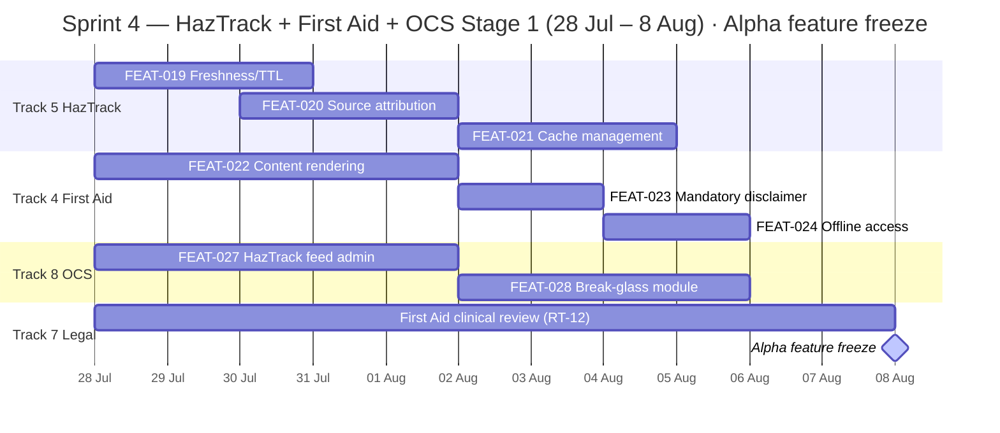

### Sprint 5 — 🛡️ STABILISATION buffer (11 – 22 Aug) → Alpha Gate
**No new features** (Alpha freeze was 8 Aug). 14-day risk buffer: end-to-end Survival Core validation, legal/clinical close, hardening, gate evidence.

| Activity | Detail |
|---|---|
| Survival Core validation | Full regression across Nav · SOS · BackTrack™ · HazTrack™ · First Aid · OCS Stage 1 |
| RT-16 SOS legal review close | Qualified-counsel sign-off (started S1) |
| RT-12 First Aid clinical review close | Clinical reviewer sign-off (started S4) |
| Prohibited-capability scan | Confirm clean (no AI/satellite/Phase-2 triggers) |
| Defect burn-down + gate evidence | Alpha evidence package |

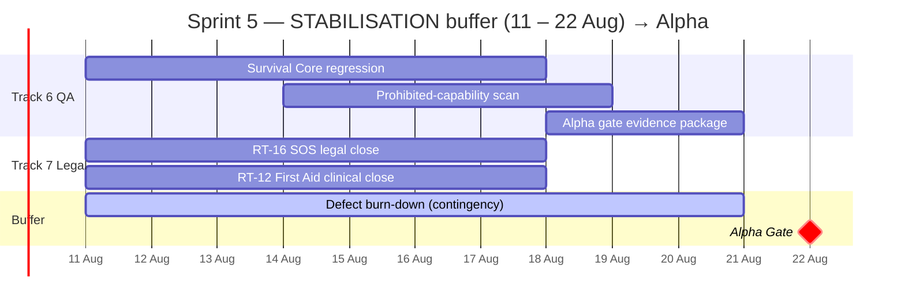

### Sprint 6 — TrackIQ™ Track Difficulty (25 Aug – 5 Sep) → Beta-Ready
| Feature | Name |
|---|---|
| FEAT-033 | Difficulty grade rendering |
| FEAT-034 | Track Verification Shield rendering |
| FEAT-035 | Deterministic difficulty scoring |
| FEAT-036 | Stop-detection prompt (fixed threshold) |
| FEAT-037 | Track metadata display |
| FEAT-038 | HazTrack™ → TrackIQ™ non-mutation guard |

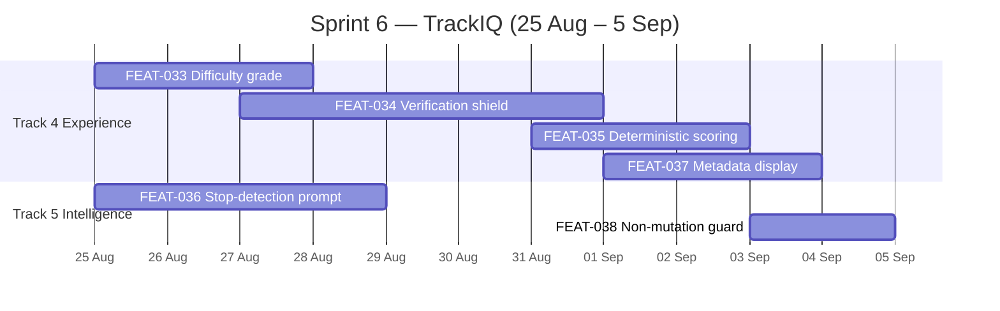

### Sprint 7 — PCR — Point Condition Reports (8 – 19 Sep) → Beta-Ready
| Feature | Name |
|---|---|
| FEAT-039 | PCR map markers (6 categories · ring states) |
| FEAT-040 | PCR detail card |
| FEAT-041 | PCR submission (online + offline queue) |
| FEAT-042 | PCR confirmation & supersession resolution |
| FEAT-043 | Unconfirmed-age muted display |
| FEAT-044 | PCR resolution & history view |

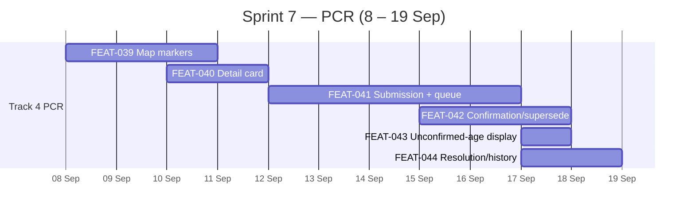

### Sprint 8 — TrackMate™ Peer Communication + history (22 Sep – 3 Oct) → Beta-Ready
| Feature | Name |
|---|---|
| FEAT-045 | Group presence & peer messaging |
| FEAT-046 | Transport stack (BLE Mesh → Wi-Fi Direct → LoRa) |
| FEAT-047 | LoRa hardware onboarding (4 wireframe states) |
| FEAT-048 | Group Health Envelope (binary indicator) |
| FEAT-049 | Offline message queue & deterministic sync |
| FEAT-015 | Persistent multi-session history (BackTrack™) *(pulled from S9)* |

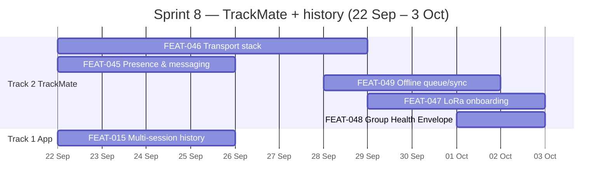

### Sprint 9 — OCS full + event-log + POI + Low-tier (6 – 17 Oct) → Beta-Ready · **feature freeze 17 Oct**
All remaining features land here (incl. the 3 Low-tier, pulled from S11) so the RC is **feature-complete by 17 Oct**.

| Feature | Name |
|---|---|
| FEAT-029 | PCR moderation module (OCS) *(after PCR built in S7)* |
| FEAT-030 | User support & account management module (OCS) |
| FEAT-031 | Audit log & compliance-evidence module (OCS) |
| FEAT-026 | Local event-log viewer |
| FEAT-050 | POI display & category iconography *(pulled from S10)* |
| FEAT-016 | Breadcrumb export (GPX / CSV) — Low *(pulled from S11)* |
| FEAT-032 | Remaining OCS operational modules (content / config / analytics) — Low *(pulled from S11)* |
| FEAT-051 | POI metadata & presentation-only indicators — Low *(pulled from S11)* |

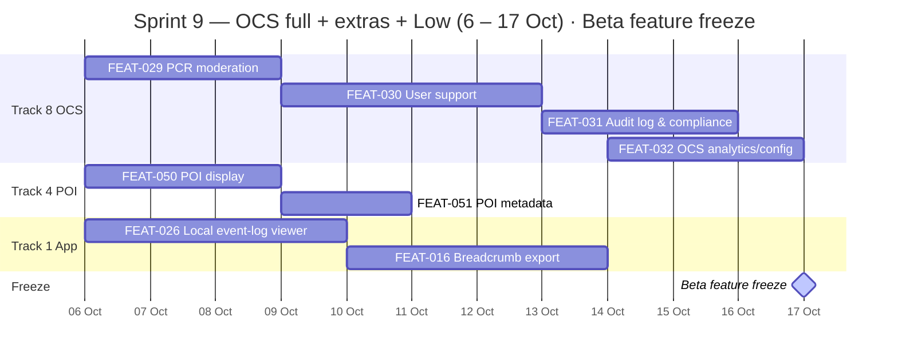

### Sprint 10 — 🛡️ STABILISATION buffer (20 – 30 Oct) → Beta-Ready Gate
**No new features** (Beta freeze was 17 Oct). 13-day risk buffer: full validation suite + audits on the frozen RC.

| Activity | Detail |
|---|---|
| 11 TQP-5026 validation domains | Full execution across the device matrix |
| WCAG 2.1 AA audit | Independent audit (RT-11) on feature-complete build |
| 22 Rejection Triggers clearance | Confirm all RT-01→22 resolved |
| Beta hardening + gate evidence | Defect burn-down · Beta-Ready evidence package |

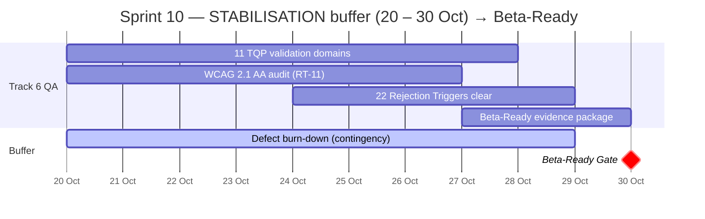

### Sprint 11 — 🛡️ RELEASE buffer (31 Oct – 13 Nov) → GA Gate
**No new features** — the RC is feature-complete since 17 Oct (S9). This sprint is pure release: regression on the frozen build, store submission, go/no-go. Maximum risk buffer for the hard commercial deadline.

| Activity | Detail |
|---|---|
| Full regression on frozen RC | All 11 epics end-to-end on the device matrix |
| App Store + Google Play submission | Store review lead-time absorbed within the buffer |
| GA go/no-go sign-off | Written Project Director sign-off |

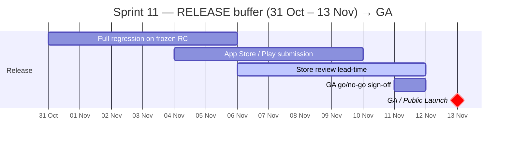

---

## A3. Coverage check

| Bucket | Count | Where (build sprints — buffer sprints excluded) |
|---|---|---|
| Foundation tasks (FND-001→044) | 44 | Sprint 0 (work by 10 Jun) |
| High features | 25 | Sprints 1–4 *(S5 = buffer)* |
| Medium features | 23 | Sprints 6–9 *(S10 = buffer)* |
| Low features | 3 | Sprint 9 *(pulled forward; S11 = release buffer)* |
| **Total business features** | **51** | Sprints 1–4 + 6–9 |

**Per-sprint feature load:** S1=5 · S2=6 · S3=6 · S4=8 · S5=buffer · S6=6 · S7=6 · S8=6 · S9=8 · S10=buffer · S11=release. (= 51)

Every FND task and every FEAT is scheduled exactly once; all feature work lands **before each gate's freeze date**, leaving the stabilisation/release buffers (S5, S10, S11). Registers below (Part B) hold the full detail.

---
---

# PART B — REGISTERS (the consolidated backlog)

## B1. Scope rule

Epics/Features are **business-functional only**. Cross-cutting foundations are **Sprint 0 tasks (FND-)**. Standards/criteria are **Acceptance Criteria**, never features.

| Bucket | Goes to | Source doc groups (per `research/spec-docs/READING-GUIDE.md`) |
|---|---|---|
| **Business-functional capability** | Feature (`FEAT-`) in [B3](#b3-consolidated-feature-backlog-9-column-canonical) | NHÓM 2/3/4/6 — AOD · FSD · CDG · MAS · ESF · SFD · BTF · HFG · OSM · WFD · VGD · OCS |
| **Cross-cutting foundation** (architecture · infra/CI-CD · data model · auth · design system · UX guidelines · RBAC · business rules · scaffolds) | Foundation task (`FND-`) in [B2](#b2-sprint-0-foundation-register) | NHÓM 2/6 + the standards from 1/5 that become baselines |
| **Standard / threshold / rule** (colour hex · TTL · battery % · RT/RG · WCAG · 5-Q hierarchy · tier gating) | Acceptance Criterion — see [B7](#b7-cross-cutting-standards-reserved-for-ac) | NHÓM 1 (UXS · TAA · PSB · FQH) + NHÓM 5 (PRD · TQP · BPS) |

> ⭐ **ID = priority order.** Lower ID = higher delivery priority. Epic IDs 3-digit. FND tasks numbered in build order. Rule in `conventions/features-conventions.md`.

---

## B2. Sprint 0 Foundation Register

*Hierarchy: Topic → Concern → Task → ACs.* Sprint 0 uses the same 3-level decomposition as the feature backlog, **renamed for the foundation phase**:

| Feature backlog | Foundation (Sprint 0) | Meaning |
|---|---|---|
| Epic | **Topic** | A theme grouping related concerns |
| Feature | **Concern** | A technical concern (the 10 areas) |
| User Story | **Task** (`FND-`) | A buildable unit of foundation work |
| Acceptance Criteria | **ACs** | Done-criteria (DoD) per Task — verifiable, English |

**5 Topics group the 10 concerns:**

| Topic | Concerns | Theme |
|---|---|---|
| **TOPIC-01 — Architecture & Delivery Platform** | C1 Architecture · C2 Infra/CI-CD | How the system is structured + built/shipped |
| **TOPIC-02 — Data, Connectivity & Identity Core** | C3 Data Model · C4 CAL · C5 Auth/RBAC | The platform substrate: storage · connectivity · identity |
| **TOPIC-03 — Experience Foundation** | C6 Map/Overlay · C7 Design System/UX | Rendering + UX substrate every screen builds on |
| **TOPIC-04 — Compliance & Phase Governance** | C8 Business Rules · C9 Phase 2 Scaffolds | Guardrails · registers · phase-boundary discipline |
| **TOPIC-05 — Public Presence** | C10 Companion Website | Public-facing Discovery deliverable |

44 tasks total · 🎯 = committed Discovery Gate deliverable ([B5](#b5-discovery-gate-deliverable-register)).
**Build-order:** TOPIC-01 → TOPIC-02 → TOPIC-03 → TOPIC-04 (∥) → TOPIC-05 (∥). All run concurrently across the 8 tracks from day 1 to hit the 10 Jun foundation freeze.

> 📖 **Reference** = spec(s) to read first. Doc IDs → `research/spec-docs/<DOC-ID>.md`; `Slitigenz §x` → the proposal extract; `diagrams/…` → project diagrams.
> ✅ **ACs (Definition-of-Done) per Task live in [`docs/sprint-0-acs.md`](./sprint-0-acs.md)** — keyed by Task ID (`AC-FND-xxx-nn`), confirmed at the Discovery gate.

---

### TOPIC-01 — Architecture & Delivery Platform

#### Concern 1 — Architecture & Technical Design  *(refs: AOD-5026 · FSD-5126)*
| Task | Reference |
|---|---|
| **FND-001 — Dual-layer architecture baseline** (Core ⇎ Experience · immutable separation) | AOD-5026 · UXS-5726 §dual-layer · `diagrams/1-overview/` |
| **FND-002 — Component / module boundaries & interfaces** (MOB-1xxx/2xxx · CBE · OCS · SYN) | AOD-5026 (component inventory) · `diagrams/2-subsystems/` |
| **FND-003 — ADR baseline + tech-stack lock** (Flutter/Dart · Mapbox+OSM · Firebase non-core) | FSD-5126 §3 · AOD-5026 §6 · `research/tech-stack-inventory.md` |
| **FND-040 🎯 — High-Level Architecture Diagram** artefact — **D1** | Slitigenz §2.7.1 · AOD-5026 · `diagrams/1-overview/trackaroo-phase1-architecture.md` |
| **FND-041 🎯 — Deterministic State Transition Matrix** (Idle/Navigating/SOS/BackTrack™) — **D2** | Slitigenz §2.7.2 · FSD-5126 §4 · `diagrams/3-flows/state/state-trackaroo-transitions.md` |
| **FND-042 🎯 — Offline-First Execution whitepaper** — **D3** | Slitigenz §2.7.3 · UXS-5726 (offline-first) · AOD-5026 |

#### Concern 2 — Infrastructure & CI/CD  *(refs: VGD-5126 · CDG-5126 · BTF-5126 · TQP-5026)*
| Task | Reference |
|---|---|
| **FND-004 — Repo, branch strategy & Flutter build pipeline** (iOS 15+ / Android 13+) | VGD-5126 · FSD-5126 §3 |
| **FND-005 — Compliance static-analysis CI** (14 mutations + field-name scan) | CDG-5126 §4.3 · BTF-5126 §5.2 · ESF-5026 §8 · TQP-5026 §7 |
| **FND-006 — Prohibited-capability & phase-boundary scan** | PRD-5126 §14.4 (RT-01/03/09) · PSB-5026 · TQP-5026 §7 |
| **FND-007 — Release-gate evidence packaging pipeline** (Discovery/Alpha/Beta/GA) | VGD-5126 · TQP-5026 · Slitigenz §10.2 |
| **FND-008 🎯 — SDK & OSS license audit tooling** (V-12 / V-13) — **D8/D9** | VGD-5126 · Slitigenz §2.7.8–2.7.9 |
| **FND-009 — WFD-5126 build-gate adherence tracking** | WFD-5126 §9 · VGD-5126 |

---

### TOPIC-02 — Data, Connectivity & Identity Core

#### Concern 3 — Foundational Data Model & Persistence  *(refs: CDG-5126 · AOD-5026 · BTF-5126)*
| Task | Reference |
|---|---|
| **FND-010 — Local-only Survival Core store** (SQLite + WAL · Firebase-independent) | CDG-5126 (Local-Only) · BTF-5126 (WAL) · AOD-5026 |
| **FND-011 — Firebase / Firestore isolation barrier** | CDG-5126 (isolation) · AOD-5026 |
| **FND-012 🎯 — Data classification + enforcement** (Local-Only / Non-Syncable) — **D5** | CDG-5126 §3–4 · Slitigenz §2.7.5 |
| **FND-013 — Firestore offline persistence** (non-Core: PCR cache · group · profile) | CDG-5126 (sync cache) · FSD-5126 |
| **FND-014 — Encryption baseline** (AES-256 at rest · TLS 1.3 in transit) | CDG-5126 · AOD-5026 |

#### Concern 4 — Connectivity Abstraction Layer (CAL)  *(refs: FSD-5126 §6.1 · AOD-5026)*
| Task | Reference |
|---|---|
| **FND-015 🎯 — CAL state-flag schema** (satReady/queueEnabled/offlineBeacon/partialSignal) — **D6** | FSD-5126 §6.1 · Slitigenz §2.7.6 · `diagrams/` CAL pages |
| **FND-016 — Connectivity detection & degraded-state abstraction** | FSD-5126 §6.1 · AOD-5026 |
| **FND-017 — Connectivity status indicator components** (cross-app) | WFD-5126 §6 · FSD-5126 §6.1 |

#### Concern 5 — Authentication & RBAC  *(refs: OCS-5026 · AOD-5026)*
| Task | Reference |
|---|---|
| **FND-018 — App identity / profile** (Firebase Auth — non-Core only) | AOD-5026 · CDG-5126 §7 |
| **FND-019 — OCS authentication** | OCS-5026 · CLR-SLZ-005 (Slitigenz §11) |
| **FND-020 — OCS 3-role RBAC + permission matrix** (Founder/Admin/Operator) | OCS-5026 §3 |

---

### TOPIC-03 — Experience Foundation

#### Concern 6 — Map & Overlay Rendering Foundation  *(refs: MAS-5126 · OSM-5026)*
| Task | Reference |
|---|---|
| **FND-021 — Mapbox SDK + OSM vector-tile pipeline** | MAS-5126 · `research/mapbox-sdk-overview.md` · CLR-SLZ-004 (Slitigenz §11) |
| **FND-022 — Offline tile-bundle infrastructure** | MAS-5126 · WFD-5126 · BPS-5126 (cold-start) |
| **FND-023 — Map-provider abstraction** (provider-agnostic) | MAS-5126 · TAA-5126 §4.4 |
| **FND-024 — Overlay rendering framework** (z-index · LIR-01→06 · 8-state · toggle) | OSM-5026 §5A / §11 / §13 · MAS-5126 |
| **FND-043 🎯 — PCR Architecture Documentation** (supersession, not TTL) — **D7** | OSM-5026 §10 · Slitigenz §2.7.7 |

#### Concern 7 — Design System, App Shell & UX Guidelines  *(refs: WFD-5126 · UXS-5726 · FQH-5026)*
| Task | Reference |
|---|---|
| **FND-025 — Design system / component library** (Figma + WFD baseline) | WFD-5126 · UXS-5726 |
| **FND-026 — Application shell & navigation chrome** (≤2-tap SOS · ≤3-tap BackTrack) | UXS-5726 §7 / §9 · WFD-5126 · SFD-5026 |
| **FND-027 — Inactive-module placeholder pattern** ("Inactive in Phase 1") | WFD-5126 §5.13 · PSB-5026 |
| **FND-028 — Accessibility baseline** (WCAG 2.1 AA · glove/one-handed/low-light) | UXS-5726 · WFD-5126 · PRD-5126 RT-11 |
| **FND-029 — Five-Question Cognitive Hierarchy harness** | FQH-5026 · UXS-5726 §3 · PRD-5126 §10 |

---

### TOPIC-04 — Compliance & Phase Governance

#### Concern 8 — Business Rules & Compliance Baseline  *(refs: UXS · ESF · CDG · BTF · OSM · PSB · PRD)*
| Task | Reference |
|---|---|
| **FND-030 — Deterministic execution rule-set** (non-adaptive · non-inferential) | UXS-5726 (Core invariants) · FSD-5126 |
| **FND-031 — 14 prohibited breadcrumb-mutation register + guard** | BTF-5126 §5.2 · CDG-5126 §4.3 · Slitigenz §2.1.1 / §7.3 |
| **FND-032 — Prohibited satellite field-name register** | ESF-5026 §8 · FSD-5126 §4.4.4 |
| **FND-033 — Zero-transmission / non-dispatch posture enforcement** | ESF-5026 §4.2 · UXS-5726 §7.4 · SFD-5026 |
| **FND-034 — 22 Rejection Triggers register** (RT-01→22) as gate checks | PRD-5126 §14.4 · VGD-5126 |
| **FND-035 — 11 Rollback Governance triggers register** (RG-01→11) | OSM-5026 §12 |
| **FND-036 — Phase-boundary discipline + 3 permitted-scaffold whitelist** | PSB-5026 §4 |

#### Concern 9 — Phase 2 Inert Scaffolds  *(refs: PSB-5026 §4 · BTF · FSD · CDG)*
| Task | Reference |
|---|---|
| **FND-037 — BackTrack™ Emergency Escrow data schema** (inert · schema-only) | PSB-5026 §4 · BTF-5126 · Slitigenz §2.6 |
| **FND-038 — CAL `satReady` flag** (declared false · not activatable) | PSB-5026 §4 · FSD-5126 §6.1 |
| **FND-039 — CAL satellite transport pathway** (architectural · non-executable) | PSB-5026 §4 · FSD-5126 · ESF-5026 §8 |

---

### TOPIC-05 — Public Presence

#### Concern 10 — Companion Website  *(refs: OCS-5026 · proposal §10.2)*
| Task | Reference |
|---|---|
| **FND-044 🎯 — Companion website live** (public CMS) — Discovery deliverable | Slitigenz §10.2 · OCS-5026 |

---

## B3. Consolidated Feature Backlog (9-column canonical)

Canonical MasterMind layout · 3-row-type pattern (Epic = A+B · Feature = C+D · Story = E–I) · no merged cells. Stories deferred (E–I empty); Priority via [B4](#b4-delivery-gate--priority); Sprint via [A1](#a1-master-delivery-timeline).

| Epic ID | Epic Name | Feature ID | Feature Name | Story ID | User Story | Priority | Status | Lifecycle |
|---|---|---|---|---|---|---|---|---|
| EPIC-001 | Offline Navigation & Mapping |  |  |  |  |  |  |  |
|  |  | FEAT-001 | Map region download & offline bundle management |  |  |  |  |  |
|  |  | FEAT-002 | Current location & orientation indicator (GNSS) |  |  |  |  |  |
|  |  | FEAT-003 | Route planning & display (deterministic · no auto-reroute) |  |  |  |  |  |
|  |  | FEAT-004 | Map interaction controls (pan / zoom / layer) |  |  |  |  |  |
|  |  | FEAT-005 | Navigational instrument overlays (route line + breadcrumb trail) |  |  |  |  |  |
| EPIC-002 | SOS & Emergency Logging |  |  |  |  |  |  |  |
|  |  | FEAT-006 | SOS activation control (persistent · multi-tap confirm) |  |  |  |  |  |
|  |  | FEAT-007 | 3-stage SOS log sequence (timestamp → GPS pending → coords) |  |  |  |  |  |
|  |  | FEAT-008 | SOS confirmation screen (feedback elements · non-dispatch copy) |  |  |  |  |  |
|  |  | FEAT-009 | SOS onboarding acknowledgement (click-through) |  |  |  |  |  |
|  |  | FEAT-010 | QR fallback handover (offline-generated) |  |  |  |  |  |
| EPIC-003 | Breadcrumb & BackTrack™ Return Navigation |  |  |  |  |  |  |  |
|  |  | FEAT-011 | Active-session breadcrumb logging (dual-trigger) |  |  |  |  |  |
|  |  | FEAT-012 | Breadcrumb immutable write (WAL + encryption) |  |  |  |  |  |
|  |  | FEAT-013 | BackTrack™ reverse retrace |  |  |  |  |  |
|  |  | FEAT-014 | Distress-mode breadcrumb capture (elevated interval) |  |  |  |  |  |
|  |  | FEAT-015 | Persistent multi-session history |  |  |  |  |  |
|  |  | FEAT-016 | Breadcrumb export (GPX / CSV) |  |  |  |  |  |
| EPIC-004 | HazTrack™ Hazard Awareness |  |  |  |  |  |  |  |
|  |  | FEAT-017 | Hazard feed ingestion & filter pipeline |  |  |  |  |  |
|  |  | FEAT-018 | Hazard overlay rendering (iconography by type) |  |  |  |  |  |
|  |  | FEAT-019 | Hazard freshness / TTL display |  |  |  |  |  |
|  |  | FEAT-020 | Hazard source attribution |  |  |  |  |  |
|  |  | FEAT-021 | Hazard cache management (offline) |  |  |  |  |  |
| EPIC-005 | First Aid Reference |  |  |  |  |  |  |  |
|  |  | FEAT-022 | First Aid Reference content rendering (structured screens) |  |  |  |  |  |
|  |  | FEAT-023 | Mandatory persistent disclaimer |  |  |  |  |  |
|  |  | FEAT-024 | Offline pre-loaded access |  |  |  |  |  |
| EPIC-006 | Application Experience |  |  |  |  |  |  |  |
|  |  | FEAT-025 | First-use onboarding flow |  |  |  |  |  |  |
|  |  | FEAT-026 | Local event-log viewer (read-only · offline) |  |  |  |  |  |
| EPIC-007 | Operations Console (OCS) — Internal Web App |  |  |  |  |  |  |  |
|  |  | FEAT-027 | HazTrack™ feed administration module |  |  |  |  |  |
|  |  | FEAT-028 | Break-glass intervention module |  |  |  |  |  |
|  |  | FEAT-029 | PCR moderation module |  |  |  |  |  |
|  |  | FEAT-030 | User support & account management module |  |  |  |  |  |
|  |  | FEAT-031 | Audit log & compliance-evidence module |  |  |  |  |  |
|  |  | FEAT-032 | Remaining OCS operational modules (content / config / analytics) |  |  |  |  |  |
| EPIC-008 | TrackIQ™ Track Difficulty Intelligence |  |  |  |  |  |  |  |
|  |  | FEAT-033 | Difficulty grade rendering |  |  |  |  |  |
|  |  | FEAT-034 | Track Verification Shield rendering |  |  |  |  |  |
|  |  | FEAT-035 | Deterministic difficulty scoring |  |  |  |  |  |
|  |  | FEAT-036 | Stop-detection prompt (fixed threshold) |  |  |  |  |  |
|  |  | FEAT-037 | Track metadata display (distance / elevation / surface) |  |  |  |  |  |
|  |  | FEAT-038 | HazTrack™ → TrackIQ™ non-mutation guard |  |  |  |  |  |
| EPIC-009 | PCR — Point Condition Reports |  |  |  |  |  |  |  |
|  |  | FEAT-039 | PCR map markers (6 categories · ring states) |  |  |  |  |  |
|  |  | FEAT-040 | PCR detail card |  |  |  |  |  |
|  |  | FEAT-041 | PCR submission (online + offline queue) |  |  |  |  |  |
|  |  | FEAT-042 | PCR confirmation & supersession resolution |  |  |  |  |  |
|  |  | FEAT-043 | Unconfirmed-age muted display |  |  |  |  |  |
|  |  | FEAT-044 | PCR resolution & history view |  |  |  |  |  |
| EPIC-010 | TrackMate™ Peer Communication & Group Coordination |  |  |  |  |  |  |  |
|  |  | FEAT-045 | Group presence & peer messaging |  |  |  |  |  |  |
|  |  | FEAT-046 | Transport stack (BLE Mesh → Wi-Fi Direct → LoRa) |  |  |  |  |  |
|  |  | FEAT-047 | LoRa hardware onboarding (4 wireframe states) |  |  |  |  |  |
|  |  | FEAT-048 | Group Health Envelope (binary indicator) |  |  |  |  |  |
|  |  | FEAT-049 | Offline message queue & deterministic sync |  |  |  |  |  |
| EPIC-011 | Points of Interest |  |  |  |  |  |  |  |
|  |  | FEAT-050 | POI display & category iconography |  |  |  |  |  |
|  |  | FEAT-051 | POI metadata & presentation-only indicators |  |  |  |  |  |

**Totals:** 11 Epics · 51 Features · 0 Stories (next pass). Plus 44 foundation tasks in [B2](#b2-sprint-0-foundation-register).

### Epic ↔ architecture layer (orthogonal to priority/ID)

| Layer | Epics |
|---|---|
| **A · Survival Core** | EPIC-001 Navigation · EPIC-002 SOS · EPIC-003 BackTrack™ · EPIC-004 HazTrack™ · EPIC-005 First Aid |
| **B · Experience & Intelligence Layer** | EPIC-008 TrackIQ™ · EPIC-009 PCR · EPIC-010 TrackMate™ · EPIC-011 POI |
| **C/D · App & Operations (functional)** | EPIC-006 Application Experience · EPIC-007 Operations Console |

---

## B4. Delivery Gate & Priority

Priority by earliest delivery gate (lower ID = higher priority). Companion mapping — not a backlog column (canonical Priority col G is filled on Story rows; Stories inherit Feature priority here).

| Priority | Gate | Date | Epics | Sprints |
|---|---|---|---|---|
| **(Foundation)** | Discovery | 15 Jun | — (FND tasks, [B2](#b2-sprint-0-foundation-register)) | Sprint 0 |
| **High** | Alpha | 22 Aug | EPIC-001 → EPIC-007 | Sprints 1–5 |
| **Medium** | Beta-Ready | 30 Oct | EPIC-008 → EPIC-011 | Sprints 6–10 |
| **Low** | GA | 13 Nov | (deferrable features, see below) | Sprint 11 |

Full locked timeline: **Contract Execution 29 May → Discovery 15 Jun → Alpha 22 Aug → Beta-Ready 30 Oct → GA 13 Nov 2026** (Slitigenz proposal §10.2 — `research/spec-docs/Slitigenz-Proposal-RFT5026.md`).

**Feature tiers (mixed epics carry features at >1 gate):**

- **High (25)** → Sprints 1–5: FEAT-001→005, 006→010, 011→014, 017→024, 025, 027, 028
- **Medium (23)** → Sprints 6–10: FEAT-015, 026, 029→031, 033→038, 039→044, 045→049, 050
- **Low (3)** → Sprint 11: FEAT-016 (breadcrumb export) · FEAT-032 (OCS analytics/config) · FEAT-051 (POI metadata)

---

## B5. Discovery Gate Deliverable Register

The headline Sprint 0 output. Slitigenz committed **9 Architectural Compliance Artefacts + companion website** for acceptance at Discovery (15 Jun 2026). All must be accepted for the gate to pass. Source: `research/spec-docs/Slitigenz-Proposal-RFT5026.md` §2.7 / §10.2.

| Deliverable | Committed artefact | Produced by (FND) | Existing project asset |
|---|---|---|---|
| **D1** | High-Level Architecture Diagram (Core isolation boundaries) | FND-040 ← FND-001 / FND-002 | `diagrams/1-overview/` |
| **D2** | Deterministic State Transition Matrix | FND-041 ← FND-030 | `diagrams/3-flows/state/state-trackaroo-transitions.md` |
| **D3** | Offline-First Execution Explanation (whitepaper) | FND-042 ← FND-001 / FND-010 | — (to author) |
| **D4** | Module Isolation Mapping (dependency graph) | FND-002 + FND-011 | `diagrams/4-cross-cutting/` |
| **D5** | Breadcrumb Classification Confirmation (Local-Only / Non-Syncable) | FND-012 | CDG-5126 extract |
| **D6** | CAL Architecture Documentation (4 state flags) | FND-015 (+016/017) | `diagrams/` CAL pages |
| **D7** | PCR Architecture Documentation (supersession, not TTL) | FND-043 | OSM-5026 §10 extract |
| **D8** | SDK Audit Declaration (no prohibited capabilities) | FND-006 + FND-008 | — (CI output) |
| **D9** | OSS Licence Audit | FND-008 | — (CI output) |
| **+** | Companion website live | FND-044 | — |

**Gate exit:** D1–D9 accepted by Project Director + companion website live. Validation per CLR-SLZ-001 (lab GPS-spoofing + Faraday simulating the Australian envelope).

---

## B6. Feature → Governing Spec (traceability)

By code, not by column. Standards from NHÓM 1/5 are cited later as ACs ([B7](#b7-cross-cutting-standards-reserved-for-ac)).

| Feature range | Epic | Governing spec doc(s) |
|---|---|---|
| FEAT-001 → 005 | EPIC-001 | FSD-5126 §4.1 · OSM-5026 §5A · MAS-5126 |
| FEAT-006 → 010 | EPIC-002 | ESF-5026 · SFD-5026 · FSD-5126 §4.4 |
| FEAT-011 → 016 | EPIC-003 | BTF-5126 · FSD-5126 §4.2 |
| FEAT-017 → 021 | EPIC-004 | HFG-5026 · OSM-5026 §6 |
| FEAT-022 → 024 | EPIC-005 | WFD-5126 §5.9 |
| FEAT-025 → 026 | EPIC-006 | WFD-5126 §5.16 · FSD-5126 §4.5 |
| FEAT-027 → 032 | EPIC-007 | OCS-5026 |
| FEAT-033 → 038 | EPIC-008 | OSM-5026 §5 · FSD-5126 · WFD-5126 §5.10 |
| FEAT-039 → 044 | EPIC-009 | OSM-5026 §10 · WFD-5126 §5.17 · FSD-5126 §13 |
| FEAT-045 → 049 | EPIC-010 | FSD-5126 §6.2 · WFD-5126 §5.7–5.8 |
| FEAT-050 → 051 | EPIC-011 | FSD-5126 · WFD-5126 §5.11 |

---

## B7. Cross-cutting standards reserved for AC

Standards are not features. Established as baselines/registers in Sprint 0 ([B2](#b2-sprint-0-foundation-register)), then asserted as **Acceptance Criteria** on the relevant feature during the Story pass.

| Reserved standard | Sprint 0 baseline | Applied as AC to |
|---|---|---|
| Five-Question Cognitive Hierarchy | FND-029 | FEAT-001 / 002 / 003 / 006 / 013 |
| ≤2-tap SOS · ≤3-tap/≤3s BackTrack | FND-026 | FEAT-006 · FEAT-013 |
| Difficulty colour hex · shield day-thresholds | (OSM values) | FEAT-033 · FEAT-034 |
| Hazard TTL values by source type | (OSM/HFG values) | FEAT-019 |
| 14 prohibited breadcrumb mutations · prohibited field names | FND-031 · FND-032 | FEAT-012 |
| Zero-transmission / non-dispatch posture | FND-033 | FEAT-008 · all Survival Core paths |
| 22 Rejection Triggers · 11 Rollback Governance | FND-034 · FND-035 | cross-cutting on all features |
| Battery / performance thresholds | (BPS values) | FEAT-001 / 011 / 006 |
| WCAG 2.1 AA · glove / one-handed / low-light | FND-028 | all UI features |
| Subscription tier gating (Free/Plus/Pro) | — | deferred (Phase 1 prohibits entitlement hooks) |
| Archetype / activity-context personalization | — | AC framing on UI features |

---

## Assumptions, risks & next step

- **Sprint allocation** follows priority-ordered IDs + the proposal build sequence (Survival Core first, SOS/BackTrack lead). Day-level durations indicative until Story estimates exist.
- **Parallel tracks:** 8-workstream model (proposal §10.3) lets Survival Core, TrackMate, Mapping, Feed, OCS, QA run concurrently — reflected by the `section` tracks in each gantt.
- **Legal gates LE-01→LE-07** (SOS RT-16, First Aid RT-12) run in Track 7 across Sprints 1–5; must close before Alpha.
- **Remote validation** (CLR-SLZ-001) — lab GPS-spoofing + Faraday substitutes for Australian field testing through Discovery/Alpha; field confirmation deferred to Separable Portion 2.
- **Open mismatch:** 7-vs-8 workstream tracks / 8-expert squad (proposal §10.3) — confirm with PD; affects per-sprint capacity.

**Next step (Story pass):** decompose each Feature → `STORY-XXX` (`[User] can [Action]`) + `en` Given/When/Then AC (pulling the reserved standards in [B7](#b7-cross-cutting-standards-reserved-for-ac)); Stories inherit Feature priority/sprint. Recommended: start Sprint 1 (SOS) — it leads the build. Optionally render `output/Trackaroo-Phase1-Plan.xlsx`.
